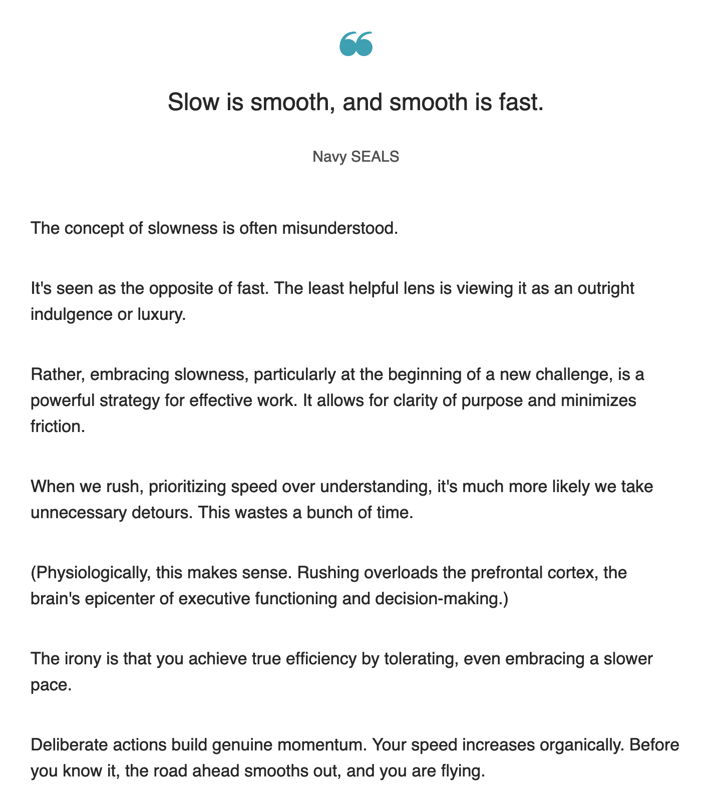

<!-- markdownlint-disable no-inline-html no-trailing-punctuation -->

## Slow is Smooth

## General

- [KidPix](https://kidpix.app/)
   This is the old Mac paint app, _KidPix_, but done in HTML/JS :exploding_head:
   The original repo can be found here -> [https://github.com/vikrum/kidpix/](https://github.com/vikrum/kidpix/)
- [If Programming Languages Were Games [Comic]](https://toggl.com/blog/programming-languages-games)
- [I am not a fan of heroism in the engineering industry](https://newsletter.eng-leadership.com/p/i-am-not-a-fan-of-heroism-in-the)
   The author discusses the consistency of long-term good work vs. spikes of great work. I'm inclined to agree with the assessment.

  

## Unique Identifiers

:::tip
React's `key` values can be tricky, these _might_ help solve that issue.
:::

- [Goodbye integers. Hello UUIDv7!](https://buildkite.com/blog/goodbye-integers-hello-uuids)

## Single Page Applications

- [Web design patterns — SSR, SSG, and SPA](https://medium.com/codex/web-design-patterns-ssr-ssg-and-spa-fadad7673dfe)
- [Mary Boyd: Single Page Applications: A Powerful Design Pattern for Modern Web Apps](https://medium.com/a-lady-dev/single-page-applications-a-powerful-design-pattern-for-modern-web-apps-ec3590bb7e7a)
  This article is ~5 years old, but the pros/cons section is still accurate.

## React

- [Cart Functionality in React with Context API](https://dev.to/anne46/cart-functionality-in-react-with-context-api-2k2f)

## CSS Modules

- [A deep dive into CSS Module](https://blog.logrocket.com/a-deep-dive-into-css-modules/)

## Debugging

- [Matt Rickard: Lessons from Debugging](https://matt-rickard.com/lessons-from-debugging?utm_source=changelog-news)
- [Changelog Youtube Channel:Trying to find a bug? It's almost always your fault...](https://www.youtube.com/watch?v=X42aF-ofrx8)
