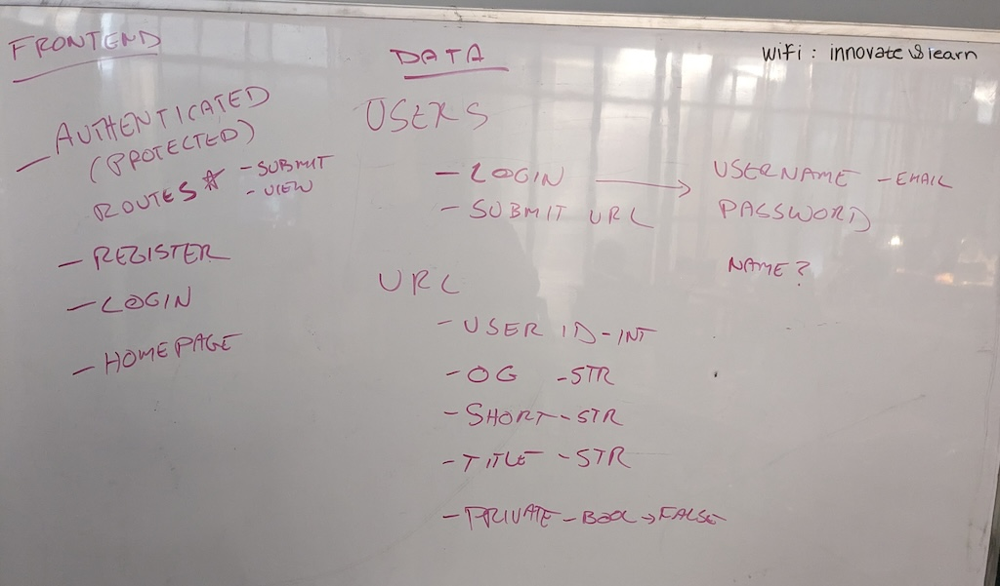

<!-- markdownlint-disable no-trailing-punctuation -->

## Project Discussion

We'll spend some time discussing the final projects

- How to prepare
- How to proceed
- How to maintain some level of sanity

## CRUDCo URL Shortener

Let's talk about what kind of data we'll need, and how to set it up!

:::note

It's very likely that some frontend routes will need to change. Don't get too bogged down in that structure yet.

We're just setting things up to test `actions` & `loaders` against the API at this point. We'll refactor later.

:bulb: You can have an action and a loader in the same file. That means you could just do all of this on the home route for now. It would need a form to submit a link and another component to view links.

:::