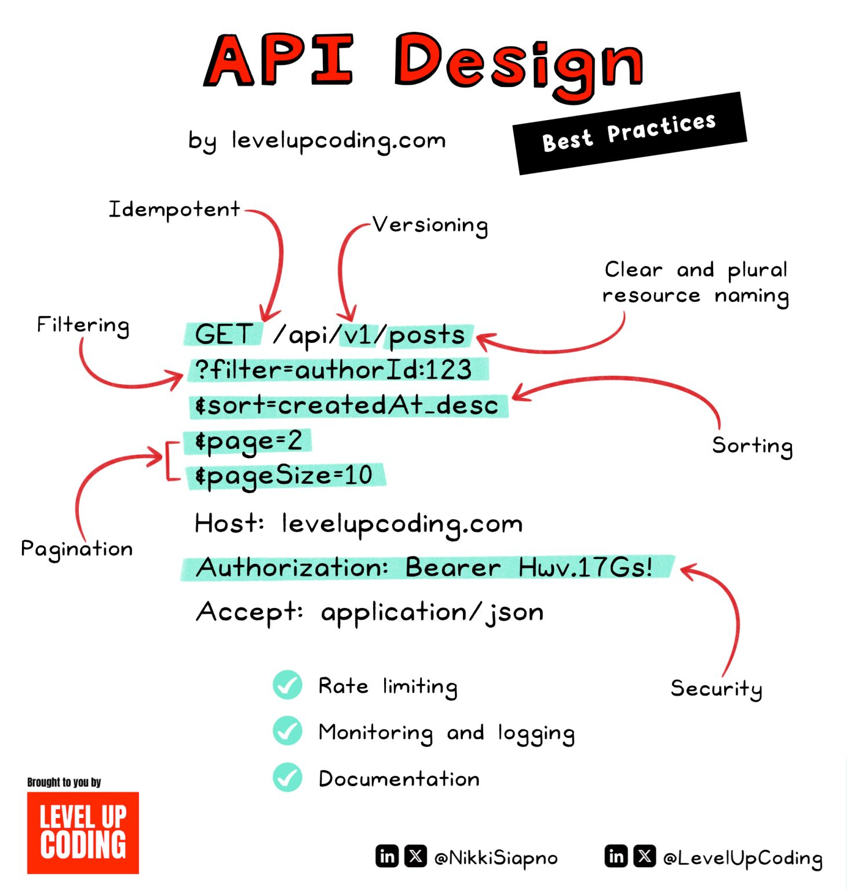

<!-- markdownlint-disable no-inline-html -->

## CRUDCo - Frontend Review + User Auth

We're going to keep working on the CRUDCo URL Shortening App.

## Review

- Code Review
  - What worked?
  - Where are you stuck?

## New Features

- Add Authentication
  - Review [JWT](https://flaviocopes.com/jwt/)
  - Review [bCrypt](https://en.wikipedia.org/wiki/Bcrypt)
- Test our API to register/login a user via Swagger
- Work on the client UI

## Upcoming Steps

- Let users _actually_ login
- Handle the _actual_ redirection
- Deploy

 ## Good API Design

 This was a LinkedIn find that does a good job of mapping out an API structure.

 