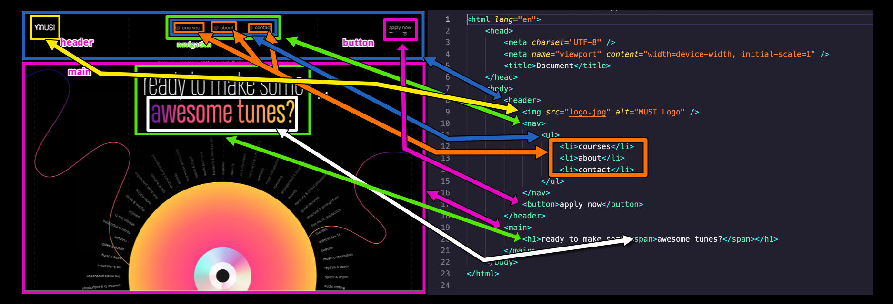

<!-- markdownlint-disable no-inline-html -->

## HTML & CSS

Today we'll go deeper into CSS, particularly CSS positioning and responsive-design.

### Presentations

- [CSS Demo Repo](https://github.com/seanrreid/CSS/)
   _Note_: Positioning Demo is on the `positioning` branch

### Lessons

- [HTML 101](/docs/lessons/front-end-foundations/html-101/)
- [CSS 101](/docs/lessons/front-end-foundations/css-101/)
- [The DOM](/docs/lessons/handling-user-input/dom/)
- [Media Queries](/docs/lessons/front-end-foundations/media-queries/)

### Review

Earlier this week y'all took this...

|               |
| :----------------------------------------------------------------------------------------------------------------------: |
| _[Via Dribbble: Landing page design by Daniella for heartbeat](https://dribbble.com/shots/23271135-Landing-page-design)_ |

and marked it up to resemble something like like this...

## Recommended Reading

- [CSS Features in last 5 years - Atlanta Dev Conf 2024](https://codepen.io/fimion/full/eYwaMZQ?utm_source=cassidoo)
- [Old CSS, new CSS](https://eev.ee/blog/2020/02/01/old-css-new-css/)
- [The Cassette Tap as Responsive Design](https://needmoredesigns.com/early-responsive-design/)
- [Solved by Flexbox](https://philipwalton.github.io/solved-by-flexbox/)
- [Media Queries (Examples of Responsive Designs)](https://mediaqueri.es/)
- [30-plus years of HyperCard, the missing link to the Web](https://arstechnica.com/gadgets/2019/05/25-years-of-hypercard-the-missing-link-to-the-web/)
   This article was originally published in 2012, then republished in 2019. HyperCard turns 37 in 2024, it would have been about 6 years old when I first worked with it! :exploding_head:

## Challenge

- [100 Days CSS Challenges](https://100dayscss.com/)
