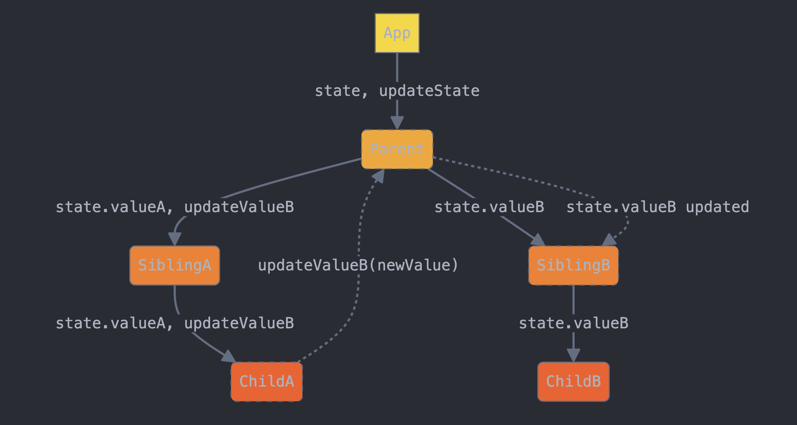

## Code Along

- Working with forms and events in React
- We'll do the [React Shopping List](/docs/exercises/react-shopping-list) exercise

## Let's talk about `props`

To drill, or not to drill?

<iframe src="https://giphy.com/embed/l2JdSdMPUfijMQWcM" width="480" height="367" frameBorder="0" class="giphy-embed" allowFullScreen></iframe>

<a href="https://giphy.com/gifs/thesimpsons-the-simpsons-6x25-l2JdSdMPUfijMQWcM">via GIPHY</a>

### Simple prop drilling

(Credit to [Claude](https://claude.ai/) for the diagrams)

### Prop drilling with sibling components

## Recommended Reading

- [When does React re-render components?](https://felixgerschau.com/react-rerender-components/)
- [OverReacted: A complete guide to `useEffect`](https://overreacted.io/a-complete-guide-to-useeffect/)
- [React.dev: Managing State](https://react.dev/learn/managing-state)
- [Patrick Roza: Component vs Prop drilling in React](https://patrickroza.com/blog/component-vs-prop-drilling-in-react/)

## NOTE

There are a _lot_ of good links in the [Resources](./RESOURCES.md) file today! I would read as many of those as you can (and note any particular questions that come to mind).
