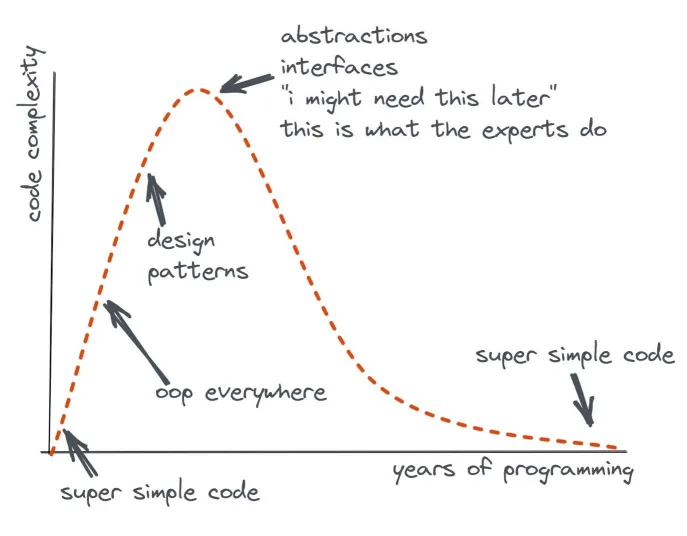
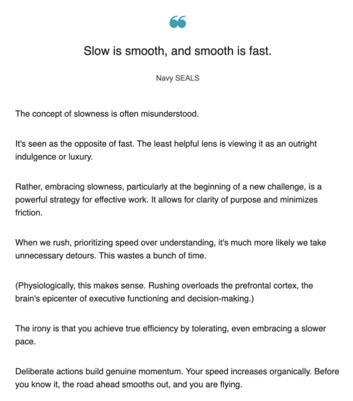
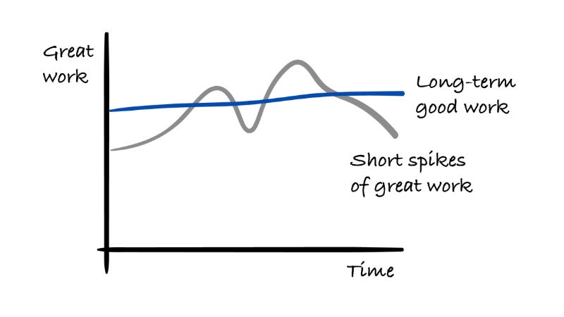

<!-- markdownlint-disable no-inline-html no-trailing-punctuation -->

## Listen to this

- :headphones: [How to Pick a JavaScript Framework](https://syntax.fm/show/835/how-to-pick-a-javascript-framework)
   I hadn't thought of things in the way that Scott frames them, but I honestly think he's spot on:
  > [...] I am going to take the stance that I don't believe a framework is a framework without auth and a database, or at least some sort of solution for that. For me, everything else is just kind of like a pre-framework. It is a a tool to build things, [...] I wouldn't consider NextJS or SvelteKit even a framework. Granted you can build websites, but, with those tools, you're always having to tack on 10 additional choices of your own. To me a framework is something more like Rails or Django, or any of these things that do more of it for you.

## Code Complexity

## Slow is Smooth

## There’s no magic formula for becoming a great programmer

<iframe width="560" height="315" src="https://www.youtube.com/embed/Dh21u07uICM?si=O_w2oRmpx7lxijYq" title="YouTube video player" frameborder="0" allow="accelerometer; autoplay; clipboard-write; encrypted-media; gyroscope; picture-in-picture; web-share" referrerpolicy="strict-origin-when-cross-origin" allowfullscreen></iframe>

## General

- [Cognitive Load](https://minds.md/zakirullin/cognitive)
- [Don’t Start Coding Yet: Here’s What Great Engineers Do First](https://strategizeyourcareer.com/p/dont-start-coding-yet-heres-what-great-engineers-do-first)
- [I am not a fan of heroism in the engineering industry](https://newsletter.eng-leadership.com/p/i-am-not-a-fan-of-heroism-in-the)
   The author discusses the consistency of long-term good work vs. spikes of great work. I'm inclined to agree with the assessment.
   

## Web Development

- [Guide to Error & Exception Handling in React](https://blog.sentry.io/guide-to-error-and-exception-handling-in-react/?utm_source=tldrwebdev)
- [CSS min() All The Things](https://www.smashingmagazine.com/2024/10/css-min-all-the-things/?utm_source=cassidoo)

## Random and Awesome

- [If Programming Languages Were Games [Comic]](https://toggl.com/blog/programming-languages-games)
- [CSS Music Video](https://codepen.io/ivorjetski/pen/jOgEyPO?utm_source=cassidoo)
   This is crazy, I'm still not entirely sure I grok how they did this :exploding_head:
- [KidPix](https://kidpix.app/)
   This is the old Mac paint app, _KidPix_, but done in HTML/JS :exploding_head: :exploding_head:
   The original repo can be found here -> [https://github.com/vikrum/kidpix/](https://github.com/vikrum/kidpix/)
