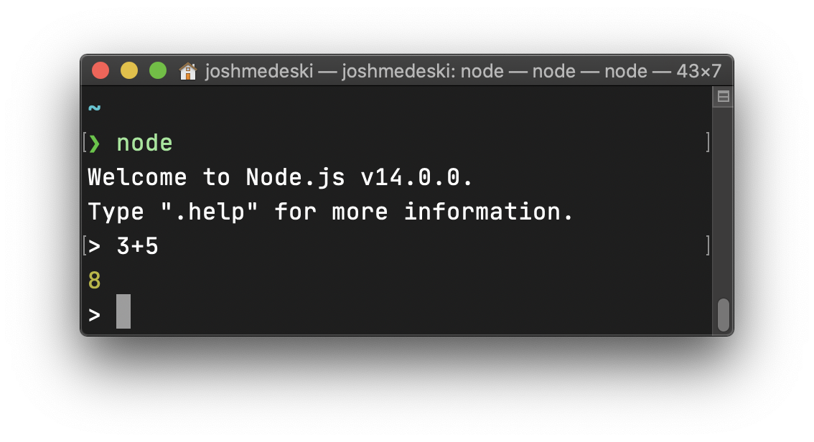
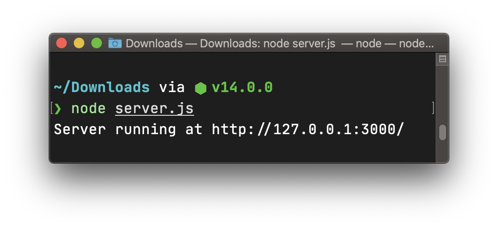
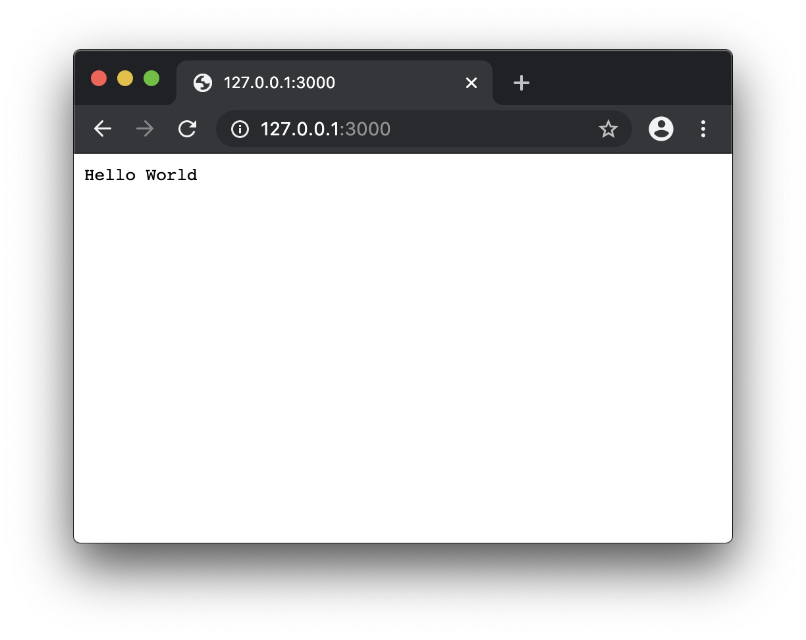
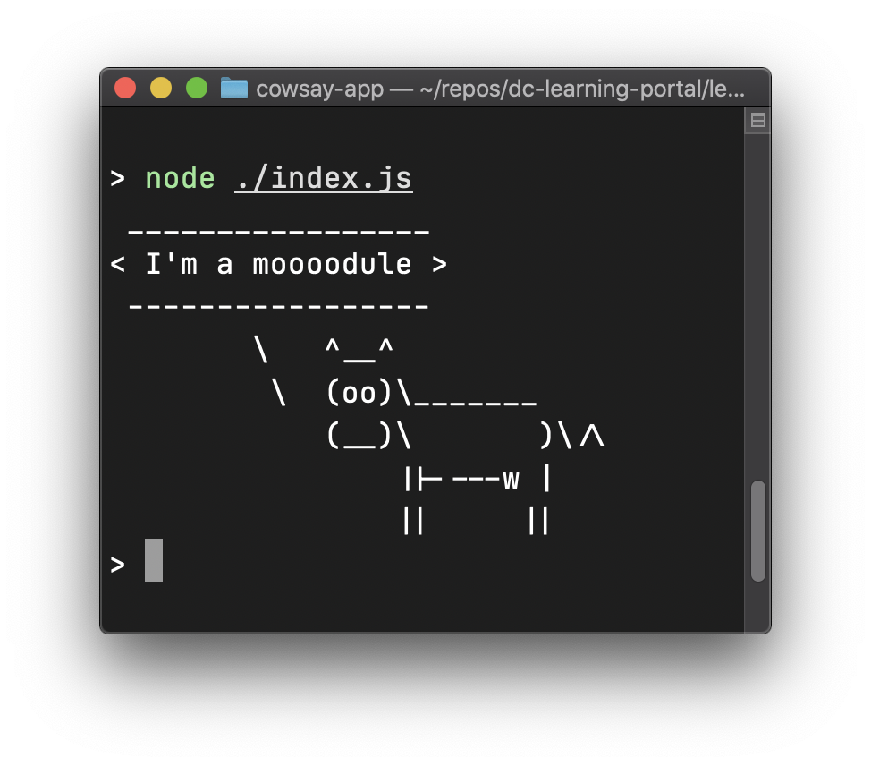

## Learning Objectives

- What are some similarities between how your run code in python and node? What are some differences?
- Why can't Node.js code run in the browser?
- What does asynchronous mean?
- Why is it essential to understand how to write code in JavaScript?

## Overview

Node is an engine that runs JavaScript on a server. The creators of Node took the JavaScript engine from browsers and added functionality so you can create backend applications using the JavaScript language.

It has become one of the most popular web development tools in the world (used by millions and millions of projects) and comes with a package manager called `npm`, which we will cover in this lesson. Over the years, some amazing projects have been created, including [React](https://reactjs.org/), which you will learn in a later lesson.

### Installing Node

To install Node, we'll use the Node Version Manager (or `nvm`). Unlike the installer you can download from Node's website, `nvm` lets you switch between different versions of Node. This proves useful if you need to support an old project or you want to try out bleeding-edge features in an upcoming beta version of Node.

We will do this in two steps: installing `nvm` and using `nvm` to install Node.

#### Installing `nvm`

The [`nvm` GitHub page](https://github.com/nvm-sh/nvm#install--update-script) has a script that you can copy/paste into the Terminal.

For convenience, here is the command:

```sh
curl -o- https://raw.githubusercontent.com/nvm-sh/nvm/v0.35.3/install.sh | "$SHELL"
```

#### Adding `nvm` to your shell path

The `nvm` installer will automatically modify your shell's startup script.
However, there is a small chance that it will not work, depending on how your shell is configured.

After running the installation script, it will show you the lines it is trying to add.
Do not close this tab, yet!

Open a new Terminal tab and then type `nvm`.

If it says `command not found`, copy the startup code from that other tab.

Depending on whether you are running `bash` or `zsh`, you will need to paste that code at the end of your shell's startup configuration file.

- For `bash`, open your startup file with `code ~/.bash_profile`
- For `zsh`, use `code ~/.zshrc`

:::tip Which shell are you running?
To determine what shell you're using, run the following command:

```sh
echo "$SHELL"
```

It should print something like `/bin/bash` or `/bin/zsh`.
:::

Then open another Terminal tab and try to run `nvm` again.

Once your shell is aware of the `nvm` command, you should see a listing of all the things `nvm` can do. It should look like this:

```sh
$ nvm

Node Version Manager (v0.35.2)

Note: <version> refers to any version-like string nvm understands. This includes:
  - full or partial version numbers, starting with an optional "v" (0.10, v0.1.2, v1)
  - default (built-in) aliases: node, stable, unstable, iojs, system
  - custom aliases you define with `nvm alias foo`

 Any options that produce colorized output should respect the `--no-colors` option.

Usage:
  nvm --help                                Show this message
  nvm --version                             Print out the installed version of nvm
  nvm install [-s] <version>                Download and install a <version>, [-s] from source. Uses .nvmrc if available
    --reinstall-packages-from=<version>     When installing, reinstall packages installed in <node|iojs|node version number>
    --lts                                   When installing, only select from LTS (long-term support) versions
    --lts=<LTS name>                        When installing, only select from versions for a specific LTS line
    --skip-default-packages                 When installing, skip the default-packages file if it exists
    --latest-npm                            After installing, attempt to upgrade to the latest working npm on the given node version
    --no-progress                           Disable the progress bar on any downloads
  nvm uninstall <version>                   Uninstall a version
  nvm uninstall --lts                       Uninstall using automatic LTS (long-term support) alias `lts/*`, if available.
...
```

_The output will be several screens long. The output shown is truncated._

#### Installing the LTS version of Node

LTS stands for "Long Term Support" - for software, it means that it will continue to get updates for several years.

Install the LTS version of node by running `nvm install --lts`

Once it is finished, quit the Terminal and re-open it. Every new Terminal window you open from now on should be able to access the freshly installed version of Node.

### Running Node

Similar to Python, Node installs an executable command in your terminal. Simply type `node` and your system, and you can interact with the engine manually. Think of it like Google Chrome's console.



The more common way to work with `node` is to create a JavaScript file and run it using the node command.

```js
// index.js
console.log("Hello World");
```

Once you've created the file, you run the `node` command followed by the name of the file you want to execute:

```sh
node ./index.js
```


Because we are using the `node` engine from directly inside the terminal, you can see the file is run, and the only way for us to see the output is to log it using `console.log`.

### Creating a server

The most common use for `node` is creating a web server. Here is a basic way to get a web server started:

```js
const http = require("http");

const hostname = "127.0.0.1";
const port = 3000;

const server = http.createServer((req, res) => {
  res.statusCode = 200;
  res.setHeader("Content-Type", "text/plain");
  res.end("Hello World");
});

server.listen(port, hostname, () => {
  console.log(`Server running at http://${hostname}:${port}/`);
});
// Code provided by nodejs.org
```

First, the `http` module is imported. This module is built into Node and allows you to create a server.

Next, you have to create the server and configure it to send a response when the user attempts to connect to it. In this example, at successful status code (200) is passed with the content "Hello World" in the plain text format.

Lastly, you have to start the server by calling the `listen()` function, which takes the port and hostname. Since this is going to run on our computer, we will use `localhost` (127.0.0.1) and port 3000. This port number is arbitrary, but it is common to use 3000 for a `node` server.

:::tip What's a port number?
An [IP Address](https://developer.mozilla.org/en-US/docs/Glossary/IP_Address) is like the physical address of an office building (e.g., "3423 Piedmont Rd NE, Atlanta, GA 30305").

A [port number](https://developer.mozilla.org/en-US/docs/Glossary/Port) is like a particular suite or unit number in that office building (e.g., "#420")

When we say that our server is "listening on" port `3000`, this is akin to saying that it is located in a particular unit number. If somebody goes to port `3000`, they'll encounter our code. More formally, if a browser sends a Request to port `3000`, our code will receive that Request (and subsequently send back a Response).
:::

Running this file will show the console log, which means the server is running.



The `listen` function will allow the `node` process to continue to run until you manually kill the task (`ctrl+c`). While the process is still running, you can connect to the server using a browser.



As you can see, the simple plain text message of "Hello World" displays when you connect to the server. This simple server is a simple way to getting started with Node. Creating a JavaScript file and running it with with the node command in your terminal.

### Intro to the Node Package Manager (npm)

The Node Package Manager is the world’s largest software registry. It allows you to create and use modular chunks of code for your project (`npm` calls each project a "package"). The `npm` is automatically available when you Node onto your computer. To make sure it's there, run the following command:

```sh
npm --version
```

You'll notice the `npm` and `Node` versions are different. The different is because `npm` is not `Node`.

### Creating your own package

`npm` treats everything as a package, including your project. So in order to get started, you have to create a `package.json` file in the root of your project.

For this example, create a new folder called `cowsay-app`, `cd` into the folder and run the following command:

```sh
npm init -y
```

:::tip
The `-y` command is to answer "yes" to all of the prompts the `npm init` asks. If you want to answer each question individually, you remove the `-y` flag and run `npm init` by itself.
:::

The command will create a `package.json` file. As we continue working with `npm`, you will see how this file helps you while working with other packages.

### Third-party Packages

The power of `npm` is the ability to use existing npm packages to build your project. To do this, you can run the `npm install {package-name}` command.

For our `cowsay-app` we will install the [cowsay package](https://www.npmjs.com/package/cowsay) with the following command:

```sh
npm install cowsay
```

:::tip Smarter Defaults
When working with npm documentation, you may see the `-s` flag (`npm install -s`) for installing packages. Now, you don't have to include `-s` because the default install command will automatically save it to your `package.json` file.
:::

Once the package is installed, multiple things will have happened:

1. The `package.json` file will have a new value in the "dependencies" packages for the installed package.

```json
{
  "dependencies": {
    "cowsay": "^1.4.0"
  }
}
```

The key is the name of the package, as defined in the `npm` library, and the value is the version of the package installed. Version `1.4.0` of the `cowsay` package has been installed. The `^` indicates that if a new patch version (ex: `v1.4.1`) is available, `npm` will update it automatically.

2. A `package-lock.json` file is created.

This file is a more detailed record of every package (and its dependencies) installed into your project. It's best to commit this file in version control. Note: you will not ever make changes to this file manually, it is updated every time you run an `npm install` or `npm uninstall` command automatically.

### Installing all packages

Before we continue and use the cowsay package, I want to show you how to install packages from an existing project that already has a `package.json` file and listed dependencies.

Delete your `node_modules` folder then run `npm install`. You will see the `node_modules` folder is created again, and all of the dependencies listed in `package.json` will be installed.

:::tip Ignoring `node_modules`
Always add `node_modules` to the project's `.gitignore`. You don't want to commit any files from that folder in version control.
:::

:::warning Locked Packages
The default `npm install` command will not read the `package-lock.json` file. If you want to install the locked versions of the packages, use the `npm ci` command.

The `ci` stands for [continuous integration](https://en.wikipedia.org/wiki/Continuous_integration). The `npm ci` command is useful because you don't want to inadvertently install a newer version of a package that might have a bug or be incompatible with your system.
:::

### Using a package

Now that you have installed deleted, and reinstalled the npm packages. We will use `cowsay`.

First, create an `index.js` file in the root of your project.

Next, you will require the cowsay package in the file. Then, to make the cow say something (following the [project's README](https://www.npmjs.com/package/cowsay)) you call the `cowsay.say()` command:

```js
var cowsay = require("cowsay");

console.log(cowsay.say({ text: "I'm a module" }));
```

Remember, we have to include `console.log` so that when we run the code, we can see the output.

:::tip How does it know where "cowsay" is?
npm communicates with Node so you can call `require("package-name")`. It will automatically know where to find that package.
:::

To test the code, run `node ./index.js`. You will see something like this:



### Creating a script

Our final step is to use the npm scripts feature to build a custom command to run our application. This custom command is created using the "scripts" key in the `package.json` file. `npm init` will create a "test" script. We will add a new "start" command with `node ./index.js` as the value.

```json
{
  "scripts": {
    "test": "echo \"Error: no test specified\" && exit 1",
    "start": "node ./index.js"
  }
}
```

A script is executed with `npm run {command-name}`. The "start" command is a default command expected by `npm` so you can run `npm start`.

### Summary

You have now built your first `npm` package with a dependency. As your projects get more complicated, you will install more dependencies and write more code, including some of the exercises below.

Node is a powerful tool for writing server-side (backend) code using JavaScript. You learned the basics for creating scripts and running them with Node in the command-line. We also covered how to create your own `npm` package, then install and use dependencies. Lastly, we saved some time creating a start script.

Node and npm will be the primary underlying tools you use for the remainder of the course. You will continue to learn more about the node engine and use many more dependencies.

### Architect

- What are the advantages of Node.js over another server-side programming language like Python?

## Additional Resources

- [Node.js official website](https://nodejs.org/en/)
- [NPM website](https://www.npmjs.com/)
- [nodejs.dev (learning resource)](https://nodejs.dev/)
