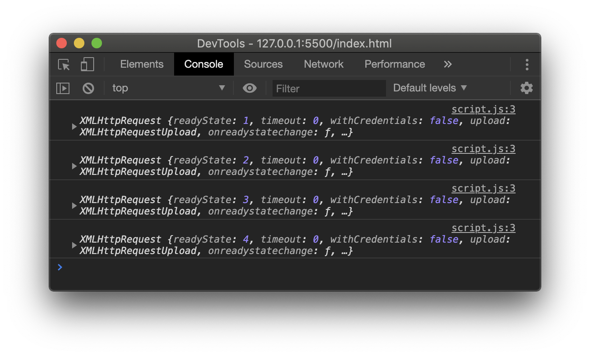

## Learning Objectives

- What is AJAX?
- How do you send an AJAX request in JavaScript?
- List advantages and disadvantages of using AJAX

## Overview

AJAX stands for **A**synchronous **J**avaScript **A**nd **X**ML. It's a way of retrieving data from a server after a webpage has loaded. Asynchronous means the process that triggers the request runs independently from the source code. Because of that, you have to track and manage the request and its subsequent response.


Credit: [AJAX Introduction - w3schools.com](https://www.w3schools.com/xml/ajax_intro.asp)

As seen in the diagram above, the browser creates and triggers an `XMLHttpRequest` and then the server sends a response back to the browser. You can then use JavaScript to manipulate the DOM and provide feedback to the user.

### XHR Object

To make your first AJAX request, you will use the `XMLHttpRequest` object.

```js
const request = new XMLHttpRequest();
```

There is an event listening property on the object called `onreadystatechange` that will be triggered every time the request updates to the browser.

```js
const request = new XMLHttpRequest();
request.onreadystatechange = function () {
  console.log(this);
};
```

:::tip What is `this`?
`this` in the code sample above refers to the `XMLHttpRequest` object. You can learn more about how the `this` keyword works on [MDN web docs - this](https://developer.mozilla.org/en-US/docs/Web/JavaScript/Reference/Operators/this)
:::

Now that you have the event listener defined, you have to specify what kind of request method you want to use. The most common HTTP request methods are as follows:

| Method   | Description                               |
| -------- | ----------------------------------------- |
| `GET`    | Requests data from a resource             |
| `POST`   | Sends data to create a new resource       |
| `PATCH`  | Sends data to update an existing resource |
| `DELETE` | Deletes a specific resource               |

For this lesson, we are going to stay focused on the `GET` method. You initialize the HTTP response method using the `open()` function. The first argument is the method type, the second argument is the URL to the resource.

```js
const request = new XMLHttpRequest();
request.onreadystatechange = function () {
  console.log(this);
};
request.open("GET", "./sample.txt");
```

Finally, you call the `send()` function to execute the request.

```js
const request = new XMLHttpRequest();
request.onreadystatechange = function () {
  console.log(this);
};
request.open("GET", "./sample.txt");
request.send();
```

### Creating a Server

A browser will only fetch data from a server. A simple way to simulate a server is using the [Live Server vscode extension](https://marketplace.visualstudio.com/items?itemName=ritwickdey.LiveServer). Once installed, run the `Live Server: Open with Live Server` command.

The browser will open and if you look at your console logs you will see the `this` contents from our function displays the following results.



You can see the requests logged multiple times, this means everything is working correctly. Now that we know it's working, there are a couple of items we need to address.

### State Change

When running the existing code, the `onreadystatechange` function fires multiple times. This is because there are multiple state changes on the request.

| Ready State | Description                            |
| ----------- | -------------------------------------- |
| 0           | Request not initialized                |
| 1           | Server connection established          |
| 2           | Request received                       |
| 3           | Processing request                     |
| 4           | Request finished and response is ready |

For our code sample, we will check that the ready state is finished and the response is ready by checking to see if the ready state is at `4`.

```js
const request = new XMLHttpRequest();
request.onreadystatechange = function () {
  if (this.readyState === 4) {
    console.log(this);
  }
};
request.open("GET", "./sample.txt");
request.send();
```

Running this code you will see that the console log only appears once after the response is ready.

#### Status Codes

Even though we received a response, it may contain an error message instead of the data we want. Luckily, the server adds a status code to every response. By looking at the status code, we can determine if the request was successful. There are many status codes, but an individual status code falls in one of these categories:

| Code    | Description       |
| ------- | ----------------- |
| 100–199 | Informational     |
| 200–299 | Successful        |
| 300–399 | Redirects         |
| 400–499 | Client errors     |
| 500–599 | and Server errors |

Our code will check for status 200, which is the standard status code for successful requests.

```js
const request = new XMLHttpRequest();
request.onreadystatechange = function () {
  if (this.readyState === 4 && this.status === 200) {
    console.log(this);
  }
};
request.open("GET", "./sample.txt");
request.send();
```

Congratulations! You made your first AJAX request! Looking back at our code, it was only 5 steps:

1. Create an `XMLHttpRequest` object
2. Add an `onreadystatechange` event handler function
3. Set your handler function to check for a final `readyState` and a successful `status`
4. `open()` the request
5. `send()` the request

### Fetch API

Another way is to use `fetch()`. The `fetch()` function is built into modern browsers. It simplifies the process of making AJAX requests and uses Promises to handle your asynchronous code.

Here is an example of using `fetch()` to make the same AJAX request:

```js
fetch("./sample.txt").then((response) => {
  console.log(response);
});
```

By default, `fetch()` makes `GET` requests. You pass in the URL to the resource you want. You chain a call to `.then()` and pass in your handler function.

What took 8 lines before only takes 3 with `fetch()`! Because it uses promises you also have more control of when and how you use the request data.

## Summary

AJAX is a powerful technique. It allows you to request data from the server without reloading the page. When combined with DOM manipulation, you can transform your static web pages into dynamic web applications with rich interactivity.

In this lesson, you learned two ways of creating AJAX requests: manually creating an `XMLHttpRequest` object and the much simpler `fetch()` function. You also learned how to use status codes to determine whether your request was successful. Finally, you got a sneak peek at using Promises for writing asynchronous code.

## Additional Resources

- [AJAX Introduction - w3schools](https://www.w3schools.com/xml/ajax_intro.asp)
- [Ajax (programming) - Wikipedia](<https://en.wikipedia.org/wiki/Ajax_(programming)>)
- [AJAX Getting Started - MDN web docs](https://developer.mozilla.org/en-US/docs/Web/Guide/AJAX/Getting_Started)
- [Introduction to fetch](https://developers.google.com/web/updates/2015/03/introduction-to-fetch)
