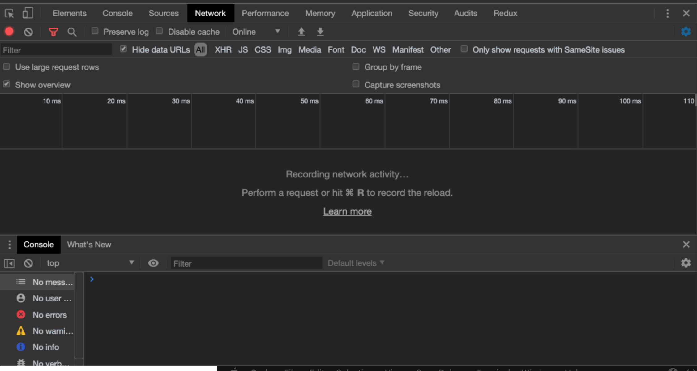
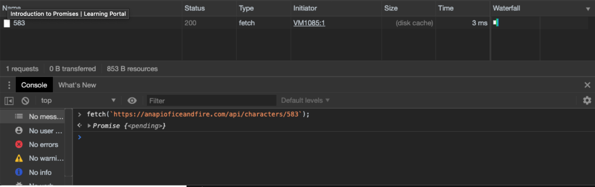
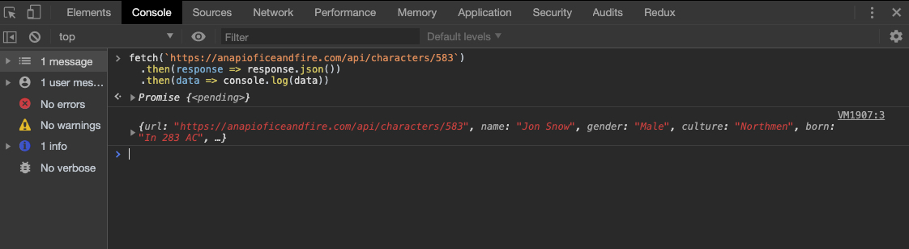
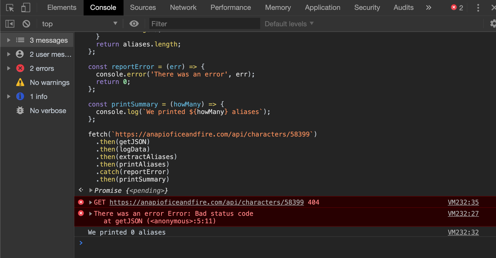

## Learning Objectives

After completing this section, you'll be able to:

- Use Promises to write cleaner, more readable asynchronous code.
- Use the browser's built-in `fetch()` function to retrieve data from a remote API.
- Build your asynchronous code as pipelines of pure functions, a.k.a. Promise chains.
- Wrap synchronous APIs in Promises to use in Promise chains.
- Coordinate multiple, interdependent Promise chains.
- Handle exceptions thrown inside of your functions.
- Use `Promise.all()` to wait for multiple Promises to finish.

### What is Asynchrony

> Asynchrony, in computer programming, refers to the occurrence of events independent of the main program flow and ways to deal with such events. These may be "outside" events such as the arrival of signals, or actions instigated by a program that take place concurrently with program execution, without the program blocking to wait for results. Asynchronous input/output is an example of the latter cause of asynchrony, and lets programs issue commands to storage or network devices that service these requests while the processor continues executing the program. Doing so provides a degree of parallelism. - [Wikipedia on Asynchrony (computer programming)](https://en.wikipedia.org/wiki/Asynchrony_%28computer_programming%29)

### What is a Promise?

A Promise...

- provides alternative to using callback for writing asynchronous code
- represents a value that will _eventually_ arrive
- is an object with a `.then()` method and a `.catch()` method
  - and it has a `status` property with one of the following values:
    - `pending`
    - `fulfilled`
    - `rejected`

### How do you use a Promise?

The easiest way to work with Promises is by using the browser's built-in `fetch()` function, which provides a convenient way to retrieve data from an API. `fetch()` does its work in the background, allowing your code to display fresh data without requiring the user to reload the page.

Open the Dev Tools and click on the Network panel. Press the `Escape` key to open the Console drawer. You will be able to write code in the Console while seeing the traffic in the Network panel.



Enter the following code in the Console:

@/lessons/building-interactive-uis/intro-to-promises/walkthrough-1.js

You should see something similar to this:



`fetch()` immediately returns a Promise, even though no data has been received from the server yet. At this point, the Promise's status is `pending`.

If it receives a valid value, the Promise moves to the `fulfilled` state. If there is a problem and an Exception is [thrown](https://developer.mozilla.org/en-US/docs/Web/JavaScript/Reference/Statements/throw), the Promise moves to the `rejected` state.

### How do you access the eventual value with `.then()`?

When `fetch()` requests data from the API, it creates a Promise object. The job of this Promise object is to wait for the API to send a response back. This allows the browser to continue running other code in the meantime.

You can give the Promise a list of instructions that it will execute whenever the response data has arrived. To do this, you call the Promise's `.then()` method, passing it a function that contains these instructions.

In addition, your function can expect to receive an argument. When working with `fetch()`, this argument is the `response` object. Using the `response` object, you can access the JSON data produced by the API.

Enter the following code to retrieve the JSON data from the `response`, and then `console.log()` it. (Make sure to brush up on [arrow function syntax](https://developer.mozilla.org/en-US/docs/Web/JavaScript/Reference/Functions/Arrow_functions#Function_body) before continuing.)

@/lessons/building-interactive-uis/intro-to-promises/walkthrough-2.js

We needed to call `.then()` twice: once to _access_ the JSON version of the data from the `response`, and a second time to _do something_ with that data.

Here is what you might see on the Console after running this new code:



:::tip
It may seem odd that you have to call `.then()` twice just to get to the data.

But this is because `fetch()` is primarily for making network requests, and it assumes that your code may need to the read the HTTP [headers](https://developer.mozilla.org/en-US/docs/Web/HTTP/Headers) or [status code](https://developer.mozilla.org/en-US/docs/Web/HTTP/Status).
:::

### Why do you pass a function to `.then()`?

`.then()` accepts a single argument: a function.

This design choice makes working with Promises flexible. Here is a modified version of the code that creates individual functions for retrieving the JSON from the `response` and for outputting the data to the Console. In addition, it adds functions that get the value of the `aliases` key and print each alias to the Console.

```js
const getJSON = response => response.json();

const logData = data => {
  console.log(data);
  return data;
};

const extractAliases = character => {
  const {aliases} = character;
  return aliases;
};

const printAliases = aliases => {
  for (let a of aliases) {
    console.log(a);
  }
};

fetch(`https://anapioficeandfire.com/api/characters/583`)
  .then(getJSON)
  .then(logData)
  .then(extractAliases)
  .then(printAliases)
```

It starts by defining helper functions, each of which does a small part of the processing of the data returned by the server. It culminates in a "Promise chain" that uses each function as part of a series of `.then()` calls.

The Promise chain now reads like a list of steps, written in plain English.

:::tip
`.then()` is an example of a "[higher-order function](https://eloquentjavascript.net/05_higher_order.html#h_xxCc98lOBK)" - a function that accepts another function as an argument and invokes that function as part of its work.
:::

### What should your function return?

You probably noticed that `logData()` also `return`s the data that it prints out. Why is that necessary?

Any function that is part of a Promise chain _must return a value_. This value will be passed to the next function in the chain.

:::warning
If a function does not `return` a value, the next function in the Promise chain will receive `undefined` as its argument.
:::

In the code sample, each function in the Promise chain receives whatever value is returned by the previous function.

### How do you handle Exceptions in a Promise chain?

There are number of things that could go wrong when making a request to the API:

- no network connection
- server returns a bad status code
- server sends back an empty response

The first of these is "truly exceptional" - if there's no network connection, there's no chance of getting any data back.

For the other two, you did receive a valid response from the server, but it doesn't contain anything useful for your application.

In all of these cases, your Promise chain will need some error handling code.

Add the following code that adds the `reportError()` helper function and adds it to the Promise chain using the `.catch()` method

```js{19-21,23,28}
const getJSON = response => response.json();

const logData = data => {
  console.log(data);
  return data;
};

const extractAliases = character => {
  const {aliases} = character;
  return aliases;
};

const printAliases = aliases => {
  for (let a of aliases) {
    console.log(a);
  }
};

const reportError = () => {
  console.error('There was an error');
};

fetch(`https://badbadbad.anapioficeandfire.com/api/characters/583`)
  .then(getJSON)
  .then(logData)
  .then(extractAliases)
  .then(printAliases)
  .catch(reportError)

```

Notice that on line 23, we have intentionally set the URL to a non-existent hostname. This will trigger an Exception to be thrown, skipping over the `.then()`s and jumping to the `.catch()` on line 28.

:::tip
When an Exception is thrown in a Promise chain, the code "fast-fowards" to the nearest `.catch()`, skipping all of the `.then()`s in between.
:::

### How do you provide a fallback value with `.catch()`?

The function you pass to `.catch()` can also `return` a value to any `.then()`s that come after it.

Let's add a function to the end of the Promise chain that reports a summary of how many aliases a specific character has. Make sure to change the domain name back to the working version first.

```js{17,22,25-27,35}
const getJSON = response => response.json();

const logData = data => {
  console.log(data);
  return data;
};

const extractAliases = character => {
  const {aliases} = character;
  return aliases;
};

const printAliases = aliases => {
  for (let a of aliases) {
    console.log(a);
  }
  return aliases.length;
};

const reportError = () => {
  console.error('There was an error');
  return 0;
};

const printSummary = (howMany) => {
  console.log(`We printed ${howMany} aliases`);
};

fetch(`https://anapioficeandfire.com/api/characters/583`)
  .then(getJSON)
  .then(logData)
  .then(extractAliases)
  .then(printAliases)
  .catch(reportError)
  .then(printSummary)

```

`printAliases` now returns the length of the `aliases` array. When there are no Exceptions thrown, the `.catch()` never runs and this value is passed to `printSummary`.

Try your code again, but with a gibberish domain name. This time, the `.then()`s are skipped, the `.catch()` runs, returning `0` to the Promise chain. The `0` is passed to the next `.then()` and `printSummary` receives it.

### How do you throw a custom Exception?

Each of your functions has the opportunity to inspect its argument and determine if an error has occurred. Continuing with our `fetch()` example, we can modify the `getJSON()` function so that it checks the value of `response.status`. If the `status === 200`, then we choose to return the JSON data.

The `reportError()` function can also be modified to receive the `Error` object that was thrown.

To make sure it works, we can change value at the end of the URL so that it is outside the valid range for the API.

```js
const getJSON = response => {
  if (response.status === 200) {
    return response.json();
  } else {
    throw new Error('Bad status code');
  }
};

const logData = data => {
  console.log(data);
  return data;
};

const extractAliases = character => {
  const {aliases} = character;
  return aliases;
};

const printAliases = aliases => {
  for (let a of aliases) {
    console.log(a);
  }
  return aliases.length;
};

const reportError = (err) => {
  console.error('There was an error', err);
  return 0;
};

const printSummary = (howMany) => {
  console.log(`We printed ${howMany} aliases`);
};

fetch(`https://anapioficeandfire.com/api/characters/58399`)
  .then(getJSON)
  .then(logData)
  .then(extractAliases)
  .then(printAliases)
  .catch(reportError)
  .then(printSummary)

```

When you run this code in the Console, you should see the following:



Our `.catch()` shows our custom `Error` message and returns `0` to the Promise chain.

### How do you write a function that returns a Promise?

Many newer APIs return Promises, but you may need to "wrap" some older APIs in Promise-friendly code to use them together.

Imagine that you want to use `localStorage` as a cache for your API data. The first time you need a value, you request it from the API and save it to `localStorage`. Every time you need it afterwards, you can retrieve it from `localStorage`.

Lets combine this with what you've just learned about custom Exceptions and fallback values.

Here's the syntax for creating a Promise:

@/lessons/building-interactive-uis/intro-to-promises/walkthrough-7.js

This Promise isn't very useful, as it only ever produces the number `42`.

When creating a new Promise, you pass it an [executor function](https://developer.mozilla.org/en-US/docs/Web/JavaScript/Reference/Global_Objects/Promise#Parameters). The executor function is a function that expects to receive two arguments: `resolve` and `reject`.

Inside of the executor, you can write any valid JavaScript code. But at some point, you must call either `resolve()` or `reject()` so that the promise can change its `status`.

If you call `resolve()`, the first `.then()` in the Promise chain will be triggered. If you call `reject()`, the first `.catch()` will be triggered.

With that in mind, you can write a function that creates a Promise which `resolve()`s to a value retrieved from `localStorage`.

@/lessons/building-interactive-uis/intro-to-promises/walkthrough-8.js

We make sure to `return` our new Promise, so that we can chain `.then()` calls onto the end of `loadFromStorage()`.

Inside the executor function, we write code that looks for a value in `localStorage`. If we find a valid value, we convert it from a JSON string into a JavaScript value, and pass that value to `resolve()`. If we don't find a valid value, we call `reject()` and pass it the key we were looking for.

In order to use our new `loadFromStorage()` function with the rest of our Promise chain, we'll need to modify our existing code just a bit. First, instead of starting the Promise chain with our `fetch()`, we start it with `loadFromStorage()` since that's the first place we want to look for the data.

If we don't find what we're looking for in `localStorage`, we need to `fetch()` the data from the API. To do that, we'll create a new function called `retrieveFromAPI()` that expects to receive the ID of the character and uses that as part of the URL.

We'll use a `.catch()` instead of a `.then()` with `retreiveFromAPI()`, since it should only be called if `loadFromStorage()` needs to `reject()`.

@/lessons/building-interactive-uis/intro-to-promises/walkthrough-9.js

### When do I need to nest my functions (vs chaining)?

In the previous code sample, you might have noticed that we `return` the result of calling `fetch()`, but we're also chaining a `.then()` onto it.

We _nest_ the call to `getJSON()` inside of our `retrieveFromAPI()` because we want to return the result of this "mini" Promise chain.

You might be tempted to do the following, but it won't work:

@/lessons/building-interactive-uis/intro-to-promises/walkthrough-10.js

Why not? If we do find the correct value in `localStorage` and we do not `reject()`, the first `.then()` is called. The problem is that the first `.then()` invokes `getJSON()` which expects to work with a `response` object.

Since the value coming from `localStorage()` is not a `response`, our code will throw another exception and the next `.catch()` will be triggered.

Here is the correct version of our code so far:

@/lessons/building-interactive-uis/intro-to-promises/walkthrough-11.js

### How do you wait for many Promises to provide values?

For the final example, imagine that you want to retrieve the allegiances (the houses they are loyal to) for a character. Currently, the API provides you with an array of URLs, with each URL pointing to the detailed information for a single house.

First, you could write a function that can do a `fetch()` and `getJSON()` for a single house:

@/lessons/building-interactive-uis/intro-to-promises/walkthrough-12a.js

`fetchHouse()` [implicitly returns](https://developer.mozilla.org/en-US/docs/Web/JavaScript/Reference/Functions/Arrow_functions#Function_body) the Promise chain produced by the `fetch()`.

We can now use that function to transform an array of URLs into an array of Promises in a new `retreiveHousesFromAPI()` function.

@/lessons/building-interactive-uis/intro-to-promises/walkthrough-12b.js

Notice that the function returns the result of passing our `fetchArray` to `Promise.all()`.

`Promise.all()` returns a Promise that will resolve after _all_ of the Promises in the array are resolved.

The `retrieveHousesFromAPI()` function can be used in conjunction with two more functions: one to extract the `allegiances` array from a character object, and another that replaces `allegiances` with the data from the API.

@/lessons/building-interactive-uis/intro-to-promises/walkthrough-12c.js

In `addHousesToCharacter()`, we chain a `.then()` onto our call to `retrieveHousesFromAPI()` and pass it an anonymous function. That anonymous function receives the array that is resolved by `Promise.all()`.

:::tip
`Promise.all()` preserves the order of the array of Promises that you pass to it. The function you pass to `.then()` will receive an array whose values correspond to the original array of Promises.
:::

### Conceptual: Pros and Cons

What are some advantages and disadvantages of using Promises vs Callbacks?

- Callbacks are best for smaller programs that do not involve multiple asynchronous steps. In these cases, breaking your code into pure functions can be tedious and less readable.
- Though it takes more effort up front, Promises are cleaner for complex asynchronous code, especially when multiple, interdependent steps are needed. Additionally, because each step is a pure function, it is more modular, allowing teams to reorder,refactor, and debug individual steps.

## Additional Resources

### Further Reading

#### Articles about Promises

- [Javascript Promises Explained](https://www.macadamian.com/learn/javascript-promises-explained/)
- [How its implemented](https://github.com/then/promise/blob/master/src/core.js)
- [How Javascript Promises actually work from the inside out](https://www.freecodecamp.org/news/how-javascript-promises-actually-work-from-the-inside-out-76698bb7210b/)
- [Promises explained with real life analogies](https://codeburst.io/javascript-promises-explained-with-simple-real-life-analogies-dd6908092138)
- [Promises, with runnable code](https://www.geeksforgeeks.org/javascript-promises/)

##### The Event Loop (Video)

<iframe width="560" height="315" src="https://www.youtube.com/embed/8aGhZQkoFbQ" frameborder="0" allow="accelerometer; autoplay; encrypted-media; gyroscope; picture-in-picture" allowfullscreen></iframe>
