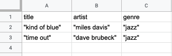

### Overview

Here are some questions you might have asked while shopping, listening to music, or reading social media:

- What new books got the most 5-star ratings in the last month?
- In order of popularity, what artists have the most-played song this week?
- What tags have had the most active posts in the last 24 hours?

By now, you know that as you use a web application, your browser is sending Requests to the server and receiving Responses:

On a typical social media site, users have friends and make posts. An individual post might get lots of comments and likes from other users. Once you have a few thousand regular users, there are hundreds of thousands of posts, comments, and likes created every hour. How would you build a site that handles a constant flow of data like this?

First, you need a piece of software that was made to manage this kind of data. While we could do it manually in JavaScript using Objects and Arrays, it wouldn't perform nearly as well or as reliably as a _Database Management System_ (DBMS). A DBMS does two things for us: it stores our data and it has a dedicated language for working with that data.

The most popular database language is the Structured Query Language, abbreviated as _SQL_. A DBMS that uses SQL is referred to as a "SQL Database" - examples include MySQL, Oracle, Microsoft SQL Server, and PostgreSQL.

:::tip How do you say "SQL"?
You will hear some developers say "ess queue el" while others say "sequel".

Either is fine, as there is no single, correct pronounciation. In this lesson, we'll treat the word _SQL_ as though it were pronounced "sequel", with phrases like:

> "We create a SQL database using the following command."

Check out [this discussion on stackexchange.com](https://softwareengineering.stackexchange.com/questions/8588/whats-the-history-of-the-non-official-pronunciation-of-sql) for more details.

:::

In this lesson, we'll use PostgreSQL, an extremely popular, [open source](https://en.wikipedia.org/wiki/Open_source) DBMS.

:::tip How do you say "PostgreSQL"?
"_post-GRES-que-ell_" per the [PostgreSQL FAQ](https://www.postgresql.org/about/press/faq/).

But many developers just say "post-GRES".
:::

### Terminology

Spreadsheets and databases share similar terminology, which we'll use throughout the lesson.



If we were managing our music collection in a spreadsheet, we might say:

- We have one **sheet** for all of our albums on vinyl (and we might have another for CDs, another for 8-tracks, etc.)
- There are **columns** for different kinds of information, such as "title", "artist", and "genre"
- Each **row** holds the information for one album

Translating that to databases, we would say:

- We have one **table** for all of our albums on vinyl (and we might have another for CDs, another for 8-tracks, etc.)
- There are **columns** for different kinds of information, such as "title", "artist", and "genre"
- Each **row** holds the information for one album

### Installing PostgreSQL

The easiest way to install PostgreSQL on macOS is to download [Postgres.app](https://postgresapp.com/downloads.html)


After downloading, do the following to install:

1. Move Postgres.app to your Applications folder
1. Open your Applications folder, find Postgres.app and double click it
1. Click "Initialize" to create a new server
1. Configure your `$PATH` to use the command line tools:

```sh
sudo mkdir -p /etc/paths.d &&
echo /Applications/Postgres.app/Contents/Versions/latest/bin | sudo tee /etc/paths.d/postgresapp
```

### Notes on writing SQL

You might notice a few things about SQL code:

- Whitespace does not matter.
- It is case insensitive.

Many tutorials show command words in all caps and may omit the linebreaks and indentation.

:::tip What's a schema?
A [schema](https://en.wikipedia.org/wiki/Database_schema) is a description of the structure of the database.
Our `schema.sql` will hold all of our `create table` statements. Every time we make a change to this file, we'll run `npm run db:reset` to recreate the database.
:::

### Summary

In this lesson, you learned how to create the database tables in SQL for a simple social media site. You gave the columns of your tables appropriate data types.

You created "belongs to", "has many", and "many to many" relationships using Primary Keys and Foreign Keys. Based on the kind of relationship you wanted to create, you learned to place the Foreign Key in the correct table.

To create more complex relationships, you created Linking Tables. You wrote SQL that queried multiple tables using subqueries and joins.

In addition to inserting and selecting data, you learned how to update and delete data. Finally, you learned how to manage deletions when Foreign Keys tie data together.

## Additional Resources

- [PostgreSQL Tutorial](https://www.postgresqltutorial.com/) - Excellent guide to basic, intermediate, and advanced topics
- [PostgreSQL Tutorial: Data Types](https://www.postgresqltutorial.com/postgresql-data-types/)
- [PostgreSQL Tutorial: Joins](https://www.postgresqltutorial.com/postgresql-joins/) - An overview of different kinds of joins
