> The name "git" was given by Linus Torvalds when he wrote the very first version. He described the tool as "the stupid content tracker" and the name as (depending on your mood):
>
> - random three-letter combination that is pronounceable, and not actually used by any common UNIX command. The fact that it is a > \* mispronunciation of "get" may or may not be relevant.
> - stupid. contemptible and despicable. simple. Take your pick from the dictionary of slang.
> - "global information tracker": you're in a good mood, and it actually works for you. Angels sing, and a light suddenly fills the room.
> - "goddamn idiotic truckload of sh\*t": when it breaks

[Source](https://github.com/git/git/blob/68812df3100aa5b2cbdd9ee72b1e8bbee8e8a0b1/README.md#git---fast-scalable-distributed-revision-control-system)

## Learning Objectives

After completing this lesson, you will be able to:

1. Manage revisions of your code using git
2. Synchronize your local code repository with GitHub

## Lesson

### Overview

When working on your code, you save regularly. But there will be times you wish you could go back to a previous change beyond what a simple "undo" can give you. Or you may find that you want to work on a copy of your code, while leaving its current state safely preserved.

Version Control Systems (VCS) were created to handle these very situations.

In this lesson, we'll introduce two different ways of using version control:

- Commit source code
- Revert and reset previous commits
- Create separate branches of your code
- Merge changes from two branches
- Resolve conflicting changes when merging

We'll use a program called `git` as our VCS - it's extremely powerful and the most widely used in the industry. Though we'll only be managing code written by a single developer, its real strength lies in its collaboration tools. We'll learn about these in a future lesson.

### Configuring git

Since git is made for tracking changes made by multiple collaborators, each change will be attributed to a particular developer.

Let's make sure git can do that by letting git know who you are. Run the following commands, but with your name and your email address:

```sh
git config --global user.name "Firstname Lastname"
git config --global user.email myaddress@example.com
```

### Using git

Even if you're not working with other developers, git can help you manage versions of your code in two ways:

- Restore old versions of your code
- Create alternate versions of your code and switch between them

#### The git workflow, visually

When working with git, you'll make changes to your files as normal. Then you'll add some or all of these changes into git's staging area. Finally, you'll _commit_, or save, a snapshot of the staging area in the repository.

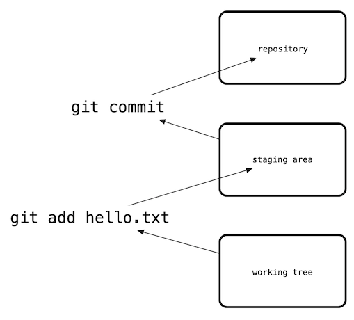

Even though the bulk of your development work will be editing files on your hard drive (or in git's terminology, in the _working tree_), it is important to regularly commit snapshots as your code changes.

#### Creating a repository

The first step is to create a _repository_, which is a directory that git will watch for changes. You can turn any directory into a git repository by running `git init`. For this lesson, we'll create a new directory from scratch:

```sh
mkdir git101
cd git101
git init
```

This creates a "local" repository (or simply "repo"), meaning that it only exists on your computer. (Later in this lesson, we will walk through the steps to make this repo public.)

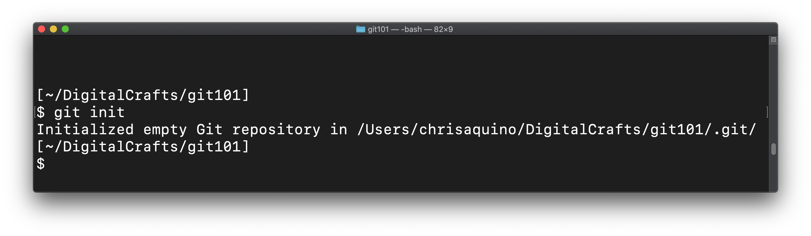

After running `git init`, git reports that it has initialized a new repository in the current directory.

:::tip A repo is a directory with a `.git`
When you ran `git init`, the message shows that it created a new directory named `.git`. This is the directory that git uses to manage the different versions of your code.

Other than the exisence of this directory, there's nothing special about a repo.
:::

Run the following command to ask git about the current state of the repository.

```sh
git status
```

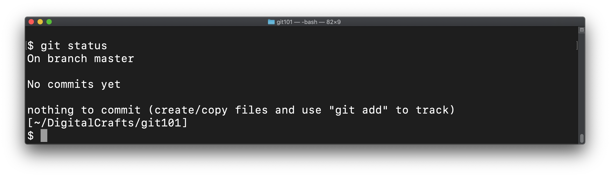

Congratulations! You've successfully created a git repo and are ready to start tracking changes to files.

#### Adding and committing changes

Let's create a file in our repo:

```sh
echo "Hello git" > hello.txt
```

This command puts the text `"Hello git"` into our new `hello.txt` file. Run `git status` again. git informs you that it is aware of the file, but that it currenlty isn't tracking it:

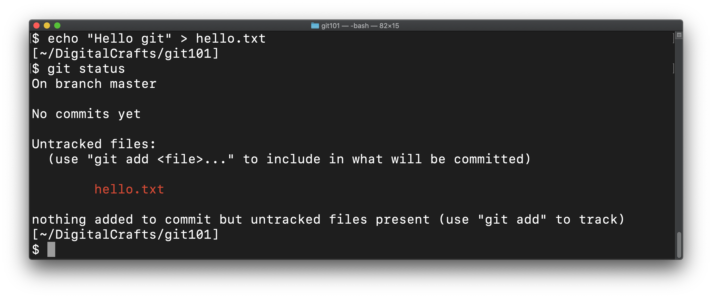

Tell git to start tracking changes to `hello.txt` using the `git add` command:

```sh
git add hello.txt
```

Run `git status` again. git shows that this change will be _committed_, which is similar to taking a snapshot of the files.

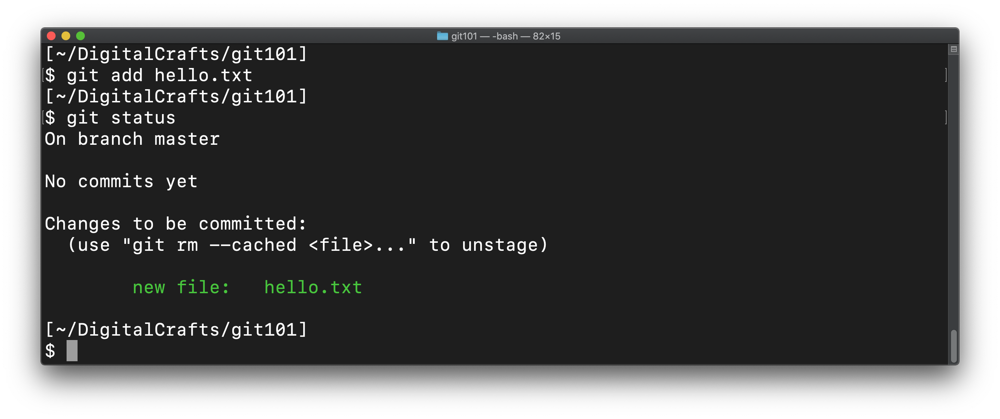

Make the commit using `git commit` and provide a description of the contents of the commit:

```sh
git commit -m "adds traditional welcome message"
```

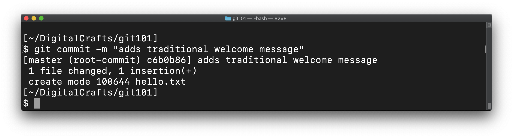

:::tip Writing a good commit message
It is best to keep commit messages short and to start them with a present-tense verb.

When viewing a list of commits during code review, the reviewer knows precisely what changes were made by each individual commit.

For example:

- adds automated end-to-end tests for authorization
- uses stronger encryption for password field
- adds username and password fields to database
- displays login form instead of protected content
- creates login form in HTML
:::

Now that you've committed those changes, check the status of your git repo:

```sh
git status
```

You should see that there are no changes to commit:

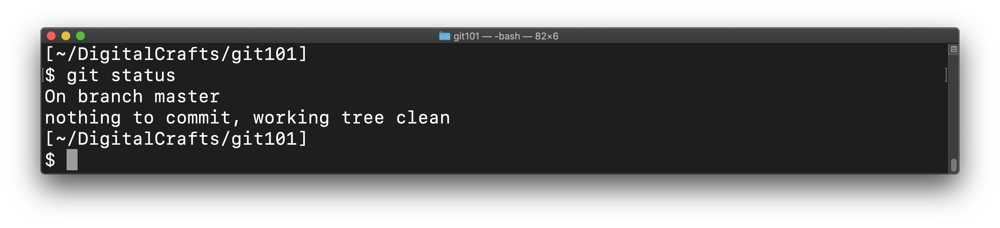

#### Committing subsequent changes

So far, you have created a single commit to your repository. Let's add more changes to your repo. Create a new file with the following command:

```sh
echo "Goodbye" > bye.txt
```

And make an additional change to our `hello.txt` file:

```sh
echo "Pleased to meet you" >> hello.txt
```

`git status` should reflect those changes:

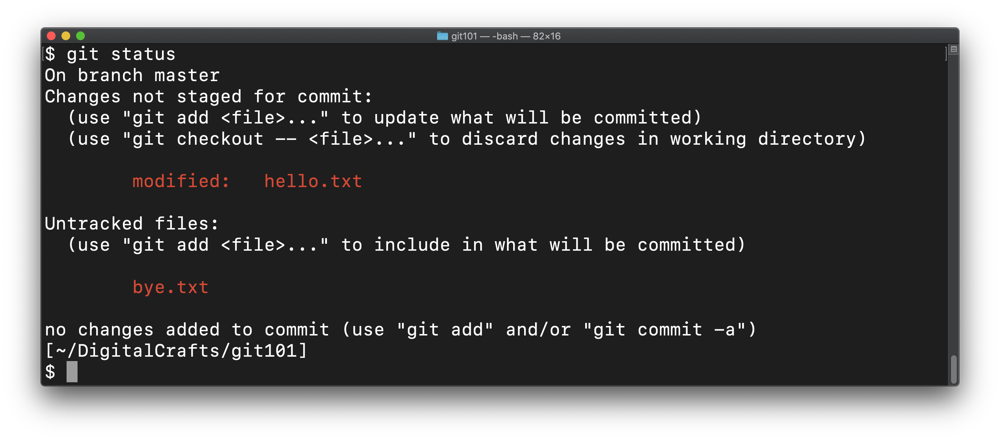

Add `bye.txt` and `hello.txt` to the staging area, and then commit using `git commit -m`:

```sh
git add bye.txt
git add hello.txt
git commit -m "adds changes to hello.txt and bye.txt"
```

:::warning git tracks changes, not files
One thing that confuses new users of git is that they need to continue to `git add` for the same file paths. This is because git knows that the file has changed, but it will not automatically include the file path in the next commit.

As you get more used to git, you pick and choose the changes that go into an individual commit.

For example, you might make unrelated changes before making a commit, perhaps one is a bug fix, and another is a documentation change. You might choose to split these into two separate commits.
::::

:::tip Add and commit in single command
The previous code example could have been written like so:

```sh
git add bye.txt
git commit -am "adds changes to hello.txt and bye.txt"
```

The `-a` flag tells git to automatically add changes to any files it is already tracking. We did not have to `git add hello.txt` to include it in the commit.

The `-a` flag is the short version of `--all`.
:::

#### Fixing a commit message

Even the most experienced developers make mistakes. Let's say you run the following command:

```sh
git commit -m 'adds awesome slolution'
```

But before you notice the typo, you press the `Enter` key. Not to worry, you can change the message on the last commit with the following command:

```sh
git commit --amend -m 'adds awesome solution'
```

The `--amend` option tells git to replace the last commit message with the new one.

#### Viewing a log of commits

You can view record of your commits using the following command:

```sh
git log
```

You should see two entries in the log:

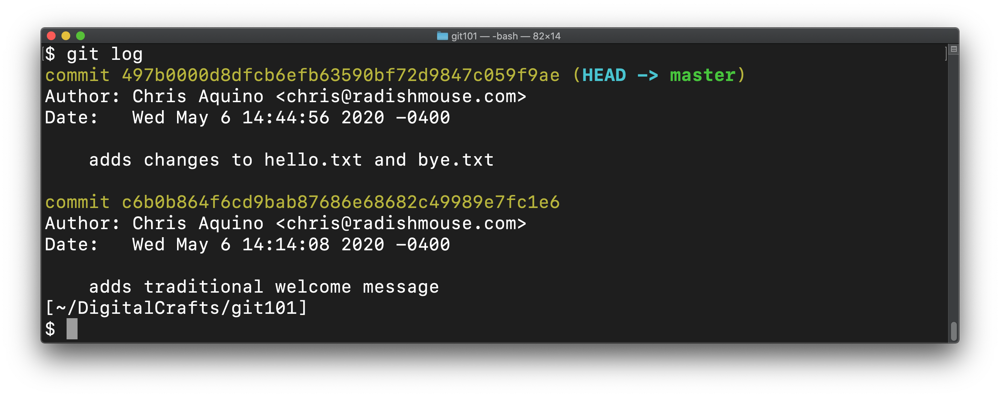

:::tip Press `q` to quit the log
If your terminal window is small, git may only be able to show you a few lines of the log at a time.

You can use the `PageUp` and `PageDown` keys to move up and down when viewing a longer `git log`.

When you are finished viewing the log and want to return to the bash prompt, press `q` on your keyboard.
:::

In addition to the author, the date, and the commit message, you should see a _commit ID_, also referred to as the _hash_ A hash is a unique identifier generated using a mathematical function. The commit ID is sometimes called the "SHA" (which is the name of the algorithm used to generate the hash).

When there are many commits, it can be useful to view a condensed version of the log:

```sh
git log --oneline
```


Each line shows the first 7 characters of the hash and the commit message. We'll use the hash in the next section. The important thing to understand is that a hash is universally unique. The first 7 characters are enough to distinguish one commit from another, even for commits that contain the exact same changes.

It can be useful to visualize a sequence of commits like this:

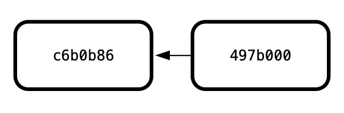

Each commit is a snapshot of changes since the previous commit. The previous commit is referred to as the _parent_ commit. In our example repository, commit `c6b0b86` is the parent of commit `497b000`.

### Undoing changes

Using git, there are two ways to undo changes you make to your files:

- _revert_ - add a new commit that change your files back to a previous state
- _reset_ - remove commits and erase the changes that they made

In either case, you must tell git which commits you want to undo. Again you have two options:

- use the hash to identify a specific commit you want to go back to
- or tell git how many commits you want to go back.

Let's look at these techniques now.

#### `git revert`

In the output from `git log --oneline`, you may have noticed that the most recent commit also carries the designation `HEAD`. To "undo" this most recent commit, run the following:

```sh
git revert HEAD --no-edit
```

The `--no-edit` command line option means that you want to accept the default message for the commit.

Run this command on your repo.

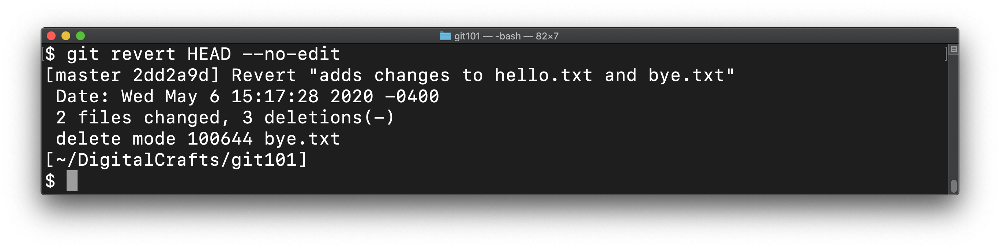

Check the status of the repo and list the files in your directory.

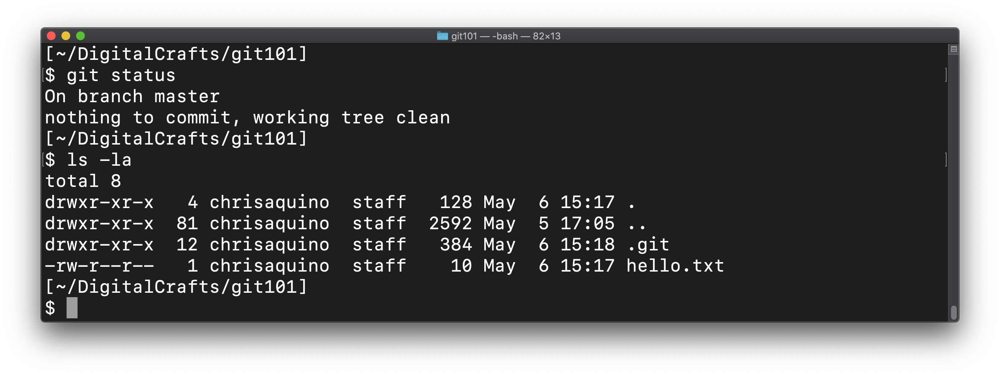

If you view the contents of `hello.txt`, you'll see that it only contains the text "Hello git"; the text "Pleased to meet you" was removed from the file when you executed the `git revert`:

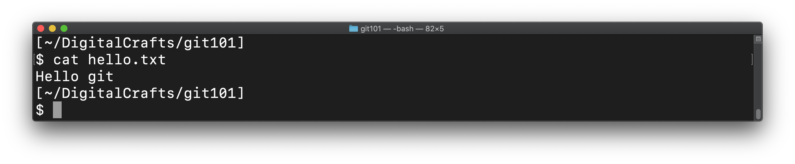

To find out exactly what happend, run `git log --oneline`:

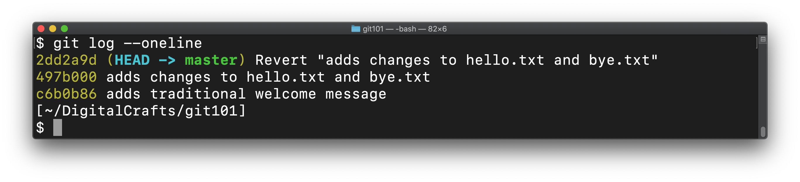

You can see that git adds a new commit that makes the _opposite_ changes of the last commit.

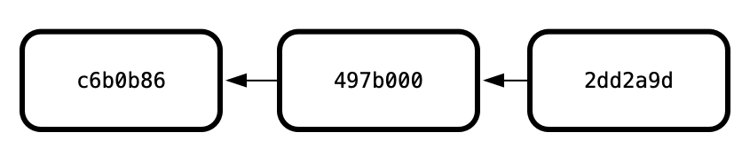

:::tip
`HEAD` always refers to the current commit and you can use it as a reference point.

The commit prior the current one is `HEAD~1`. The commit before that one is `HEAD~2`.

The syntax is similar to calculating an array index: `HEAD~4` is `current index minus 4`.

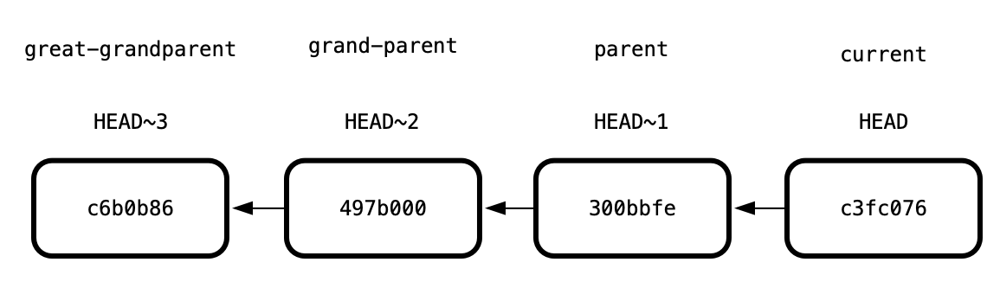

You can read more about [Relative references](https://www.atlassian.com/git/tutorials/refs-and-the-reflog?section=special-refs#relative-refs) on the Atlassian.com site.
:::

#### `git reset`

`git revert` is convenient when you want a record of all of the changes in a repo. On the other hand, if you want to delete commits without preserving them, use `git reset` to go back to a particular commit. Let's delete the most recent commit.

We currently have 3 commits. Two of them came from creating and modifying the files `hello.txt` and `bye.txt`. The third one was added when we ran `git revert`. Let's go back to the second commit, which will delete the third one.

(Your hashes will be different than the ones shown, so make sure to substitute the values accordingly.)

```sh
git reset 497b000
```

git tells us that there are changes that need to be committed:

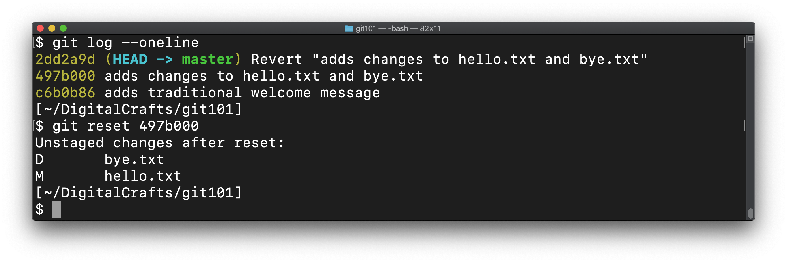

What this means is that git left the files on the hard drive alone - `bye.txt` is still deleted and `hello.txt` still only has the text "Hello git". We can either commit those changes (canceling the `git reset`) or we can throw the changes away (finalizing the `git reset`).

To throw the changes away, run `git stash`:

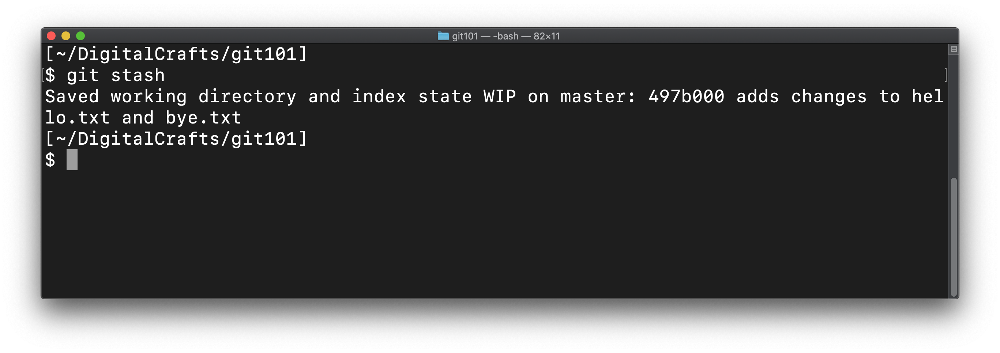

After running that command, our repo only contains 2 commits:

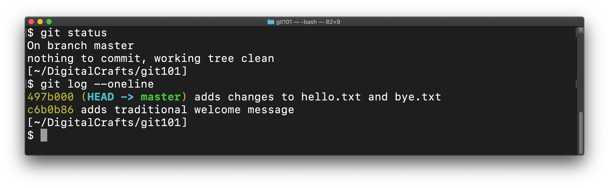

Our commits, visually:


:::tip The stash keeps changes for later
By using `git stash` we aren't _really_ throwing away our changes.

Instead, git records the current state of the working tree and changes your files back to their previous state.

If we want to re-apply those changes to our files at a later time, we can run `git stash apply`.
:::

:::warning Destructively resetting
We've shown you a safer (though more complicated) way of using `git reset`. It gives you a chance to retrieve your changes from the stash in case you've made a mistake.

The destructive version of our reset is the command `git reset --hard 497b000`

This immediately applies the changes to our files without giving us the opportunity to review or stash them. Use with caution.
:::

:::tip The staging area
When you `git add` a file path, git moves the file path to "the staging area" - that is, the list of file paths to be included in the next commit.

It is more formally known as _the index_, but it might be useful to think of it as a staging area or a waiting room.

If you accidentally add a path to the staging area, you can _unstage_ it using `git reset hello.txt`.
:::

### Using branches

The ability to go back to a different revision of your code is a huge win for a developer. But git also gives you the ability to switch between entirely different _versions_ of our code.

These versions of your code are known as _branches_. You can view the available branches using the following command:

```sh
git branch
```

At the moment, our repo only has a single branch, whose default name is `master`:

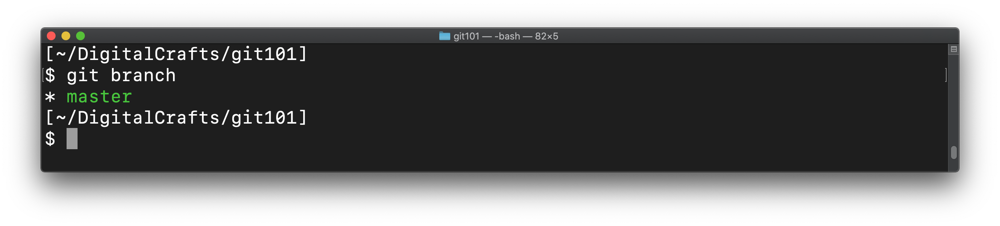

:::tip Renaming "master" to "main"
A better name for the default branch is "main" and many organizations are choosing this for their new projects, including GitHub.

To configure git to use "main" as the default name for any new repos, run this command:

```sh
git config --global init.defaultBranch main
```

This will not affect any of your existing repos. To make that change, use this command when your terminal is in one of those repo directories:

```sh
git branch -m master main
```

:::

To create a new branch, run `git branch` again, but provide it with the name of the branch you'd like to create:

```sh
git branch digitalcrafts/experiment
```

In this example, we create the new branch with the name `digitalcrafts/experiment`.

:::tip Branch naming
It is a common practice to prefix your branch name with your name. This help identify branches when you are working on a project with other developers.
:::

Running `git branch` again shows our new branch:

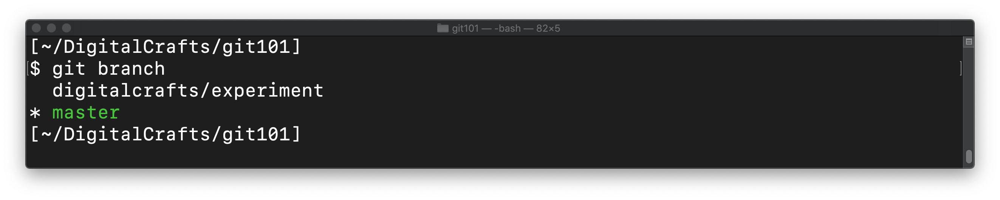

To use our new branch, run `git checkout` and provide the branch name:


`git branch` now shows that we are "on" our new branch:

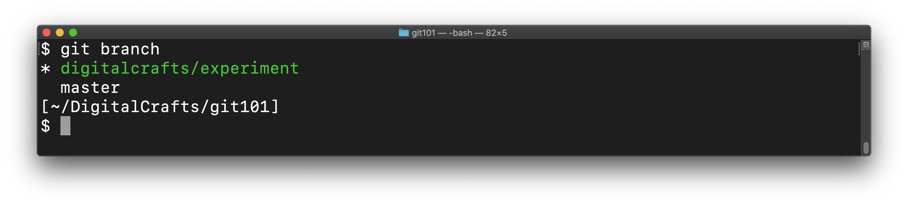

A diagram of our commits would show two branches, but they have the exact same commits:

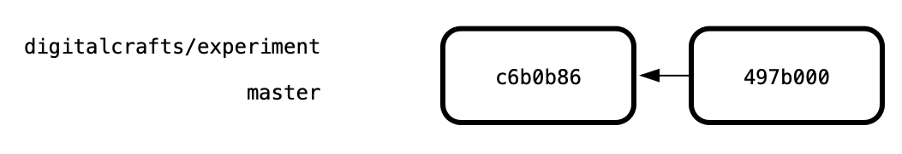

#### Committing changes to your branch

You can change your code and commit the changes, just as you did before. But the commits will only affect the current branch.

To demonstrate, we'll add two commits: one that changes `bye.txt` and one that creates a new file `hello-again.txt`.

```sh
echo "farewell" >> bye.txt
git commit -am "adds additional text to bye.txt"
echo "oh hey I didn't see you there" >> hello-again.txt
git add hello-again.txt
git commit -m "creates additional greeting file"
```

View the log and confirm that the two new commits exist:

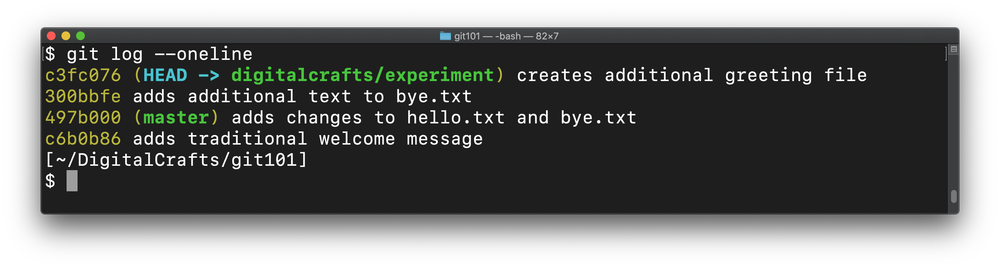

A visualization of the log shows that `digitalcrafts/experiment` has four commits in total. The first two commits are the same ones that live on the `master` branch:


In theory, that makes sense, but how can you confirm that these changes are isolated to your experimental branch?

#### Switching back to the `master` branch

Earlier, you changed from `master` to `digitalcrafts/experiment` using the `git checkout` command. You can use `git checkout` to return to the `master` branch:

```sh
git checkout master
```

You can use `git branch` confirm that you have successfully switched back to `master`:

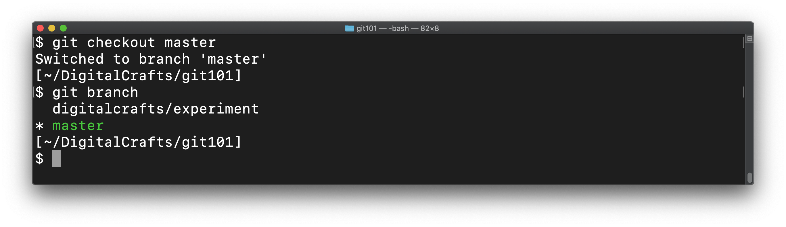

Run `ls` and `cat` to confirm that the files are in the same state as before:

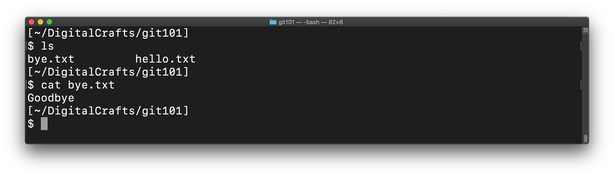

When you switch to the master branch, the files on the hard drive are changed to match the last commit on the master branch. Using `git log --oneline` shows that `HEAD` is pointing to the last commit before we created `digitalcrafts/experiment`:

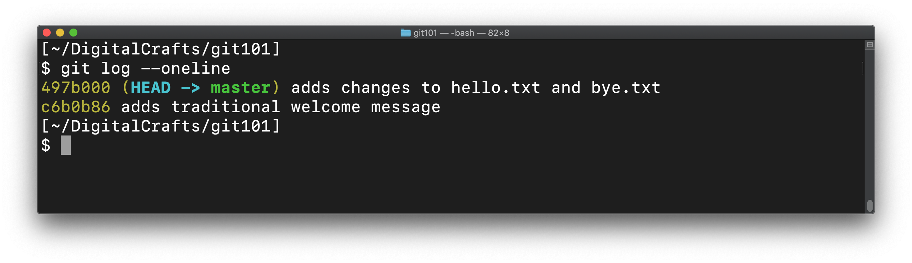


When you switch back to your feature branch, git will change the files to match:

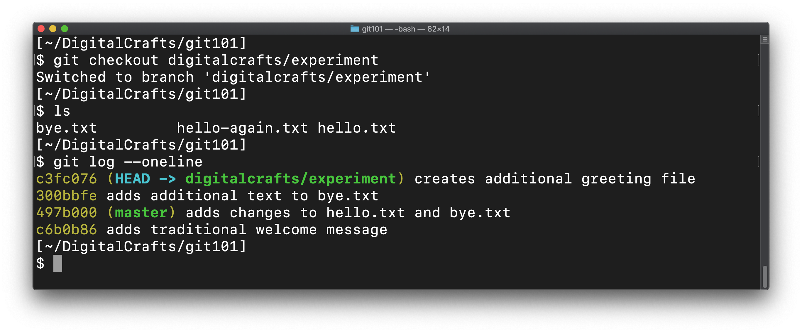


This is one way that git manages versions of your code. You can literally have different copies of the same code and switch between them.

:::tip The working tree
In git terminology, the files and directories in your repo are known collectively as _the working tree_

When you move the `HEAD` to a specific commit using `git reset` or you switch to a branch using `git checkout`, git will update the contents of the working tree to match.
:::

Ideally, you will use branches to isolate changes to your code, whether you are implementing a new feature or fixing a bug. When you are ready to incorporate those changes into `master` by _merging_ the commits.

#### Merging

To copy the new commits from `digitalcrafts/experiment` to `master`, do the following:

```sh
git checkout master
git merge digitalcrafts/experiment
```

Running these two commands should show the following:

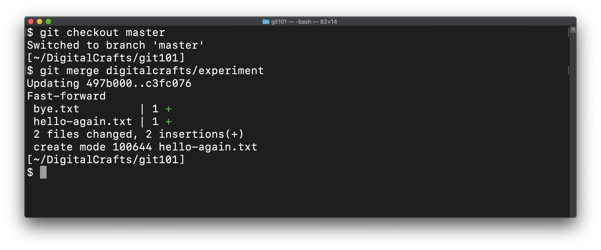

This kind of merge is known as a _fast-foward_. This is ideal, in that git only has to copy the commits and then apply the changes to the working tree.

Checking the directory with `ls` and viewing the `git log` shows that `master` has been updated:

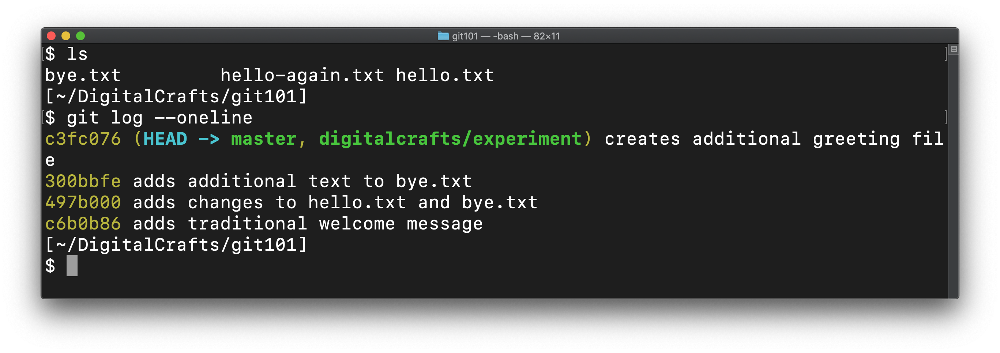

After merging, both branches contain the same commits:

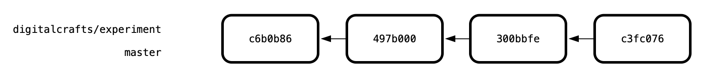

Sometimes a fast-forward isn't possible. git will determine whether it can simply apply the new commits, or if there are conflicting changes.

#### Resolving conflicts

As a demonstration, we'll make a new commit to `master` and a new commit to `digitalcrafts/experiment`. In each commit, we'll make different changes to `hello.txt`.

First, make the changes to `master`:

```sh
# Using a single ">" which completely overwrites hello.txt
echo "this is a change from master" > hello.txt
git commit -am "replaces contents of hello.txt"
```

Then, `checkout` the `digitalcrafts/experiment` branch and make different changes:

```sh
git checkout digitalcrafts/experiment

# Using double ">>" to append to hello.txt
echo "adding new stuff to the file" >> hello.txt
git commit -am "adds to hello.txt"
```

At this point, our two branches have diverged:

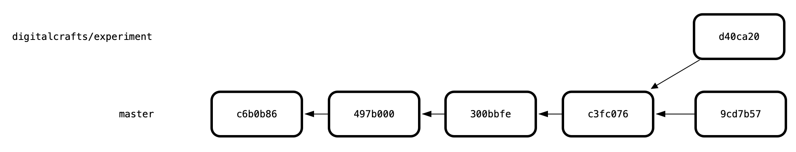

Return to `master` and try to merge `digitalcrafts/experiment`.

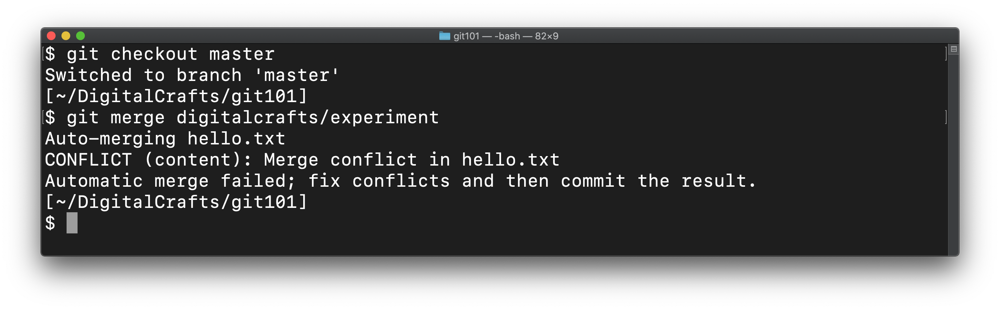

If you `cat hello.txt`, you'll see the following:

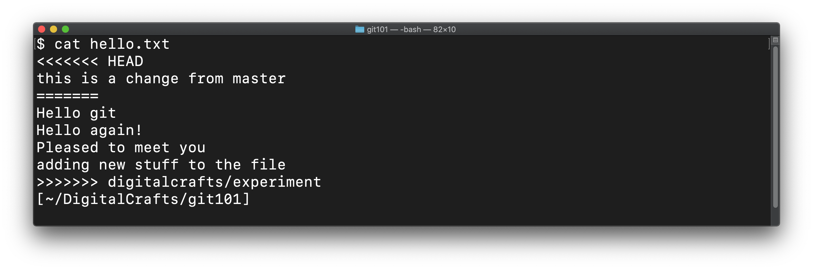

The text `<<<<<<< HEAD`, `=======`, and `>>>>>>> digitalcrafts/experiment` are git's way of indicating what text came from which branch. These are known as _code fences_.

The lines between `<<<<<<< HEAD` and `=======` are from the `master` branch.

The lines between `=======` and `>>>>>>> digitalcrafts/experiment` are from the `digitalcrafts/experiment` branch.

At this point, git wants you to manually edit the file. Remove the lines you do not want, as well as the code fences that git added. In this demontration, we'll keep the first two lines from the `digitalcrafts/experiment` branch:

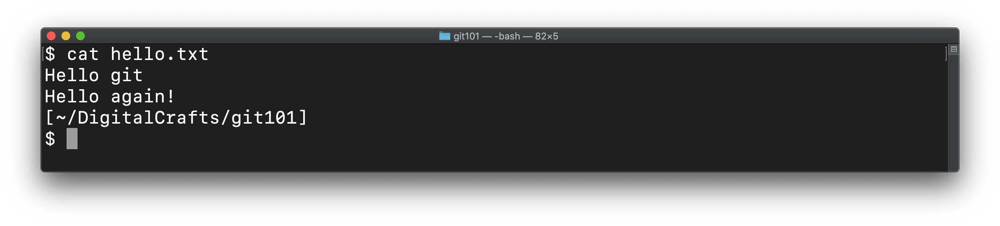

The only thing left to do is to `git add` the changes to `hello.txt` and then commit those changes:

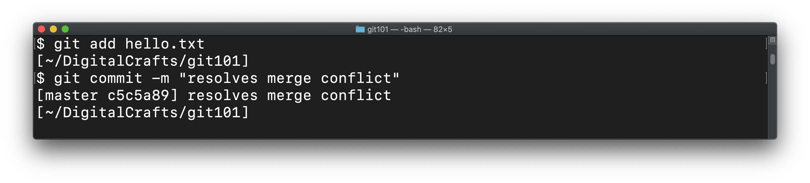

Finally, you can view the log to see that master contains the new commit from `digitalcrafts/experiment` as well as the commit you made to resolve the conflict:

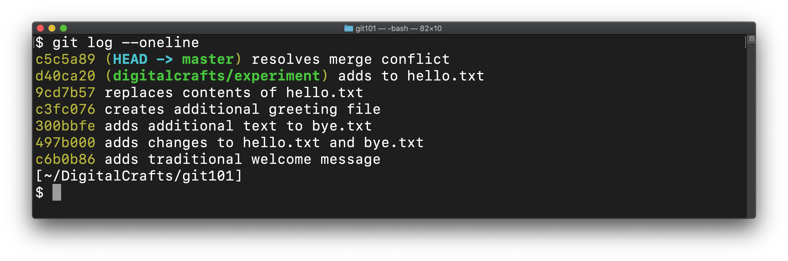

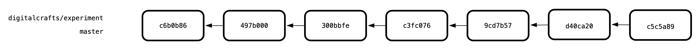

## Summary

In this lesson, you learned how to create a local git repo using `git init`. You created new files and tracked changes to these files by using `git add` and `git commit`. You switched to older revisions using `git revert` and `git reset`, and you created parallel versions of your code using `git branch` and `git checkout`.

## Interview Questions

### Fundamentals

- What is source control?
- How do you create a git repository?
- What commands store snapshots of your code?
- What is the difference between `git revert` and `git reset`?
- How do you use branches?
- How do you create a GitHub pull request?

### Bugfix

This screenshot shows a sequence of commands that ends up in a failure to commit. What did the developer forget to do?

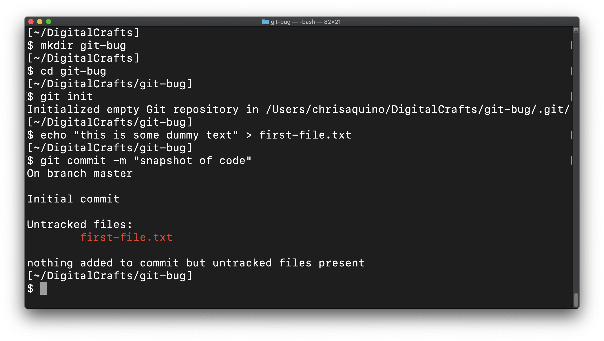

### Conceptual

- How is `git` different from GitHub?

## Additional Resources

- [Git Website](https://git-scm.com/) - the official website of git.
- [Learn Git Branching](https://learngitbranching.js.org/) - a visual tutorial for common tasks, including advanced topics.
- [Git from the Bottom Up](https://jwiegley.github.io/git-from-the-bottom-up/) - a free book about git, starting from first principles.
- [Dangit, Git!?!](https://dangitgit.com/) - a cheatsheet for solving common mistakes with git

### Develop Yourself Podcast

<!-- markdownlint-disable no-inline-html -->
<iframe style={{ borderRadius:"12px" }} src="https://open.spotify.com/embed/episode/2HpNy3CgwQgj49spwzNvMl?utm_source=generator" width="100%" height="352" frameBorder="0" allowfullscreen="" allow="autoplay; clipboard-write; encrypted-media; fullscreen; picture-in-picture" loading="lazy"></iframe>
