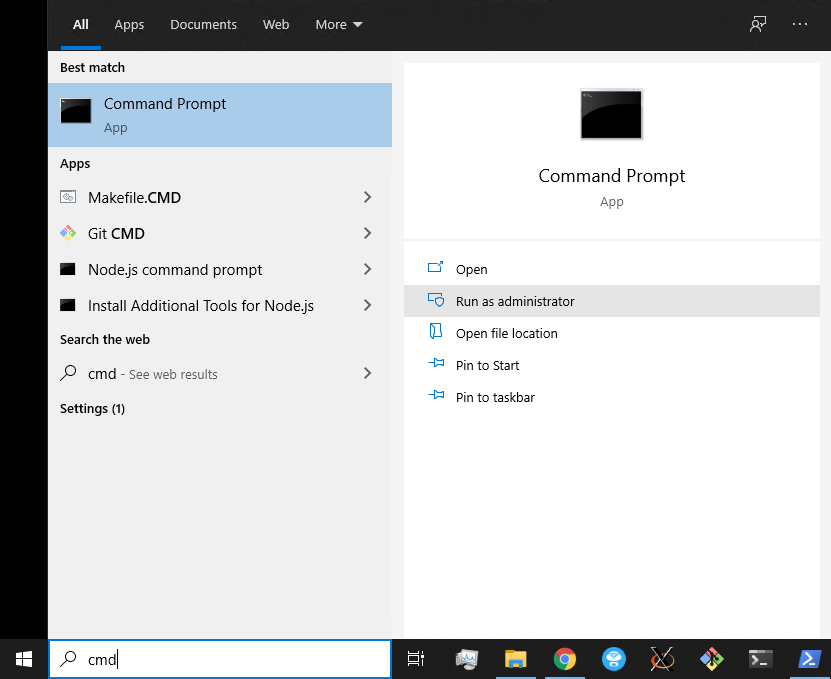
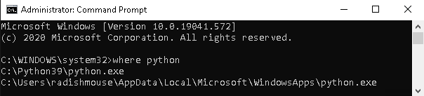
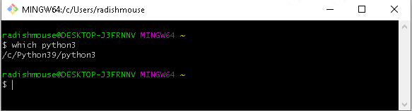

Python is one of the most popular languages in the world. It is used by web developers, scientists, digital artists, and security experts.

It originated as a language for teaching beginners, but designed to be a powerful tool in the hands of a professional. We use it in class because:

- Its syntax is clear and simple compared to other languages
- It forces you to format your code well
- The error messages are descriptive (and easily used in a Google search!)

There is a good chance that Python3 is already installed on your computer. To check, type this in a bash terminal:

```sh
which python3
```

You might see output similar to the following:

```sh
/usr/local/bin/python3
```

If there is no output (and it just shows you your prompt again), please follow the installation instructions in this guide.

:::danger Python2 is no longer supported
Though you can run many (but not all) of the code samples using Python2, it is not recommended.

- Support ended in January 2020
  - i.e., It no longer receves bug fixes or security updates
- It contains language design flaws fixed by Python3

If you choose to use Python2, you won't be able to follow all of the code examples as shown in the Learning Portal. There will be times you'll need to translate from Python3 to Python2. (Be prepared to do some extra debugging!)
:::

## Installing Python

There are a few different ways to install Python, and a few specific options for various operating systems (MacOS, Windows, Linux). However, for our purposes, the easiest solution is to use the default Python installer.

That can be [downloaded here](https://www.python.org/downloads/). Download the file to your local machine and run the installer.

### Creating the File Alias

In the Python developer community, we refer to the Python3 program as `python3`. You'll see that command in our lessons as well as tutorials you'll find online.

Unfortunately, Windows 10 already has a program named `python3`, but it only opens the Microsoft Store (even if you've already installed Python3).

To make sure you can run your scripts with the right program, we'll create a file alias (also known as a _symbolic link_).

Note: You can only do this from `cmd.exe` (not from PowerShell or from Git Bash).

To open a `cmd.exe` window as Administrator:

- In the search bar, type `cmd`
- In the menu to the right, click `Run as administrator`



At the prompt, find the location of your Python3 installation:

```sh
where python
```

It will print out two paths. For example, on one instructor's computer, it listed the following:



The one that is _not_ in the `WindowsApps` directory is the one installed by `choco`.

`cd` to that directory (omitting `python.exe`):

```sh
cd C:\Python39
```

Then run the `mklink` command to create the symbolic link:

```sh
mklink python3.exe python.exe
```

Here, you are creating an alias named `python3.exe` that points to `python.exe`.

### Updating Git Bash

The next step is to make sure Git Bash can locate the `python3.exe` command. Open Git Bash and run the following command to edit `.bash_profile` in VS Code:

```sh
code .bash_profile
```

add `python3` to your `PATH`:

```sh
export PATH=$PATH:/c/Python39/
```

Close your Git Bash window and open a new one. Run the following command and confirm that Git Bash can find `python3`:

```
which python3
```

It should echo the path (though it will be formatted like a UNIX path, not a Windows path):


