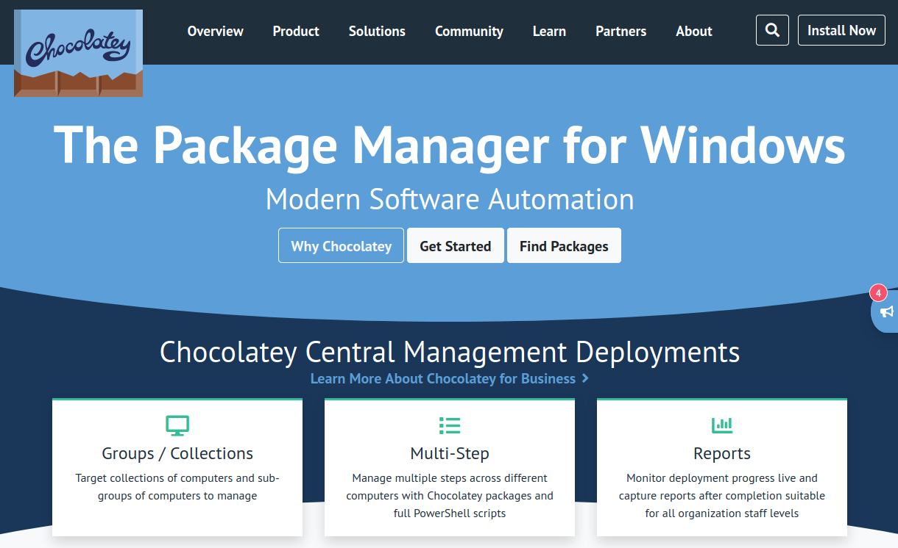

# Setting Up Your Dev Environment

## Overview

There are five primary tools you'll use during your time at DigitalCrafts:

- The Visual Studio Code text editor
- The Google Chrome web browser
- A Terminal app
- A package manager for your Operating System
- The Node.js development environment

This lesson will guide you through downloading and installing these tools. The other lessons in the Learning Portal will show you how and when to use them.

## Visual Studio Code

Visit the [Visual Studio Code download site](https://code.visualstudio.com/download) to get an installer for your Operating System.


Download and install the Visual Studio Code text editor (also known as "VS Code" or just "Code"). VS Code is an open-source text editor created by Microsoft. It has some of the best features of many similar editors like Sublime Text and Atom, but with better support, bi-monthly updates, and a plethora of robust extensions.

:::danger You want VS Code, not Visual Studio IDE!
Make sure you're downloading "Visual Studio Code" and not "Visual Studio"

Though they are named similarly, Visual Studio is a much larger program and uses more resources. It will not run as well as VS Code for the kinds of projects we'll build during the bootcamp.
:::

:::details macOS Additional Steps

**1. Move VS Code to your Applications folder**

Be sure to move VS Code from your Downloads folder into the Applications folder! VS Code will not work properly if you run it from your Downloads folder.

**2. Install the Shell Command**

While working on a project, you'll open VS Code from the command line to edit files. To do so, you'll first need to install the VS Code command line tool.

Open VS Code and press `Command + Shift + p` (that is, press these three keys at the same time: `Command`, `Shift`, and `p`) to open the Command Palette.

In the Command Palette, type the text "shell command". The top result should be `Shell command: Install 'code' command in PATH`. Make sure this result is highlighted and then press the `return` key.


You should see a notification in the lower right of the VS Code window telling you that the shell command was successfully installed.


With the command line tool install, you can open files and folders in VS Code directly from the Terminal using the `code` command.
:::

## Google Chrome

If you don't have Chrome on your computer, go to the [Google Chrome download page](https://www.google.com/chrome/).


Download and install Chrome.

Chrome is the browser of choice for web developers. It provides a fast browsing experience, support for the newest APIs, and cutting-edge developer tools.

## Command Line Tools

If you're like most folks, you have a microwave in your kitchen. When you want to heat something up, you put it in and press a few buttons. Magic!

However, in a prefessional chef's kitchen, they have an assortment of specialized tools. Not only that, they've spent years becoming experts in using those tools to create dazzling culinary effects.

Up to now, most (if not all) of the programs you've used are "apps" - you press or tap buttons to make it work, just like a microwave. But what do you do if there's no button for the feature you want?

You (and other developers) use the _terminal_.


As a developer, you'll be spending quite a lot of time using a terminal. There's a separate [introduction to the command line](/lessons/dev-fundamentals/cli-101/#learning-objectives), but this part of the lesson will walk you using the terminal to install some necessary development tools.

The first of these tools is a _package manager_. You can think of it like an App Store, but for command line programs.
To get started, go to the section matching your Operating System:

- [macOS](#macos)
- [Windows 10](#windows-10)
- [Linux](#linux)

### macOS

#### Package Manager: Homebrew

Paste this command into a terminal and press the `enter` (or `return`) key:

```
/bin/bash -c "$(curl -fsSL https://raw.githubusercontent.com/Homebrew/install/master/install.sh)"
```

It's going to take a while, so get a cup of coffee -- or better yet! Help another student if they've hit a rough patch.

Once it's finished, let's try installing a program. The `tldr` program (which is short for ["too long; didn't read"](https://en.wikipedia.org/wiki/Wikipedia:Too_long;_didn%27t_read)) gives you a cheat sheet for common terminal commands.

```bash
brew install tldr
```

When you run this command, you'll see some activity in your terminal similar to the following:


Now, you can run `tldr` to see a cheatsheet. Here's the output of running `tldr ls`:


:::tip Use `tldr` when you get stuck!

There are a lot of commands to get familiar with, and it's easy to forget how to use them. When you can't quite recall how to use a command, remember `tldr`. Here are some other cheatsheets you can view now:

- `tldr cd`
- `tldr mv`
- `tldr mkdir`
  :::

#### git

Your Mac should already have the `git` command installed. To check, run this command in the terminal:

```
which git
```

You should see output like:

```sh
/usr/bin/git
```

If so, that's great! Move on to the next step.

If it didn't print anything at all, it means that you'll need to install git. You can do that with Homebrew by running this command:

```
brew install git
```

#### nvm and Node.js

:::warning
There should be no previous version of Node installed on your computer. If you do, follow these [instructions to uninstall](https://gist.github.com/nicerobot/2697848) it.
:::

And then...

In order to install Node.js, you'll need to first install `nvm`. nvm is a Node.js version manager, which is the way we recommend you install Node.js. It allows you to install and use different versions of Node.js. This is important when you need to maintain projects that rely on a specific version of Node.js.

Though it seems more complicated than it needs to be, that's how it is is the software world. Let's walk through it step by step.

Install nvm by pasting in this command into your terminal:

```bash
curl -o- https://raw.githubusercontent.com/nvm-sh/nvm/v0.35.2/install.sh | $SHELL
```

and then press the `return` key.

**Close this terminal** and open a new one.

In the new terminal window, run this command:

```sh
nvm install --lts
```

Press the `return` key to run the command.

You should see that nvm is downloading and installing the latest version of node!

#### Bonus Software

Here are two more programs that you might find useful.

##### Window Manager: Rectangle

[Download Rectangle](https://rectangleapp.com/)

Download and install Rectangle for your Mac. It's free and lets you position and rearrange windows via keyboard shortcuts.

You can also install via homebrew:

```bash
brew cask install rectangle
```

##### Terminal Emulator: iTerm2

[Download iTerm2](https://iterm2.com/)

Download and install iTerm2 for your Mac. It's like a supercharged Terminal program that allows you to split screen your terminal windows, easily load tabs, and loads of other cool stuff!

### Windows 10

#### Package Manager: Chocolatey

[Chocolatey](https://chocolatey.org/) is community-driven package manager for Windows 10.



[To install](https://chocolatey.org/install), open a `PowerShell` window as Administrator.


Then, paste in the following command:

```
Set-ExecutionPolicy Bypass -Scope Process -Force; [System.Net.ServicePointManager]::SecurityProtocol = [System.Net.ServicePointManager]::SecurityProtocol -bor 3072; iex ((New-Object System.Net.WebClient).DownloadString('https://chocolatey.org/install.ps1'))
```

At the prompt, press `y` and then `Enter`.

:::tip Always use an Administrator PowerShell to use `choco`

In the next step, you'll install `Git Bash`, which you'll use when working on exercises and projects.

But any time you need to run `choco install`, you must do it from an Administrator PowerShell.

Then, after you install a package in an Administrator PowerShell, you can use the newly installed commands from `Git Bash`.
:::

#### Git Client and Bash Terminal

Most of the lessons in the Learning Portal show commands made for `bash`-style terminals. The main reason for this is that it is ubiquitous across macOS and Linux (including the vast majority of servers on the internet).

To get the same experience on Windows 10, you'll install the `Git Bash` terminal, along with the `git` program.

In your Administrator PowerShell, run the following command to install both Git and Git Bash:

```sh
choco install git -y
```

After a few minutes, you'll have a `Git` folder in the Start Menu. Inside, you'll find a `Git Bash` program. We recommend you pin it to the Taskbar so you can quickly open it at any time.

#### Node.js

In an Administrator PowerShell, run the following command:

```sh
choco install nodejs-lts
```

##### Configuring the Bash Terminal

Open Git Bash from the Taskbar (or the Start Menu) and run the following command:

```sh
code .bash_profile
```

This will open VS Code and allow you to access the Node.js installation from Git Bash.

Add the following line in VS Code:

```sh
export PATH=$PATH:/c/Program\ Files/nodejs/
```

Save the file and close the tab in VS Code.

You'll need to close any open `Git Bash` tabs and open a new one to access the aliases.

### Linux

#### Package Manager

On Linux, you've already got a package manager installed by default. However, _which_ package manager depends on which [Linux distribution](https://en.wikipedia.org/wiki/Linux_distribution) you're using,

In the terminal, enter the following command:

```sh
cat /etc/os-release
```

You might see one of the following names:

- Ubuntu
- Debian
- Arch Linux
- Fedora

(If you don't see yours here, and you installed Linux yourself, you probably already know how to use your package manager.)

We'll list installation commands for the following package managers:

- `apt` (Debian or Ubuntu)
- `pacman` (Arch Linux)
- `dnf` (Fedora)

**Make sure to use the command that matches your package manager!**

To update your installed packages:

- `sudo apt update && sudo apt upgrade -y`
- `sudo pacman -Syu`
- `sudo dnf upgrade`

#### Git

To install git:

- `sudo apt install git`
- `sudo pacman -S git`
- `sudo dnf install git`

Confirm that the installation was successful by running:

```sh
which git
```

It was successful if it prints something like:

```
/bin/git
```

#### nvm and Node.js

In order to install Node.js, you'll need to first install `nvm`. nvm is a Node.js version manager, which is the way we recommend you install Node.js. It allows you to install and use different versions of Node.js. This is important when you need to maintain projects that rely on a specific version of Node.js.

Though it seems more complicated than it needs to be, that's how it is is the software world. Let's walk through it step by step.

Install nvm by pasting in this command into your terminal:

```bash
curl -o- https://raw.githubusercontent.com/nvm-sh/nvm/v0.35.2/install.sh | $SHELL
```

and then press the `return` key.

**Close this terminal** and open a new one.

In the new terminal window, run this command:

```sh
nvm install --lts
```

Press the `return` key to run the command.

You should see that nvm is downloading and installing the latest version of node!

Confirm that the installation was successful by running:

```sh
which node
```

It was successful if it prints something like:

```
/home/radishmouse/.nvm/versions/node/v12.19.0/bin/node
```
