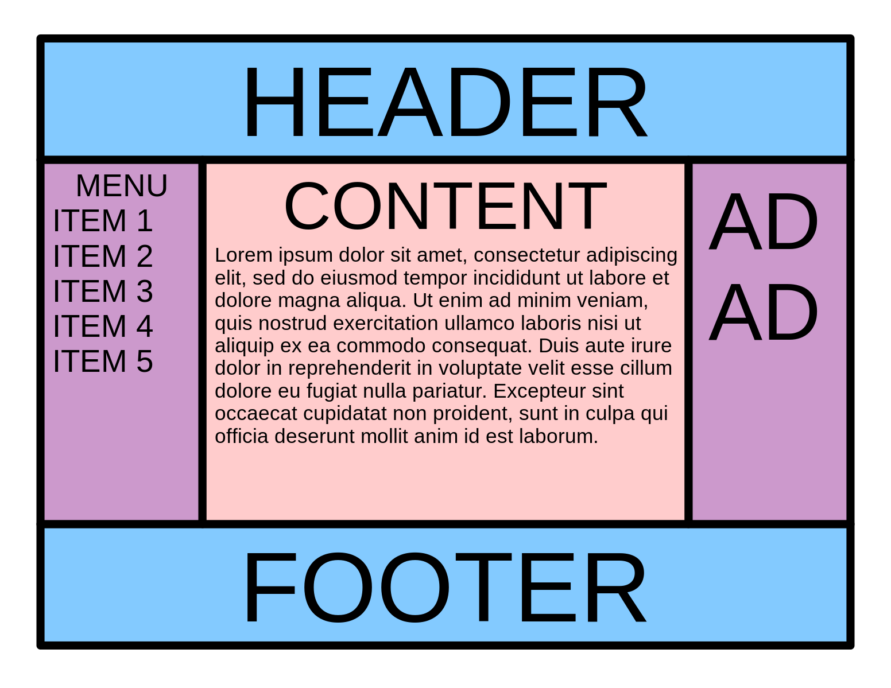
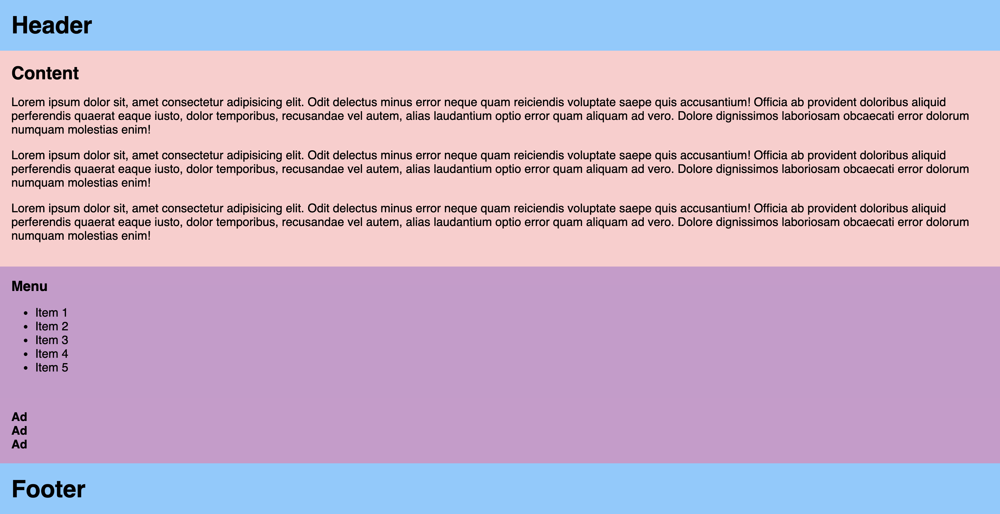
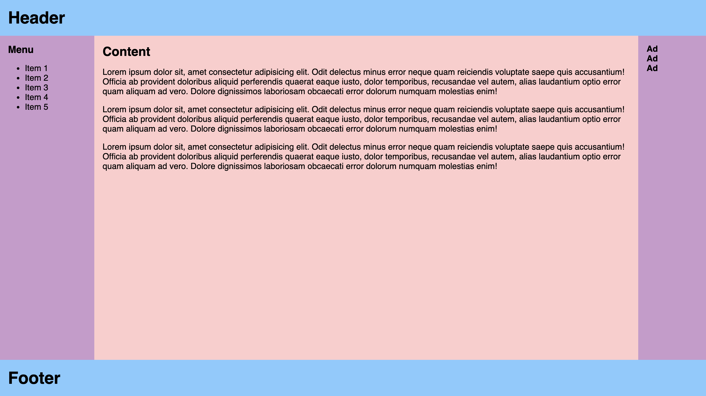

# Flexbox

## Learning Objectives

After completing this lesson, you will be able to use the Flexbox layout module to do the following things:

- Align and distribute HTML elements (items) vertically and horizontally
- Adjust the size and flow of items
- Evenly distribute and fit items in a container
- Reorder items
- Perfectly center an item vertically and horizontally with Flexbox
- Create the holy grail layout

## Lesson

### Overview

> The Flexbox Layout (Flexible Box) module (a W3C Candidate Recommendation as of October 2017) aims at providing a more efficient way to lay out, align and distribute space among items in a container, even when their size is unknown and/or dynamic (thus the word "flex")
>
> [A Complete Guide to Flexbox | CSS Tricks](https://css-tricks.com/snippets/css/a-guide-to-flexbox/)

Basically, Flexbox is a CSS module that allows you to create layouts in a more simple and flexible way than previous solutions like using `float` and `position` to rearrange items manually. With Flexbox, the container element tells the browser how to distribute, align, and space the children elements automatically.

Here are a few main advantages to Flexbox:

- Simple HTML
- Allows vertical alignment (which wasn't possible before Flexbox)
- Allows even column heights (and make responsive)

Here is a visual overview of Flexbox and how it works:


<small>_Image Credit: [A Complete Guide to Flexbox | CSS Tricks](https://css-tricks.com/snippets/css/a-guide-to-flexbox/)_</small>

#### Basic Example

Here is a basic example of Flexbox using the default properties.

```html
<div class="container">
  <div>1</div>
  <div>2</div>
  <div>3</div>
</div>
```

```css
.container {
  display: flex;
}
```

<div class="container" style="display:flex; background-color: #eee; margin: 20px 0; border-radius: 6px;">
  <div style="background-color: #fff; margin: 10px 0 10px 10px; padding: 20px 30px; font-size: 20px; border-radius: 6px;">1</div>
  <div style="background-color: #fff; margin: 10px 0 10px 10px; padding: 20px 30px; font-size: 20px; border-radius: 6px;">2</div>
  <div style="background-color: #fff; margin: 10px 0 10px 10px; padding: 20px 30px; font-size: 20px; border-radius: 6px;">3</div>
</div>

As you can see, the container element is given a `display: flex` CSS property and the children elements are arranged from left-to-right.

:::tip
Flexbox only effects direct children elements, any elements nested deeper are not effected by the top container's Flexbox properties.
:::

### Container Properties

#### `display`

Flexbox is made up of CSS properties on the container and children elements. As seen in the example above, you put `display: flex` on the container element for all the direct children to be flex content.

#### `flex-direction`

Values: `row` (default), `row-reverse`, `column`, or `column-reverse`

Flex direction determines the direction of the content, also known as the axis. The horizontal axis (X) is called "row" and the vertical axis (Y) is called a "column". Notice that both can be reversed by prefixing `-reverse` on either property.

```css
.container {
  display: flex;
  flex-direction: row-reverse;
}
```

<div class="container" style="display:flex; background-color: #eee; margin: 20px 0; border-radius: 6px; flex-direction: row-reverse;">
  <div style="background-color: #fff; margin: 10px 10px 10px 0; padding: 20px 30px; font-size: 20px; border-radius: 6px;">1. flex</div>
  <div style="background-color: #fff; margin: 10px 10px 10px 0; padding: 20px 30px; font-size: 20px; border-radius: 6px;">2. direction</div>
  <div style="background-color: #fff; margin: 10px 10px 10px 0; padding: 20px 30px; font-size: 20px; border-radius: 6px;">3. row-reverse</div>
</div>

#### `flex-wrap`

Values: `no-wrap` (default), `wrap`, or `wrap-reverse`

The `flex-wrap` property determines what flex items will do when they occupy more space then the container's width. By default, the items will not wrap and continue in the same direction no matter the width of the parent container. If you want the items to wrap onto a new line, you can use the `wrap` value as well as the `wrap-reverse` for a similar effect (in reverse).

```css
.container {
  display: flex;
  flex-wrap: wrap;
}
```

<div class="container" style="display:flex; flex-wrap: wrap; background-color: #eee; margin: 20px 0; border-radius: 6px;">
  <div style="background-color: #fff; margin: 10px; padding: 20px 30px; font-size: 20px; border-radius: 6px;">🍬</div>
  <div style="background-color: #fff; margin: 10px; padding: 20px 30px; font-size: 20px; border-radius: 6px;">🍬</div>
  <div style="background-color: #fff; margin: 10px; padding: 20px 30px; font-size: 20px; border-radius: 6px;">🍬</div>
  <div style="background-color: #fff; margin: 10px; padding: 20px 30px; font-size: 20px; border-radius: 6px;">🍬</div>
  <div style="background-color: #fff; margin: 10px; padding: 20px 30px; font-size: 20px; border-radius: 6px;">🍬</div>
  <div style="background-color: #fff; margin: 10px; padding: 20px 30px; font-size: 20px; border-radius: 6px;">🍬</div>
  <div style="background-color: #fff; margin: 10px; padding: 20px 30px; font-size: 20px; border-radius: 6px;">🍬</div>
  <div style="background-color: #fff; margin: 10px; padding: 20px 30px; font-size: 20px; border-radius: 6px;">🍬</div>
  <div style="background-color: #fff; margin: 10px; padding: 20px 30px; font-size: 20px; border-radius: 6px;">🍬</div>
  <div style="background-color: #fff; margin: 10px; padding: 20px 30px; font-size: 20px; border-radius: 6px;">🍬</div>
  <div style="background-color: #fff; margin: 10px; padding: 20px 30px; font-size: 20px; border-radius: 6px;">🍬</div>
</div>

:::tip
**`flex-flow` shorthand**

The `flex-flow` property allows you to write out the direction and wrap properties in one line of CSS. Just be careful that you fully understand both properties before using this property. Example: `flex-flow: row-reverse || wrap;`
:::

#### `justify-content`

Values: `flex-start` (default), `center`, `flex-end`, `space-between`, or `space-around`

The `justify-content` property justifies the content of the flex items by aligning the items vertically along the outer margins. The different values best describe where the spacing between items will go. For example, the `space-between` will justify the flex items by adding an even amount of whitespace between elements. You can experiment with all the properties to better understand how they work.

```css
.container {
  display: flex;
  justify-content: space-between;
}
```

<div class="container" style="display:flex; justify-content: space-between; background-color: #eee; margin: 20px 0; border-radius: 6px;">
  <div style="background-color: #fff; margin: 10px; padding: 20px 30px; font-size: 20px; border-radius: 6px;">Justify</div>
  <div style="background-color: #fff; margin: 10px; padding: 20px 30px; font-size: 20px; border-radius: 6px;">Space</div>
  <div style="background-color: #fff; margin: 10px; padding: 20px 30px; font-size: 20px; border-radius: 6px;">Between</div>
</div>

#### `align-items`

Values: `stretch` (default), `flex-start`, `flex-end`, `center`, and `baseline`

The `align-items` property defines how the flex items are aligned and positioned against the cross axis per line.

<div class="container" style="display:flex; align-items: flex-end; background-color: #eee; margin: 20px 0; border-radius: 6px; height: 200px;">
  <div style="background-color: #fff; margin: 10px; padding: 20px 30px; font-size: 20px; border-radius: 6px; height: 100px;">Align</div>
  <div style="background-color: #fff; margin: 10px; padding: 20px 30px; font-size: 20px; border-radius: 6px;">Items</div>
  <div style="background-color: #fff; margin: 10px; padding: 20px 30px; font-size: 20px; border-radius: 6px; height: 50px;">Flex</div>
  <div style="background-color: #fff; margin: 10px; padding: 20px 30px; font-size: 20px; border-radius: 6px;">End</div>
</div>

#### `align-content`

Values: `flex-start` (default), `flex-end`, `center`, `stretch`, `space-around`, and `space-between`

The `align-content` property aligns the content based on any extra space along the cross access.

---

The container properties make up the majority of the work you will typically do with Flexbox.

### Item Properties

The following properties are for flex items that are direct children inside a flex container.

#### `order`

Values: `<integer>` (default is `0`)

The `order` property allows you to manually set the order which the flex items appear in their container. The default with be by the source order, the order in which the items are defined in the HTML. Note that it requires an integer value however negative values work as well.

<div class="container" style="display:flex; background-color: #eee; margin: 20px 0; border-radius: 6px;">
  <div style="order: 5; background-color: #fff; margin: 10px; padding: 20px 30px; font-size: 20px; border-radius: 6px;">5</div>
  <div style="order: 2; background-color: #fff; margin: 10px; padding: 20px 30px; font-size: 20px; border-radius: 6px;">2</div>
  <div style="order: 1; background-color: #fff; margin: 10px; padding: 20px 30px; font-size: 20px; border-radius: 6px;">1</div>
  <div style="order: -1; background-color: #fff; margin: 10px; padding: 20px 30px; font-size: 20px; border-radius: 6px;">-1</div>
</div>

#### `flex-grow`

Values: `<number>` (default is `0`)

The `flex-grow` property allows you to change the size of the flex item along the main axis. The value is proportional to the items in the container's available space.

For example, if all of the items are set to `flex-grow: 1` the space remaining inside the container will be equally distributed. When one child is set to `flex-grow: 2` the remaining space will take up double the space as the others (if there is room).

<div class="container" style="display:flex; background-color: #eee; margin: 20px 0; border-radius: 6px; text-align: center;">
  <div style="flex-grow: 1; background-color: #fff; margin: 10px; padding: 20px 30px; font-size: 20px; border-radius: 6px;">1</div>
  <div style="flex-grow: 2; background-color: #fff; margin: 10px; padding: 20px 30px; font-size: 20px; border-radius: 6px;">2</div>
  <div style="flex-grow: 1; background-color: #fff; margin: 10px; padding: 20px 30px; font-size: 20px; border-radius: 6px;">1</div>
</div>

#### `flex-shrink`

Values: `<number>` (default is `0`)

Flex shrink does the opposite as flex-grow, it allows you to shrink the amount of space the child fills up in the container.

#### `flex-basis`

Values: `<length> | auto`

The `flex-basis` property defines the default size of a child item before the rest of the containers available space is distributed. It can be any standard CSS length (percentage, pixels, rems, etc...). The keyword `auto` is also supported and will read the `width` and `height` properties.

<div class="container" style="display:flex; background-color: #eee; margin: 20px 0; border-radius: 6px;">
  <div style="flex-basis: 20%; background-color: #fff; margin: 10px; padding: 20px 30px; font-size: 20px; border-radius: 6px;">20%</div>
  <div style="flex-basis: auto; background-color: #fff; margin: 10px; padding: 20px 30px; font-size: 20px; border-radius: 6px;">auto</div>
  <div style="flex-basis: 75px; background-color: #fff; margin: 10px; padding: 20px 30px; font-size: 20px; border-radius: 6px;">75px</div>
</div>

:::tip
**`flex` shorthand**

The `flex` property is shorthand for setting `flex-grow`, `flex-shrink`, and `flex-basis`. The first value is required and sets the `flex-grow` property and the second and third options values are optional (defaulting to `0 1 auto`). Again, it's important to understand the properties before switching to the shorthand syntax but using it can be helpful in setting smart default values with less code.
:::

#### `align-self`

Values: `auto` (default), or `flex-start`, `flex-end`, `center`, `baseline`, or `stretch`

The `align-self` property allows you to overwrite an individual flex item's position regarding the `align-items` property.

<div class="container" style="display: flex; align-items: flex-start; background-color: #eee; margin: 20px 0; border-radius: 6px; height: 200px;">
  <div style="background-color: #fff; margin: 10px; padding: 20px 30px; font-size: 20px; border-radius: 6px;">start</div>
  <div style="align-self: flex-end; background-color: #fff; margin: 10px; padding: 20px 30px; font-size: 20px; border-radius: 6px;">end</div>
  <div style="background-color: #fff; margin: 10px; padding: 20px 30px; font-size: 20px; border-radius: 6px;">start</div>
  <div style="background-color: #fff; margin: 10px; padding: 20px 30px; font-size: 20px; border-radius: 6px;">start</div>
  <div style="background-color: #fff; margin: 10px; padding: 20px 30px; font-size: 20px; border-radius: 6px;">start</div>
</div>

### Holy Grail Layout Example

Let's build something with Flexbox to get an idea of how to use all of these properties together to create a website.

The [Holy Grail Layout](<https://en.wikipedia.org/wiki/Holy_grail_(web_design)>) is a web design layout problem that has been tricky to solve over the years. Flexbox is a great (newer) solution for creating this with ease.

Here is a preview of the final layout we want to create:



First, you setup the HTML and some basic CSS to get started.

:::details View Starter HTML File
@/lessons/front-end-foundations/flexbox/holy-grail-layout-starter.html
:::



As you can see, the content is stacked top down using the default `display: block` formatting. But the footer is not properly fixed to the bottom of the screen.

Creating the final solution less steps then you would expect. The main layout (header, content, footer) needs to be a flex container in the column direction, and the content (main and sidebars) needs to be a flex in the row direction (default).

```css
.layout {
  min-height: 100vh;
  display: flex;
  flex-direction: column;
}

.content {
  display: flex;
  flex: 1;
}
```

:::tip
`flex: 1` is shorthand and will set the growth property so that the content will fill the container of the column.
:::

You'll notice the sidebars are not in the same order as the original diagram. Thanks to flexbox we can define the order with CSS. It's also important to give the sidebars some width to give it a more balanced look.

```css
.sidebar-left {
  order: 1;
  width: 30%;
}

.main {
  order: 2;
}

.sidebar-right {
  order: 3;
  width: 20%;
}
```

Here's what the final solution will look like.



:::details View holy grail layout final solution
@/lessons/front-end-foundations/flexbox/holy-grail-layout-solution.html
:::

And that's it! With a few lines of CSS we can create the holy grail layout with easy to read HTML and a mix of two flexbox containers and adjusting a few flexbox child items.

### Summary

Flexbox is a powerful tool for layout out and distributing space between elements. There are properties for the parent container, to control the children, and properties for the child items to adjust positioning, size, and shape. Now that the Flexbox module is [well supported by browsers](https://caniuse.com/#feat=flexbox) it is a great solution instead of the traditional floats, positioning, and/or table solutions.

### Fundamentals

- What is Flexbox and why would you use it?
- What are the advantages and disadvantages of using Flexbox over traditional positions and floats?
- How would you center something into the center of the screen using Flexbox?

### Architect

- Would you recommend a company using Flexbox for layout on production? Explain why.
- Do you recommend an existing project switch from traditional floats layout to Flexbox layout? What are the pros and cons to making that switch?
- What decisions do you make to decide to use Flexbox on a new project?

## Additional Resources

- [A Complete Guide to Flexbox | CSS Tricks](https://css-tricks.com/snippets/css/a-guide-to-flexbox/)
- [CSS Flexbox | w3schools](https://www.w3schools.com/csS/css3_flexbox.asp)
- [Basic concepts of Flexbox - CSS: Cascading Style Sheets | MDN](https://developer.mozilla.org/en-US/docs/Web/CSS/CSS_Flexible_Box_Layout/Basic_Concepts_of_Flexbox)
- [Flexbox Zombies | Mastery Games](https://flexboxzombies.com/p/flexbox-zombies)
- [Flexbox Froggy](https://flexboxfroggy.com/)
- A [more in-depth conversation](https://alistapart.com/article/holygrail/) on the Holy Grail Layout
