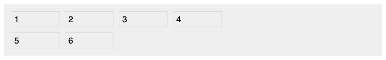
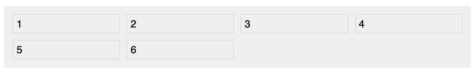
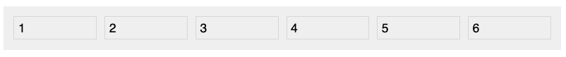
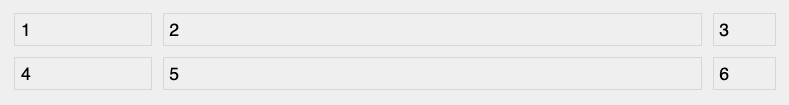
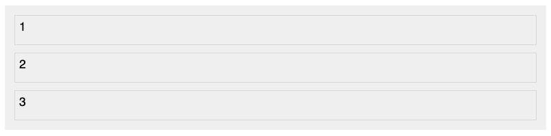
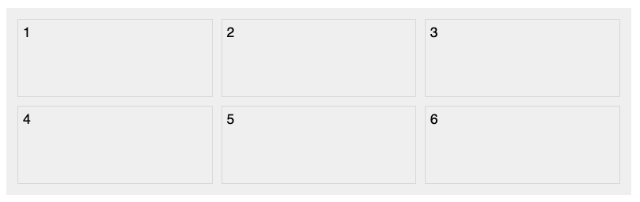
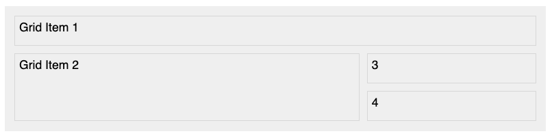
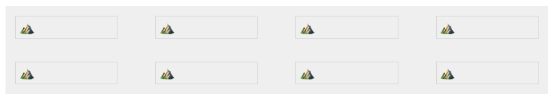
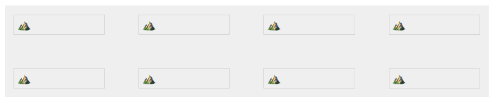
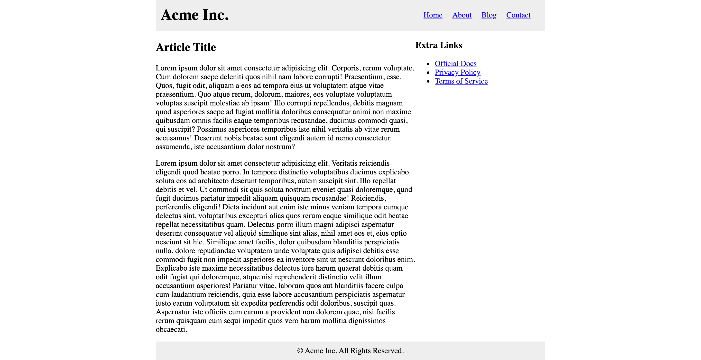

# Grid Layout

## Learning Objectives

After completing this lesson, you will be able to:

- Create grid-based layouts with rows and columns using the grid layout module
- Customize grid items by positioning, reordering, and resizing

## Lesson

### Overview

CSS Grid Layout allows you to create a two-dimensional grid system. Simple row/column grid systems are a common way to lay out user interfaces. This is an overview of grid and how to use it.

### Grid Container

Using grid starts with container element set to `display: grid`. All of the direct children elements will become grid items.

By default, the grid will be setup in a single column and row. As we go into more detail, you will learn how to create more and more complex grids by adding properties to the grid container and its items.

### Columns

Columns are defined using the `grid-template-columns` property. It accepts multiple values for each column. So to create 4 columns at 100px per column, use the following code:

```css
.grid {
  background-color: #efefef;
  display: grid;
  padding: 8px;
  grid-template-columns: 100px 100px 100px 100px;
  width: 100%;
}
```

The `grid` property interacts with direct children elements, so we will include a handful of `<div>` child elements.

```html
<div class="grid">
  <div>1</div>
  <div>2</div>
  <div>3</div>
  <div>4</div>
  <div>5</div>
  <div>6</div>
</div>
```

We'll add a border, some padding and margins to our divs for demo purposes:

```css
.grid > div {
  border: 1px solid rgba(0, 0, 0, 0.1);
  font-size: 1rem;
  padding: 5px;
  margin: 5px;
}
```



The grid will break the children to a new row once all four columns have been filled (see 5 & 6 above).

#### `fr` Unit

The `fr` unit measurement can be used instead of pixels on the `grid-template-columns` property value. It creates a flexible space that evenly fills the grid container.

```css
grid-template-columns: 1fr 1fr 1fr 1fr;
```



#### Repeat

You an also use the `repeat()` CSS function to define repeated patterns more easily. The first argument is how many times you want it to repeat. The second argument is the size.

```css
grid-template-columns: repeat(6, 1fr);
```



:::tip Mix and Match
The `grid-template-columns` allows a mixture of values in whatever you desire. As we continue in this lesson you will begin to see more and more complex grids.

```css
grid-template-columns: 2fr 500px 1fr;
```


:::

### Rows

At this point, rows will implicitly be generated by how many elements are in the container. The `grid-template-rows` property can also be used. It acts similar to the columns property but defines the y-axis.

```css
grid-template-rows: 50px 50px 50px;
```



You can also use the `grid-auto-rows` property to set the height of the rows:

```css
grid-template-columns: repeat(3, 1fr);
grid-auto-rows: 100px;
```



### Lines


<small>Credit: [MDM Web Docs - Basic Concepts of grid layout](https://developer.mozilla.org/en-US/docs/Web/CSS/CSS_Grid_Layout/Basic_Concepts_of_Grid_Layout)</small>

When a grid is generated, the lines that divide each column and row are assigned to a number from left-to-right (columns) and top-to-bottom (rows). You can size grid items by defining the start and end positions by row and column on the grid item.

For the example, we're going to highlight the first two grid items, we'll call them `Grid Item 1` and `Grid Item 2`. We'll add their names to the HTML as follows:

```html
<div class="grid">
    <div class="grid-item-1">Grid Item 1</div>
    <div class="grid-item-2">Grid Item 2</div>
    <div>3</div>
    <div>4</div>
</div>
```

You can hard-code grid items using the following properties:

```css
.grid-item-1 {
  grid-column-start: 1;
  grid-column-end: 4;
  grid-row-start: 1;
  grid-row-end: 2;
}

.grid-item-2 {
  grid-column-start: 1;
  grid-column-end: 3;
  grid-row-start: 2;
  grid-row-end: 4;
}
```



### Gutters

Gutters, also known as allies, are the spaces between cells. These can be controlled with `column-gap` and `row-gap` properties, or the `gap` using shorthand.

```css
grid-template-columns: repeat(4, 1fr);
row-gap: 20px;
column-gap: 40px;
```



The `gap` shorthand property can have one value for both row and column, or two values (first is row, second is columns)

```css
gap: 20px 40px;
```


Or you can use a single value which will be used for row and column gaps.

```css
gap: 40px;
```



### Summary

These are just the very basics of Grid Layout. There are more properties and tools for using this powerful CSS module linked in additional resources.

For now, you've learned Grid layout is a powerful tool for creating complex layout using CSS. A container is set to `display: grid` and the direct children are sorted into a grid automatically. The columns and rows can be customized, items can be positioned manually using the grid lines, and gutters can be resized.

## Training Exercises

To solidify your knowledge, here are a set of exercises that will require you to use the techniques you've just learned in the lesson above.

They are organized into _small_, _medium_, and _large_ sized problems. The small exercises will be very similar to the examples in the lesson. If you get stuck, refer to the relevant section above. The medium exercises will require you to combine concepts. The lesson may not have a single, specific example for you to reference. The large exercises are more open-ended and may require you to search the web for additional material.

### Small

#### Tick-Tac-Toe Board

Create a tick-tack-toe board using Grid Layout. Alternate the colors of every other cell to create a checkerboard pattern.

- Make each tile 50x50 pixels
- Use `border: 3px solid black;` to create board effect (you can leave the outside border)

:::details Tic Tac Toe Solution
/lessons/front-end-foundations/grid-layout/tic-tac-toe-solution.html
:::

### Medium

#### Blog Layout

Create a basic blog layout page using Grid Layout with the following properties:

- Max width of 800px (centered)
- The header, main content, sidebar and footer should all be in one grid container and positioned manually
- The header menu can be aligned with flexbox

Here is a preview of what it should look like:



:::details Blog Layout Solution
/lessons/front-end-foundations/grid-layout/blog-layout-solution.html
:::

### Large

#### Responsive Image Gallery

Create a responsive image gallery using the Grid Layout


- 1 column for the default (mobile)
- 2 columns for screens over 400px and under 799px wide
- 4 columns for screens over 800px wide
- Use the [Lorem Picsum](https://picsum.photos/) service to generate images
- Set the images to `width: 100%`, `height: auto` to fill the images into the columns
- Add even padding on all sides of the grid cells (there is more than one way to achieve this)

## Interview Questions

### Fundamentals

- Have you used CSS Grid before? What are the differences between it and Flexbox?

### Bugfix

Show them code and ask them what they would change to make it exhibit the correct behavior.

### Conceptual

Ask them how a technique or technology works.

- How would you create a responsive web layout using the CSS Grid module?

### Architect

Ask them how they would build a particular feature or set of features.

## Additional Resources

- [CSS Grid Garden Interactive Game](http://cssgridgarden.com/)
- [The Experimental Layout Lab of Jen Simmons](https://labs.jensimmons.com/)
- [CSS Grid Layout - MDN web docs](https://developer.mozilla.org/en-US/docs/Web/CSS/CSS_Grid_Layout)
- [A Complete Guide to Grid - CSS Tricks](https://css-tricks.com/snippets/css/complete-guide-grid/)
- [CSS Grid. Video Course - Wes Bos](https://cssgrid.io/)
