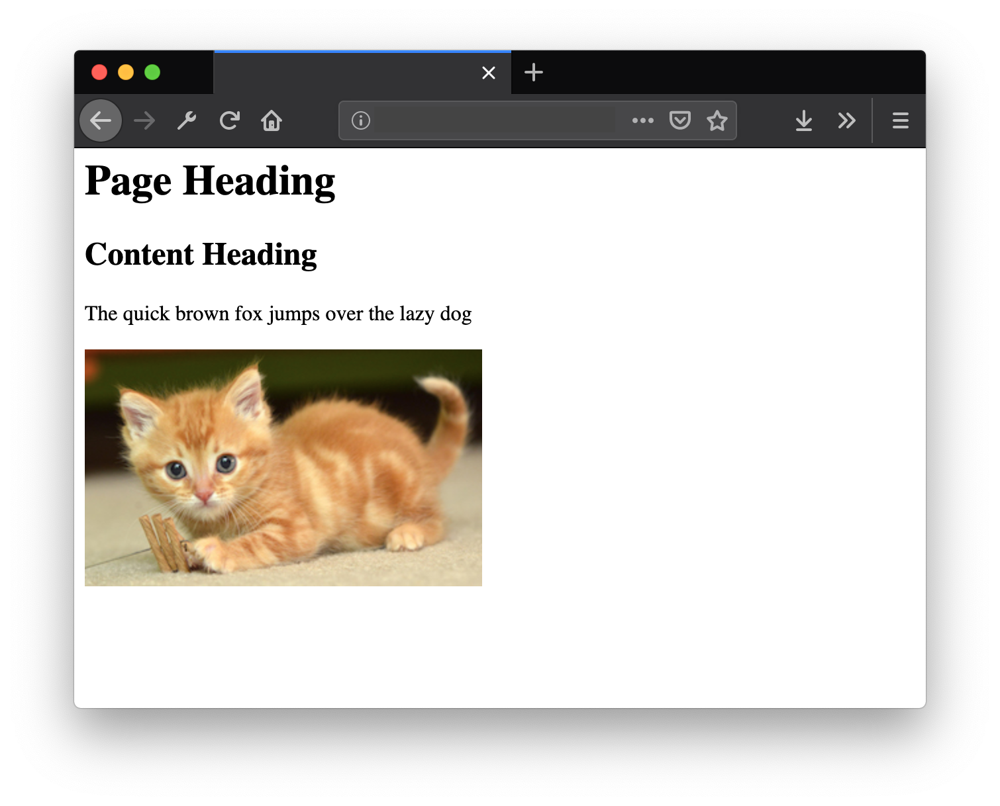

## Learning Objectives

After completing this lesson, you will be able to:

1. Understand the basics of HTML
2. Write HTML
3. Use a handful of most-used HTML elements

## Overview

**Hypertext Markup Language (HTML)** is a markup language used for creating content to be displayed by a web browser. A markup language is a way to create structure and annotate each piece of a document. Think about a newspaper, it has columns, headings, images, quotes and more. Each piece of the newspaper page needs to clearly define hierarchy and structure to help the user make sense of the content.

The same way a newspaper uses different elements to create a clear way for the reader, HTML is a foundation for creating digital structure for content on the web.

### HTML Basics

Here is a sample of a basic HTML document:

```html
<html>
  <body>
    <h1>Page Heading</h1>
    <div>
      <h2>Content Heading</h2>
      <p>The quick brown fox jumps over the lazy dog</p>
      
    </div>
  </body>
</html>
```

Here is how that document is rendered with a browser:



### HTML Syntax

"Syntax" is a term used for describing how a programming langues uses the order of characters to define structure and meaning.

An HTML element is made of an opening tag: `<div>` and a closing tag: `</div>` (notice the forward slash `/` directly after the `<`). Together, the opening and closing time together make an HTML element (ex: `<div></div>`).

An opening tag supports attributes to add more detailed annotation to the element. An attribute is always inside the opening tag, separated by a space `<div class="value">`.

There are many attributes, some are global (ex: `class`) and can be put on any element, while others are specific to the element (ex: `href` attribute on `<a>`). As you begin to write HTML you will learn about more attributes and how to use them.

### Creating a Valid HTML Document

To create a valid HTML document, browsers require specific elements:

```html
<html>
  <head>
    <title>Sample Title</title>
  </head>
  <body></body>
</html>
```

The `<html>` element is the top parent, then `<head>` and `<body>` are direct children. A `<title>` tag goes inside the `<head>` and will populate the browser's tab. All of the content of the page will go in the `<body>` element.

## Summary

- HTML creates **structure** for the web (think newspapers)
- HTML is made up of **elements**
- HTML elements have an opening and closing **tags**
- HTML opening tags can include **attributes** with values
- HTML is made up of **html, head, title, and body elements**

## Additional Resources

- [w3schools HTML elements reference](https://www.w3schools.com/html/html_elements.asp)
- [MDN web docs - HTML elements reference](https://developer.mozilla.org/en-US/docs/Web/HTML/Element)
- [The History of HTML and How It Revolutionized the Internet](https://www.thoughtco.com/history-of-html-1991418)
- 
