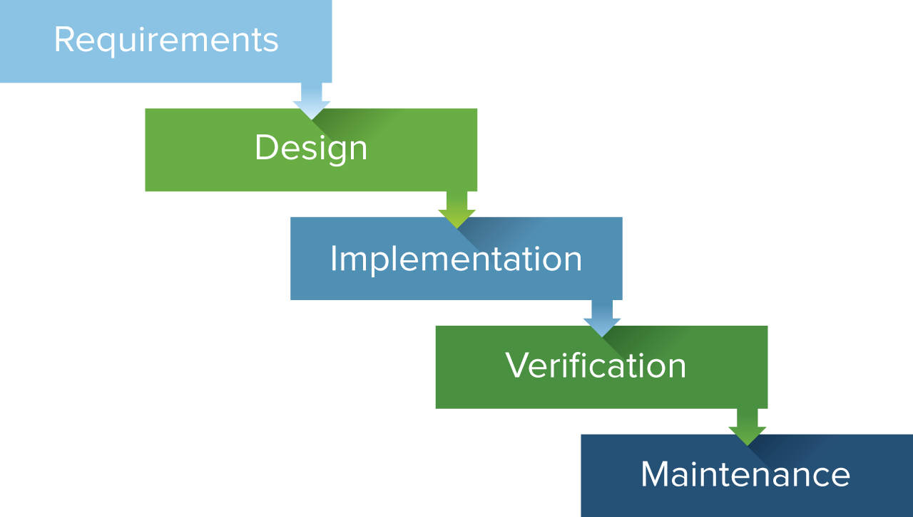
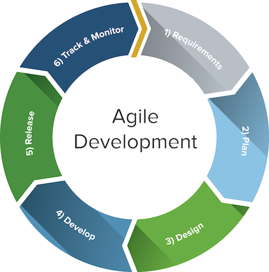
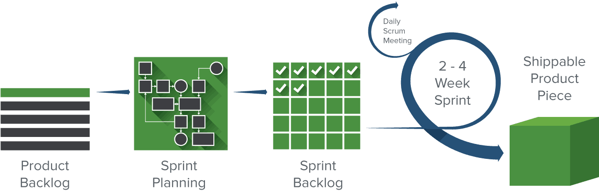

<!-- markdownlint-disable no-inline-html -->

## Learning Objectives

After completing this lesson, you will learn about the following project management platforms, what they are, and how to use them:

- Waterfall
- Agile
- Scrum
- Kanban

## Lesson

### Overview

Project management is a systemized set of processes to successfully complete projects. In software development there are many options and styles for managing projects. In this lesson, we will cover the most common software development project management solutions.

This lesson will cover the top four most popular project management solutions. Each one has it's own strengths and weaknesses. Typically leaders and/or managers are in charge of choosing and implementing a project management solution. It's important as a developer to understand how these systems work.

### Waterfall

Waterfall is considered a more traditional style of management. It is a sequential and linear process. It originates from manufacturing and construction industries in the 1970s. The original idea was to put checks and balances in every step of a project with hierarchical management (top-down).

It works with pre-defined stages for ever step in software development. From ideation to development and everything in between, every step is reviewed and approved before continuing. This is one of the most popular project management solutions. It forces whoever is leading the project to be very intentional before and after every step is completed.

One of the things that makes it as slower system is when something has to be changed (like requirements for a feature), it has to start over from the to and go through every step again. Waterfall steps are often defined across multiple teams including marking, design, accounting, etc... Waterfall has been around for decades and allows the manager to be hands on with every step and can help teams stay focused on exactly what the customer wants, but doesn't leave much room for adjusting and tweaking things as problems arise.

#### Advantages of Waterfall

- Forces a disciplined approach
- Easy to implement and keep managed
- Requires features and business decisions to be well documented

#### Disadvantages of Waterfall

- If you want to change something, the process is not very accommodating
- The final product is delivered to customers late in the process
- Being accurate with requirements before design or development can be challenging
- Teams are often isolated, so there is less collaboration

#### Stages of Waterfall

Here are the typical stages of the waterfall process:

1. Conception
1. Initiation
1. Requirement Gathering and Analysis
1. Design
1. Implementation/Coding
1. Testing
1. Maintenance

Each stage is isolated into separate tasks and one stage of the project can't be completed until all of the other stages before it are completed.

<small>Credit: [Smartsheet.com](https://www.smartsheet.com/agile-vs-scrum-vs-waterfall-vs-kanban)</small>

### Agile

Agile is an incremental process for software development. It was created specifically for software development and was released in a paper, "Manifesto for Agile Software Development", in 2001. The manifesto was based off of [twelve principles](http://agilemanifesto.org/principles.html) focused on quality, communication, and speed.

It has proven to be a effective alternative to the waterfall approach. The focus of the agile approach is shipping working software quickly and effectively while continually adding to and improving on the product over time.

Agile is a cyclical process, instead of top-down like agile. When a new feature is decided on, teams work together to get through the entire cycle together and collaborate to ship something as quickly as possible. When feedback is given the process starts over and bugs are fixed and improvements are made.

#### Advantages of Agile

- Changing over time is encouraged and embraced
- You don't have to know the end goal to get started
- Faster, more high quality code is delivered
- Team interaction is strong
- Customer feedback is more easily heard
- The product continually improves

#### Disadvantages of Agile

- Plans sometimes are less concrete and specific
- Members of the team must be knowledgeable
- Developers have to commit more time to the process
- Documentation is often out of date or neglected
- The final product can often look very different then the original idea

#### Agile Development Cycle

Here is the traditional agile development cycle:

1. Planning
1. Requirements analysis
1. Design
1. Implementation, coding or development
1. Testing
1. Deployment

Credit: [Smartsheet.com](https://www.smartsheet.com/agile-vs-scrum-vs-waterfall-vs-kanban)

#### Pair Programming

Pair programming is a technique when two programmings share a computer and work together on a feature together. One person is typically called the "driver" and uses the keyboard and mouse, the other is called the "navigator" and observes the driver and helps.

#### User Stories

A user story is a template for defining a feature. It is told in the perspective of the user and clearly defined the end result of the feature. It's typically told in this format:

> As a [type of user], I want [some goal] so that [some reason]

### Scrum

Because Agile is an open-ended process many people have created subsets with more specific tools and systems to implement Agile into software development. The most popular option is Scrum.

Scrum is most well known for it's sprint cycle: work is broken down into two week increments. In each sprint cycle the team all plans out what work they can accomplish, the progress is tracked in real time, then after each sprint cycle the team reflects on how they did and repeats the process (called a retrospective).

Standup is also a daily practice where the whole team stand around in a circle and check-in on their progress and help each other with identifying any blockers or help needed to complete the work before the sprint cycle is over.

#### Advantages of Scrum

- High project visibility and transparency from daily meetings
- Strong accountability because of team decisions and regular updates
- Problems can be identified early because of the continuous feedback
- Changes can be easily accommodated by adjusting each sprint cycle

#### Disadvantages of Scrum

- Scope creep can potentially happen because of continued feedback
- If the team isn't experienced and fully committed to the process it can make it challenging to reach deadlines
- A bad Scrum Master can also disrupt the process. It's important that person is trusting and fully understands the team and it's process.
- Poor planning can make it difficult to finish a sprint because of inaccurate estimates

#### Scrum Steps

- **Product backlog:** is a list of features to be created for the product. The team will prioritize the user stories and pull from it for each sprint cycle.
- **Sprint planning:** a team meeting held before every sprint cycle to decide and prioritize which work can be done for the sprint cycle.
- **Grooming:** at the end of every sprint cycle the
- **Standup:** A daily 15-minute meeting to check-in with the team.
- **Review:** A meeting to demo what features were completed in the sprint cycle.
- **Retrospective:** A meeting to reflect on how everything went during the sprint and look for areas to improve.

### Kanban

Kanban is a visual implementation of Agile. It is a Japanese word for "card". The focus of Kanban is to break work down into small pieces and visually represent the status of the work on a board.

The Kanban board is the central place to store information for the project. It is made up of columns (ex: to-do, doing, done) and individual cards are taken by individual developers and moved across the board as progress is made.

This visual representation of what is being worked on allows for high visibility from the team, including managers and product owners. Many times teams will color-coat the cards to identify bugs vs features.

#### Advantages of Kanban

- The priority of work can easily be changed because everything is broken down into small pieces and continually being checked.
- The Kanban board and cards are simple and easy to use.
- Code is shipped more often in a continuous deployment system, when a feature is completed it is shipped.
- Less time is wasted in meetings since work is always continually worked on

#### Disadvantages of Kanban

- If the board is out of date it can be hard to get back on track.
- The Kanban board is meant to be simple but sometimes a team can over complicate the process.
- It's harder to set deadlines or know when certain features will be done, which can be hard when coordinating with other teams (like marketing)
- Continuous deployment means that new code pushed to production can sometimes cause bugs which have to be immediately resolved.

#### Core Kanban Concepts

- **Visualize work:** The worklost is best visualized on a Kanban board using columns and cards.
- **Limit work-in-progress (WIP):** The number of cards each developer takes at a time should be limited. This helps with prioritizing work and allowing items to not stay "active" for too long.
- **Continuous improvement:** It's important for people to keep track of how the board is working for the team and make adjustments over time so you have the most effective strategy.
- **Define processes:** It's important to clearly and explicitly define what "done" looks like, as well as what each step in the process means to the whole team. It's important everyone is on the same page so the Kanban board can be used in the best way for the team.

### Summary

There are many tools and processes when using the Agile principles. It is up to each company and team to choose which processes and tools are best for each team.

Hopefully this introduction to project management and Agile will help you in your next group project. It's also can help you stand out in the hiring process if you have a grasp of these concepts, experience is even better.

## Additional Resources

- [What's the Difference? Agile vs Scrum vs Waterfall vs Kanban](https://www.smartsheet.com/agile-vs-scrum-vs-waterfall-vs-kanban)
