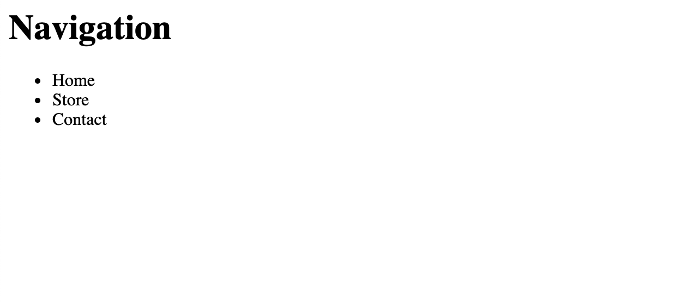
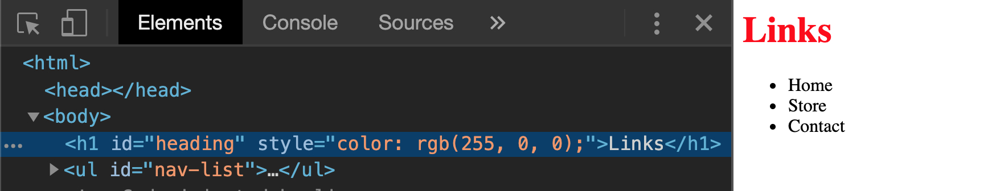
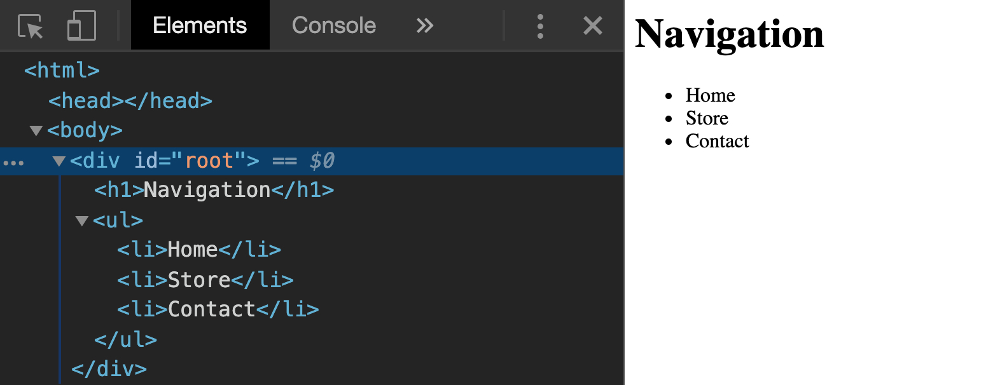
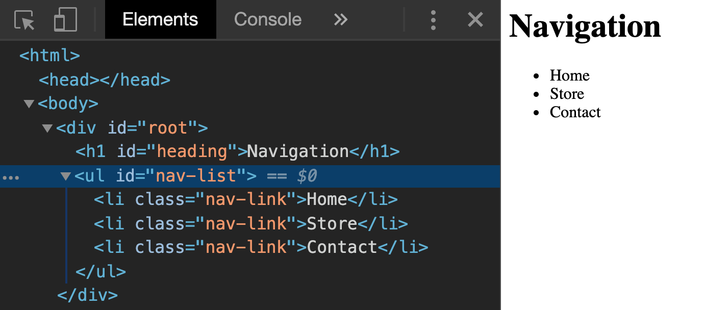

## Learning Objectives

After completing this lesson, you will be able to:

- Define what the DOM is and what it's used for
- Describe the BOM and DOM and their differences
- Use the `document` global variable
- Understand DOM tree objects
- Get elements by ID, class name, tag name, and query selector
- Create DOM elements nodes
- Replace the text and `innerHTML` of a node element
- Set and get attributes on a created element
- Append and remove elements in the document

## Lesson

In addition to HTML and CSS, a web page can include JavaScript code. JavaScript is able to modify the structure, content, and presentation of a web page without the need to reload. Browsers make this possible through two programming interfaces: the DOM and the BOM.

### What is the DOM?

>The Document Object Model (DOM) is a programming interface for HTML and XML documents. It represents the page so that programs can change the document structure, style, and content. The DOM represents the document as nodes and objects. That way, programming languages can connect to the page. [MDN - Document Object Model](https://developer.mozilla.org/en-US/docs/Web/API/Document_Object_Model/Introduction)

The DOM is the primary way that your JavaScript code will interact with a web page. Specifically, the browser provides a `document` variable that has properties and methods you can use to make changes to the page.

#### How is the DOM related to the Browser Object Model?

Whereas the DOM represents the web page, the Browser Object Model (the BOM) represents the window or tab that is showing the page.

In JavaScript, the BOM is accessible through a `window` variable. This variable has a `document` property. You could say that the BOM (the window) *contains* a DOM (the document).

But the `window` object has other useful properties, such as `history`, `screen`, and `location`.

For example, `window.screen` object contains information about a user's browser, this includes the `width` and `height` properties. `window.screen.width` give you the current width of the browser's window. It can also be written without the `window` prefix as `screen.width`.


#### The Node Tree

The primary job of the browser is to convert an HTML document into a DOM. The structure of the DOM is represented by a "node tree".

</img>

>Wikipedia - [Document Object Model](https://en.wikipedia.org/wiki/Document_Object_Model)

Each node branches off another forming the 'tree' shown above. Each branch of the tree ends in a node and each node contains objects. The DOM methods allow access to the tree and the nodes contained within.

Nodes can be an `element`, `attribute` of an element, `text`, or basically anything that is part of the HTML document.

### Accessing the DOM

The `document` interface represents any web page loaded in the browser and serves as an entry point into the web page's _node tree_.

#### DOM Selectors

DOM Selectors are used to access HTML elements within a document. The following selector methods are properties of the `document` object. This means we must prefix these selectors with the `document.` to call them.


| Method | Description |
|-------| -----------|
|`getElementsByTagName('p')` | searches HTML document for `p` tags and returns a list of these elements in an `HTMLCollection` object.|
  |`getElementsByClassName('link')` | returns all the elements that matches the specified `class` name in an `HTMLCollection` object. |
|`getElementById('password')` | returns the first element that its `id` matches the given string. |
|`querySelector('#password')` | returns the first element that matches the specified CSS selector |
|`querySelectorAll('.link')` | returns all the elements that match the specified CSS selector in a **NodeList** |


Here is the body of a simple HTML document.

```html
<body>
  <h1 id="heading">Navigation</h1>
  <ul id="nav-list">
    <li class="nav-link">Home</li>
    <li class="nav-link">Store</li>
    <li class="nav-link">Contact</li>
  </ul>
</body>
<script>

</script>
```

Let's add some selectors in our script to access the DOM.

```js
const heading = document.getElementById('heading')
```

`getElementById()` method searches the HTML for an `id` that matches the given string and returns that element. In this case, `getElementById()` returns the `h1` element because `getElementById()` is looking for the element with the `id` matching 'heading'.

```js
const listItems = document.getElementsByTagName('li')
```

`getElementsByTagName()` returns an array-like object called a `HTMLCollection` object. In this example, we are selecting all the `li` elements.

```js
const listItemsByClass = document.querySelectorAll('.nav-link')
```

`querySelectorAll()` method returns a `NodeList` object.

`NodeList` is similar to an `HTMLCollection`, though it is possible to iterate over it with `forEach()`. Any element that matches the specified class 'nav-link' will be added to the `NodeList`.

Both `querySelector()` and `querySelectorAll()` are passed a string that uses a CSS specifier. In the example above we are using the "." to specify we are looking for the class of 'nav-link'.

:::tip
`NodeList` and `HTMLCollection` are collections of DOM nodes. The difference is that while a `NodeList` can contain any node type, the `HTMLCollection` contains only elements.

An element is created from an HTML tag; a node is more general and includes text and whitespace.
:::

### Element Properties

DOM selectors return nodes containing properties and methods that can be used to get information from the DOM.

>When the browser loads the page, it parses (that is, it reads) the HTML and generates DOM objects from it. For element nodes, most standard HTML attributes automatically become properties of DOM objects. For more information, see [Attributes and Properties](https://javascript.info/dom-attributes-and-properties)


```js
const heading = document.getElementById('heading')
const headingText = heading.innerText
```

In this example, we are accessing information stored in the object's `innerText` property and assigning it to a variable. In this case, If we were to `console.log(headingText)`, it would output to the console 'Navigation'.

Another useful property is `length`. Just like any string or array we can access the length of a returned object.

```js
const listItemsByClass = document.querySelectorAll('.nav-link')
const listItemsLength = listItemsByClass.length
```

In this case our returned object is a `NodeList`. Since it contains our 3 elements, it's length will come out to be 3.

#### Changing the DOM with JavaScript

Not only can we select and access the information of nodes in the DOM, we can also update the DOM and create new elements.

#### Updating the DOM

Using the HTML of the example above let's change our heading to a different string using JavaScript.

```html
<body>
  <h1 id="heading">Navigation</h1>
  <ul id="nav-list">
    <li class="nav-link">Home</li>
    <li class="nav-link">Store</li>
    <li class="nav-link">Contact</li>
  </ul>
</body>
<script>

</script>
```

This markup is displayed in the browser as:



Assigning `document.querySelector('#heading')` to a variable will allow us to access the `innerText` property of the `element`. We can then reassigned the value of the `innerText` property.

```js
const heading = document.querySelector('#heading')
heading.innerText = 'Links'
```

If reload our webpage now, it will look something like this:


The DOM has been updated and even though we haven't changed anything in the HTML. It is now showing 'Links' instead of 'Navigation'.

We can also change the style of an element. On the next line in our script, let's change the `style` property of our `h1` element.

```js
const heading = document.querySelector('#heading')
heading.innerText = "Links"
heading.style.color = "rgb(255, 0,0)"
```

Here we access the `style` property which lets us add inline styling to an element. We then only have to reassign the `color` property.



In the dev tools we can see that the `h1` element gained a `style` attribute. It is set to the value `'rga(255,0,0)'` which is what we assignedto the `style.color` property.

#### Creating Elements

The DOM can also create new elements and place them in the DOM. Let's recreate our simple navigation list but with JavaScript only.

For creating the different elements we can use the `createElement()` method. Lets go ahead and make one for each of the elements we need to complete our bar.

```js
<script>
const headerElement = document.createElement('h1')
const listElement = document.createElement('ul')

const listItemOne = document.createElement('li')
const listItemTwo = document.createElement('li')
const listItemThree = document.createElement('li')
</script>
```

`createElement()` method creates the HTML element specified by tagName. Here we've created elements for `h1`, `ul` and three `li`s. Now that we have created them let's put them in our document. First we will create a `div` in our HTML with an `id` of 'root'.

```html
<body>
  <div id="root"></div>
</body>
```

In our `<script>`, we can add a selector for the root `div`. To add the new elements to the DOM we need to use the `append()` `append()` inserts a set of node objects or DOMString objects after the last child of the ParentNode.

```js
const headerElement = document.createElement('h1')
const listElement = document.createElement('ul')

const listItemOne = document.createElement('li')
const listItemTwo = document.createElement('li')
const listItemThree = document.createElement('li')

const root = document.querySelector('#root')

root.append(headerElement)
root.append(listElement)
```

Using the `append()` method on our ParentNode (`<div id="root"></div>`) we can then add our `headerElement` and `listElement` to the DOM by appending it to `root`.

You can also `append()` to elements that you created with JavaScript. The following example appends items to our list.

```js
<script>
// other code

const root = document.querySelector('#root')

root.append(headerElement)
root.append(listElement)

listElement.append(listItemOne, listItemTwo, listItemThree)

</script>
```

`.append()` can be used to append multiple elements at once. Here we are appending our three created `li` elements into the same list.

Let's now use the `innerText` property and add some text to our `headerElement` and list items.

```js
// other code
headerElement.innerText = "Navigation"
listItemOne.innerText = "Home"
listItemTwo.innerText = "Store"
listItemThree.innerText = "Contact"
```

Open the browser we can see our created elements and the text that we have assigned.



#### Adding Attributes

To complete our example, we will add `id` and `class` attributes to our elements.

We set the `id` property of our `Element` objects.

```js
// other code
headerElement.id = "heading"
listElement.id = "nav-list"
```

We want add the same `class` to all three `li` elements. We can do it at the same time using `childNodes()` method. This method will return a NodeList of all the elements that is a child of an element.

```js
// other code
listElement.childNodes.forEach(item => {
  item.className = "nav-link"
})
```

Since `childNodes()` returns a NodeList of our `li` elements, we can then use the `forEach()` method to apply the `class` to each of our `li` elements at once.

:::tip
Since `class` is a keyword in JavaScript. To access that property, we use `className`.
:::

In the dev tools we should see that our created elements have the proper `class` and `id` attributes.




### Summary

The DOM can be accessed and changed in Javascript through the `document` object. The `document` object has methods and properties that can be used to interact with the DOM.

DOM selector methods return `Element` objects that are present in the DOM.

Using the `append()` method, you can append an element as a child of a parentNode in the DOM.

## Additional Resources

- [Introduction to the DOM - MDN web docs](https://developer.mozilla.org/en-US/docs/Web/API/Document_Object_Model/Introduction)
- [JS: Interview Questions](https://thatjsdude.com/interview/dom.html#queryDOM)
- [DOM & BOM Revisited](https://medium.com/@fknussel/dom-bom-revisited-cf6124e2a816)
- [DOM Selectors Explained](https://blog.bitsrc.io/dom-selectors-explained-70260049aaf0)
- [Easy way to understand How the DOM works](https://www.youtube.com/watch?v=2Tld4yyN_tw)
