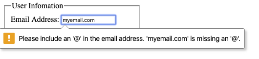
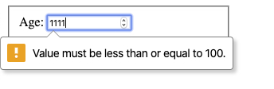
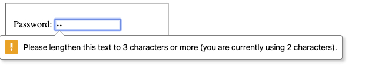
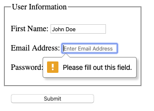
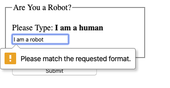
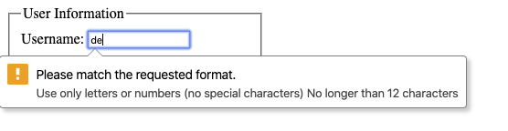
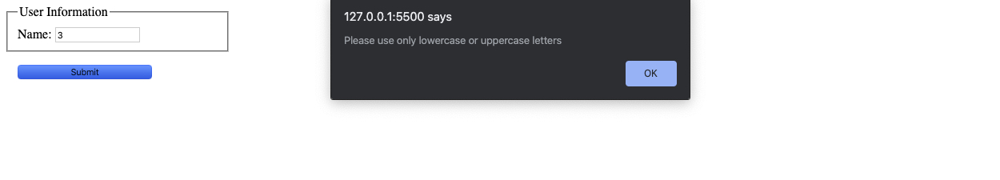
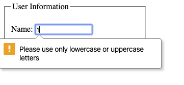

## Learning Objectives

After completing this lesson, you will be able to:

- Use built-in HTML5 form validation
- Use JavaScript to do custom validation on HTML forms
- Require a field
- Validate a field using a regular expression
- Display a custom error message

### Why is form validation important?

Form validation is the process of checking if the data entered by a user is in the correct format. The form will display error messages if any fields do not pass the validation tests.

While it is important to validate any information on both the server-side and the client-side, this lesson will cover some of the ways validation is handled on the client-side.

### Validating forms with HTML

#### Built-in validation

HTML has some built-in tools to validate the data entered into the form controls to ensure that the data is formatted correctly. In the following email example we will use an attribute `type` on an `input` element called `email`.

```html
<fieldset>
  <label> Email Address:
    <input type="email">
  </label>
</fieldset>
```



This `type` creates a single-line text field that allows a user to enter test but must contain a '@' symbol or the user will be alerted with an error stating the symbol is missing.

Let's look at the built-in validation for another `input` `type`.

```html
<fieldset>
  <label> Age:
    <input type="number">
  </label>
</fieldset>
```

This `type` also creates single-line field that only allows for numbers in the field. It prevents letters from being entered into the field and adds a step counter to the field.

```html
<fieldset>
  <label> Age:
    <input type="number" min="5" max="100">
 </label>
</fieldset>
````

To prevent someone from entering an age that is outside of a human lifetime we can add the `min` and `max` attributes onto an `input` that is of the `number` `type`. This restricts the numbers enter to the range that you assign. In this example we only allow an Age that is between 5 and 100.



There are other attributes that we can add to form controls and other form controls that can help restrict the data or format of the data entered.

```html
<fieldset>
  <label> Password:
    <input type="password" minlength="3" maxlength="12">
  </label>
</fieldset>
```

We are using the `type` of `password` to indicated the field should be hidden when a user is typing characters into the field to help protect the users password. We also added the attributes `minlength` and `maxlength`. These attributes will display an error if password entered is too short or too long. These attributes can be added to any field that contains text that you want to restrict the amount of characters entered.



You can checkout several other `input` types and attributes by visiting this link. [MDN - Input](https://developer.mozilla.org/en-US/docs/Web/HTML/Element/input)

#### Required attribute

One other attribute that is used most commonly on form controls is the `required` attribute. This can be added to all of the form controls including `<select>`. `<textarea>`, `<input>`. This attribute tells the browser that the field cannot be left blank. The user must enter information into this field for the form to be submitted otherwise the user will see an error.

```html
<form>
  <fieldset>
    <legend>User Information</legend>
    <p>
      <label for="name">Name: </label>
      <input id="name" name="name" type="text" required />
    </p>
    <p>
      <label for="email">Email Address: </label>
      <input id="email" name="email" type="email" required />
    </p>
    <p>
      <label for="password">Password: </label>
      <input id="password" name="password" type="password" required />
    </p>
  </fieldset>
  <button id="submit-button" type="submit">Submit</button>
</form>
```

In this example we've created a simple form. All the `input` elements have the `required` attribute. If we try to submit this form without entering information into one of the fields. The browser will focus the cursor on the field and display an error.



### What are Regular Expressions?

A regular expression, or _regex_ is a special text string for describing a search pattern. You can also use _regex_ in Javscript's string methods to match a pattern and modify a string.

#### RegEx in HTML

To understand regular expressions, let's look at how to use one with the `pattern` attribute. The `pattern` attribute checks if the data entered by the user matches its regex value.

```html
<fieldset>
  <legend>Are You a Robot</legend>
  <p>
    <label for="robot-check">Please Type: <strong>I am a human</strong></label>
    <input id="robot-check" type="text" pattern="I am a human">
  </p>
</fieldset>
```

In this example, we have a user type into an `input` text field "I am a human". If a user doesn't type "I am a human" exactly (including capitalization), an error will be displayed and the form will not be submitted.



Here is an example that limits the length and only allows letters and numbers.

```html
<fieldset>
  <legend>User Information</legend>
  <label for="username">Username: </label>
  <input
    id="username"
    name="username"
    type="text"
    title="letters or numbers (no special characters) between 4 and 12 characters"
    pattern="[A-Za-z0-9]{4,12}"
  />
</fieldset>
```

`[A-Za-z0-9]` is stating that the characters in the text field can be any letter, both lowercase `[a-z]` or uppercase `[A-Z]`, or a number `[0-9]`. When we use use `-` between two numbers or two letters we are creating a range that the characters can be. The final part of our pattern `{4,12}` is called a repeater. This is stating that our letters or number can be repeated between 4 or 12 times. This is essentially creating a minimum length (4) and maximum length (12). If we didn't want to restrict the user to a certain length we can replace `{4,12}` with `+`.

:::tip
The title attribute specifies extra information about an element. The information is most often shown as a tooltip text when the mouse moves over the element. This is a useful practice when using validation that isn't clearly stated as part of a label.
:::



There are many more possibilities that we don't cover here. For a complete list and many examples, check out [MDN - Regular Expressions](https://developer.mozilla.org/en-US/docs/Web/JavaScript/Guide/Regular_Expressions)

#### Regex in JavaScript

A regular expression in JavaScript is a type of object. It can be either constructed with the regex constructor or written as a literal value by enclosing a pattern in forward slash `/` characters.

```js
let regularExpressionConstructor = new RegExp("abc");
let regularExpressionLiteral = /abc/;
```

:::tip
If you expect your regular expression to remain constant, it is best to use a regex literal. If your regular expression is dynamic, it is better to use the regex constructor method.
:::

```js
const myRegex = /Hello World/
const test = myRegex.test("Hello World")
```

In this example we use the `test()` method on a string. `test()` is a regex method that accepts a string as a argument. It will then test our pattern against the string and return a boolean value. In This case, If we `console.log(test)`, it will print `true` to the console.

We can also use string methods to update our variable based on our pattern.

```js
const myRegex = /\s/
const myString = "Hello World"

const newString = myString.replace(myRegex, "-")
```

`\s` is a special character in regex. We use the `\` to signal that is is not a normal character. In regex this character signals that we are looking at any whitespace in our string, this also checks for _newline_(`\n`), _tab_(`\r`), etc.

We pass our pattern into our string method `.replace()` as its first argument. When there is a match, it will replace the first instance of whitespace with a `"-"`. So now `newString` is assigned the value of `Hello-World`. If we wanted to check for all the instances of whitespace in a string, we would add the `g` modifier to the end of our pattern (`/\s/g`).

### Validating Forms with JavaScript

HTML form controls can restrict the format of allowable values, using attributes like `required` and `pattern` to set basic constraints.

However, you may want to impose more complex constraints, or to provide clearer reporting of validation failures than the defaults.

#### JavaScript Validation

We can add in some of our validation via `if` statements in our JavaScript with the help of regex. This is useful for legacy browsers that don't support HTML built-in validation.

```html
<form>
  <fieldset>
    <legend>User Information</legend>
    <label for="name">Name: </label>
    <input id="name" name="name" type="text" />
  </fieldset>
  <button type="submit">Submit</button>
</form>
<script>
  const form = document.querySelector("form");

  function checkName(name) {
    myRegex = /[A-Za-z]+/;
    return myRegex.test(name);
  }

  form.addEventListener("submit", event => {
    const nameInput = document.querySelector("#name");
    if (!checkName(nameInput.value)) {
      event.preventDefault();
      alert("Please use only lowercase or uppercase letters");
      return;
    }
  });
</script>

```

We've added an event listener (see [Handling Browser Events](../handling-browser-events/)) `addEventListener()` on the `form`. When the user submits the form it will call our `checkName()` function takes data entered into the name field and tests it against the regex pattern. If this this function returns `false` if runs the `alert()` method telling the user to use the correct format.



We can also check to see if a field is empty just as if there was a `required` attribute on a field.

```html
<script>
  const form = document.querySelector("form");

  function checkName(name) {
    if (name == "") {
      return false;
    } else {
      return true;
    }
  }

  form.addEventListener("submit", event => {
    const nameInput = document.querySelector("#name");
    if (!checkName(nameInput.value)) {
      event.preventDefault();
      alert("Name is required");
      return;
    }
  });
</script>
```

#### Custom Error Messages

In the previous example, if our error validation function returns false, it displays a pop up alert. For larger forms, closing a lot of pop ups might be a hassle for the user. In this case, we can create our own custom error messages.

This can be done using the **Constraint Validation API** which is supported by most browsers.

In the scope of this lesson will not cover the entirety of the different properties and methods of the **Constraint Validation API** but more information can be found on [MDN - Contraint Validation API](https://developer.mozilla.org/en-US/docs/Web/API/Constraint_validation)

The **Constraint Validation API** makes some properties available on on form control elements. For the example we will take one of the examples above and refactor to change the alert into our own custom error message.

```html
<script>
  const form = document.querySelector("form");
  const nameInput = document.querySelector("#name");

  function checkName() {
    const myRegex = /[A-Za-z]+/;
    if (!myRegex.test(nameInput.value)) {
      nameInput.setCustomValidity(
        "Please use only lowercase or uppercase letters"
      );
    } else {
      nameInput.setCustomValidity("");
    }
  }
  nameInput.addEventListener("change", checkName, false);
</script>
```

We have added `addEventListener()` on the name `input` set to detect changes to the value in the name field. When changes are made it calls our `checkName()` function. This function will display our custom error message if the value doesn't match our regex.

`setCustomValidity()` changes the build-in HTML validation message and will display that error message.



## Summary

Client-side validation is a important step insuring the data passed from a form is entered correctly and formatted in a way that can be stored properly in a database and/or used to update the DOM.

HTML form controls have attributes that add in basic validation and error messages to help streamline the process, such as `input` `type`, `pattern`, and `required`.

Regular expressions are a useful tool for ensuring that valid data is entered into a form. In addition, they can change the format of that data before it is sent to a server. Regular expressions are not language specific and can be used in many different programming languages such as HTML and JavaScript.

JavaScript's Constraint Validation API allows you to create your own custom validation error messages and customize how you form validates the information.

## Additional Resources

- [Client-side form validation - MDN web docs](https://developer.mozilla.org/en-US/docs/Learn/Forms/Form_validation)
- [Regular Expressions Tutorial Video](https://www.youtube.com/watch?v=sa-TUpSx1JA)
- [Write Regular Expressions](https://www.geeksforgeeks.org/write-regular-expressions/)
- [An Introduction to Regular Expressions in JavaScript](https://codeburst.io/an-introduction-to-regular-expressions-regex-in-javascript-1d3559e7ac9a)
-[Constraint Validation](https://www.html5rocks.com/en/tutorials/forms/constraintvalidation/)
