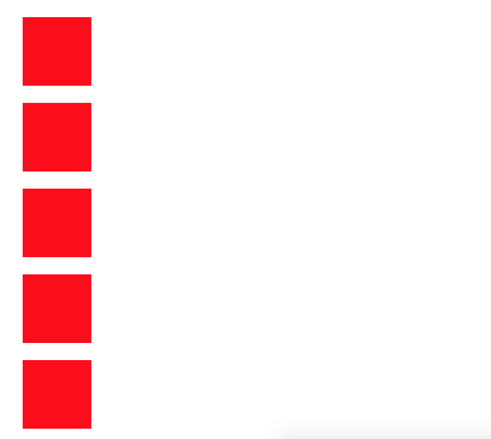
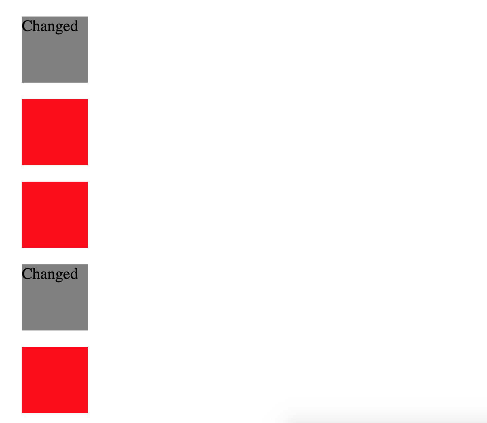

# Handling Browser Events

## Learning Objectives

After completing this lesson, you will be able to:

- Listen for clicks, keypresses, and other events.
- Run functions when an event occurs.
- Attach event listening functions to elements using HTML attributes, JS dot notation, and the DOM API

## Lesson

### What is an event?

An _event_ is an action that happens in the browser. The browser produces a signal when an _event_ occurs and provides a 'listener' to execute some code when the _event_ occurs. This usually takes place when a user is interacting with a webpage in some way. For example, when a user clicks a button an `click` event occurs, a `click` event occurs.

### What is an event handler?

Events allow users to interact with the webpage. To react to these different events we can assign an _event handler_. These are functions that are executed with the event that is specified ojects are engaged. In the example below the `alert()` function is the _event handler_.

Let's quickly take a look at an example of a `click` event and see what they do in action. In this example we will use an HTML attribute.

Here is some HTML with a `button` element.

@/lessons/handling-user-input/handling-browser-events/example1a.html{2}

Right now, nothing will happen if we click this button. Let's add an _event handler_ to our button and tell it to call `alert()` when the button is pressed.

@/lessons/handling-user-input/handling-browser-events/example1b.html{5-9}

Now you should see a pop up alert stating that the button has been clicked.

### Commonly used events
There are alot of events that can happen on a webpage check out a full list visit [MDN Event reference](https://developer.mozilla.org/en-US/docs/Web/Events). Lets take a look at a few events that are commonly used and what triggers them.

| Event | Triggered when |
|:------------------------:|:---------------------------------------------------|
| _'click'_ | the pointing device is clicked |
| _'resize'_ | the size of the browser or window is changed |
| _'scroll'_ | the window has been scroll |
| _'keydown'_ | any key is pressed |
| _'keyup'_ | any key is released |
| _'keypress'_ | ANY key except Shift, Fn, CapsLock is in pressed position. (Fired continously.) |
| _'fullscreenchange'_ | when the window has entered or exited full screen mode|
| _'dblclick'_ | the pointing device is double clicked |
| _'play'_ | media starts playing |
| _'ended'_ | media has finished playing |


### How to use HTML attribute?

In our first example we used a HTML attribute called `onclick` so that when the button is clicked, our handler is then executed. Notice the prefix 'on' before the name of the event. This is the key to this attribute that lets the browser know that it needs to execute the handler in case of the stated event. Of course for practical purposes we want to keep our HTML as clean as possible. In that case we can use **dot notation** to access our HTML attribute inside of our javascript.

Either in a separate javascript file that has been linked or in a script tag, we can give the `onclick` attribute to our button and then we can execute the same function.

```html{1,3,5-7}
<button id="myButton">Click Me!</button>
<script>
  const button = document.querySelector('#myButton')

  button.onclick = function() {
    alert('clicked')
  }
</script>
```

On line 1, our `button` element no longer has the `onclick` attribute and has been replaced with `id='myButton'`. Down in our script tag on line 3 we select the `id` of the button by using `document.querySelector()` and assigning it to a variable.

We can now use **dot notation** to assign the button's `onclick` property to call the `alert()` method. Notice that we have used an anonymous function that calls our `alert()` method. Without the anonymous function, the alert() would run as soon as the page loads.

`onclick` is essentially a property like any other available on the button node, just like `button.textContent`, or `button.style`, but it is a special type. When you set a handler to it will run that code.

You can even set it to be equal to a named function. For Example:

@/lessons/handling-user-input/handling-browser-events/example2b.html{6}

:::warning
The function should be assigned as `beenClicked`, not `beenClicked()`.
If we add parentheses, `beenClicked()` -- is a function call. So the assignment actually takes the result of the function execution, which would be `undefined` since the function returns nothing.
:::

But a node can only have one `onclick` attribute, so you can only register one _event handler_ this way. So, for example, if we were to do something like this:

@/lessons/handling-user-input/handling-browser-events/example3a.js

Only the second would execute because the `onclick` property of `button` has been reassigned.

For this reason `addEventListener()` method has become the standard. You are able to call multiple handlers to the same node.

@/lessons/handling-user-input/handling-browser-events/example3b.js

### Why use addEventListener()?

The `addEventListener()` method allows you to add any number of event handlers so that it is safe to add handlers even if there is already another handler on the element. Let's revisit our previous example of a button and refactor it to use the `addEventListener()` method.

@/lessons/handling-user-input/handling-browser-events/example4a.html

`addEventListener()` takes 2 required arguements, the first is a string specifying the type of event such as `click`, and the second argument is the handler function. one of the advantages of using this method is that there is another method we can use that will remove the event listener, properly named `removeEventListener()`. So let's make it to where we only get an alert the first time we click the button.

@/lessons/handling-user-input/handling-browser-events/example4b.html

Testing our new example, on the first click the button is pressed and you are given the alert. once you close the alert and click the button again, the button no longer works.

### Event Objects

When the event happens, the event object is created. It then travels with the event on its journey through the DOM. The event object is passed as an argument to our event handler function. We can use this object to access a wealth of information about the event that has occurred.

:::tip
You can `console.log(event)` inside of the handler to dive in to all the information that is available to you about the event.
:::

#### The Window Object and Events
The `window` object has the majority of the properties like `length`, `innerWidth`, `innerHeight`, `name`, if it has been closed, its parents, and more. It is the first thing that is loaded into the browser. Some event types can be access through the `window` object such as `resize`. To quickly take a look at this action let's take a look at a quick example.

@/lessons/handling-user-input/handling-browser-events/example5.html

This handler is executed when there is a change in the `window` size. When this event happens it will `console.log()` the current the browser's width. There are many `window` specific that can be used such as `orientationchange`, `devicemotion`, and `storage`.

#### What can I do with the event object??

There is one more key to events and event objects that we have yet to discuss in full. This is the parameter that is passed from DOM and `window` Objects into the event handlers. Let's take a close look at it through an example.

@/lessons/handling-user-input/handling-browser-events/example6a.html



In this example we have 5 boxes colored red. We are going to add an `addEventListener()` to the script that will change the color of the box that is clicked using the event object. One of the property that we can access is the _target_ property. It contains a reference to the element where the event took place. In this case it will be on our boxes.

@/lessons/handling-user-input/handling-browser-events/example6b.html

We use the `event.target` property several ways in this instance. First we are checking the _target_ of the click event and seeing it contains the class 'box'. If it does then we add a style property with `background-color` of grey. We can also change the DOM access the `innerText` property of the element and add text of our target.




### Summary

Event handlers make it possible to detect and react to events happening in our web page. The `addEventListener()` method is used to register such a handler. Each event has a type(`click`, `focus`, `submit`, etc) that identifies it.

Any Element or Node in the DOM can receive events. This includes the `window` object. Certain events can only happen on the `window` object, such as 'resize'.

It is best practice to use `addEventListener()` on the target node objects. While HTML attributes are useful if you only need to call a single event handler on a node object, they can clutter the HTML and are limited in their use.

## Training Exercises

View the training exercises here: [Training Exercises](./exercises/index.md)

## Interview Questions

### Fundamentals

- What is Asynchronous programming and how do you deal with asynchronous browser events?

### Bugfix

Take a look at the following code and rewrite to make this code run properly.

@/lessons/handling-user-input/handling-browser-events/bugfixProblem.html

:::details Solution
Solution 1

So If we try to run the problem our `alert()` function will run as soon as the page loads as we are assigning a function call to our on `onclick` property which is returning `undefined` and running the function right away.

We can fix this by assigning an anonymous function to our `onclick` assignment. This way the anonymous function will be executed when the button is clicked and call the `alert()` function.

@/lessons/handling-user-input/handling-browser-events/bugfix1.html

:::

### Conceptual

- What is the difference in using a HTML attribute and `addEventListener()`?
- What is a Event Handler?
- What is an Event Object and what information is stored and accessible through it?

### Architect

- How would you use events to build a form that would open a sidebar menu when a button is pressed?
- How would you use events to change a form's submit action?

## Additional Resources

- [Introduction to browser events - javascript.info](https://javascript.info/introduction-browser-events)
- [Handling Events Chapter - Eloquent JavaScript Book](https://eloquentjavascript.net/15_event.html)
- [Introduction to events - MDN web docs](https://developer.mozilla.org/en-US/docs/Learn/JavaScript/Building_blocks/Events)
- [MDN Event reference](https://developer.mozilla.org/en-US/docs/Web/Events)
- [MDN Event.preventDefault()](https://developer.mozilla.org/en-US/docs/Web/API/Event/preventDefault)
