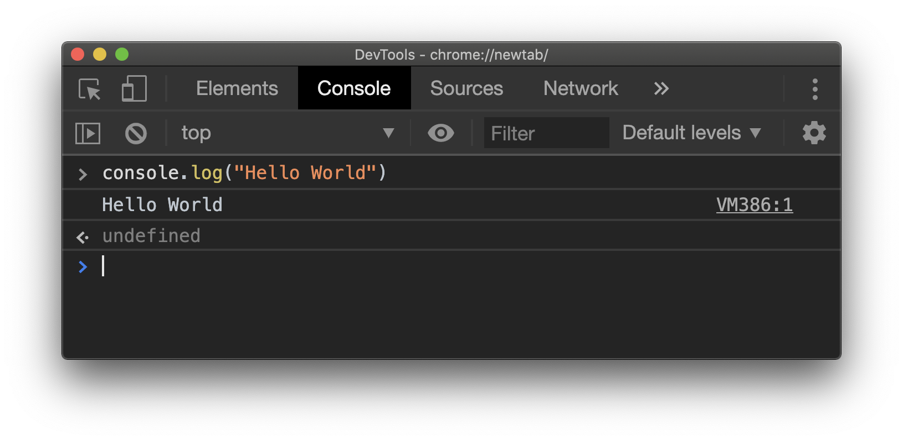

# JavaScript 101

## Learning Objectives

After completing this lesson, you will be able to:

- Understand what JavaScript is and what it is used for
- Write and run JavaScript code in the browser console, in an HTML page, and in an external JavaScript file.
- Understand the similarity and differences of JavaScript from Python
- Use JavaScript variables, basic data types, conditionals, switch cases, while and for loops
- Create, modify, and delete JavaScript array items
- Create, modify, and delete JavaScript object items
- Create JavaScript functions

## Lesson

### Overview

JavaScript is a programming language that offers interactivity for websites. All major web browsers have a JavaScript engine and is defined by the ECMAScript specification. It is the core technology, along with HTML & CSS, for how the web works. JavaScript has quickly become one of the most popular programming languages on the planet and is now used for lots of technologies beyond the web!

In this lesson we are going to go over the basics of JavaScript as a programming language and how to use it.

### Writing JavaScript

JavaScript can be written multiple ways. The first is by putting a `<script>` element inside your HTML, and putting your JavaScript code inside that element:

```html
<html>
  <head></head>
  <body>
    <h1>Content</h1>
    <script>
      // JavaScript goes here
      console.log("Hello World");
    </script>
  </body>
</html>
```

The other, more common, way to write JavaScript is by creating a separate file (with the `.js` extensions) and linking to it in your HTML using a `script` tag with a `src` attribute pointing to the file:

```js
// script.js
console.log("Hello World");
```

```html
<html>
  <head></head>
  <body>
    <h1>Content</h1>
    <script src="./script.js"></script>
  </body>
</html>
```

:::tip
Placement is important for loading scripts. HTML will load files top down. It's recommended to put all scripts on the bottom of the document just before the closing `body` tag unless otherwise instructed.
:::

#### Console

Lastly, every major browser has a built-in console that can execute JavaScript. In Google Chrome, you can right click on any webpage and right click and choose "inspect" in the right-click menu. This will pull up the DevTools, one of the navigation options on the top row is called "Console".



Similar to a terminal, you can run JavaScript code one line at a time and the console will immediately provide output.

### Logging

When working with JavaScript, there is a console built into the browser. This console allows you to evaluate JavaScript code and log messages for debugging. To log a message use the following code in your JavaScript:

```js
console.log("Hello World");
```

### Comments

Every programming language typically has a way of writing comments in your code that aren't evaluated or compiled when the code runs. In JavaScript, you prefix `//` to the line. You can also use the `/** */`. It can also break comments into multiple lines. Here are some examples:

```js
// Sample comment

/*
Here's another way to 
write comments across multiple lines
*/

/**
 * Sample comment
 * This is a description of this section of code as a sample
 */
```

### Data Types

Here are the most common data types in JavaScript:

| Data Type | Sample                   |
| --------- | ------------------------ |
| String    | `"Hello World"`          |
| Number    | `42`                     |
| Boolean   | `true`                   |
| Date      | `new Date(10, 21, 2015)` |
| Null      | `null`                   |
| Array     | `[1,2,3]`                |
| Object    | `{ name: "Sarah" }`      |
| Function  | `function greetUser(){}` |

#### Concatenating Strings

Strings are one of the most frequently used data types in JavaScript, it's common to want to concatenate strings with each other. There are two ways to do this, the first is with the plus, `+`, operator.

```js
console.log("Hello" + " world"); // logs "Hello world"
```

When working with a variable, the template literals format can be used to embed an expression into a string. It's important the string is wrapped in ticks instead of quotes, and any number of expressions can be called inside the `\$\{\}` syntax.

```js
var name = "Harry";
console.log(`Hello ${name}`); // logs "Hello Harry"
```

:::warning
JavaScript allows different data types to be concatenated, for example `"thing" + 2` will become `"thing2"` but keep in mind that concatenating different data types have different outputs that can be unexpected.
:::

### Variables

Basic variables are declared using the `var` keyword. You can declare variables and set variables using the `=` symbol. This can be done in one line or a variable that is declared can be set and even overwritten again at any point.

```js
var favoriteColor; // declaration
favoriteColor = "Blue"; // assignment
var age = 30; // shorthand for declaration and assignment
```

:::tip camelCase
In JavaScript, the most common way to name a variable is with the `camelCase` naming convention: capitalizing every first letter of words excluding the first.
:::

:::tip What about "let" and "const"?
Both `let` and `const` are keywords in JavaScript for setting variables. `let` is limited by scope and `const` is similar but can't be reassigned. You can learn more [here](https://wesbos.com/let-vs-const/)
:::

#### Dynamic Variables

JavaScript uses dynamic types, which means you can reassign a variable to any data type you want. In many other languages, this would cause an error.

```js
var name = "Jane";
// reassigning to a different data type is valid
name = false;
```

:::warning
Using multiple data types on the same variable is known to cause bugs and make code harder to read. We recommend variables are clearly named to define one specific piece of data for your logic.
:::

### Operators

| Operator                     | Meaning |
| ---------------------------- | ------- |
| Assignment                   | `=`     |
| Addition                     | `+`     |
| Subtraction                  | `-`     |
| Increment                    | `++`    |
| Decrement                    | `--`    |
| Multiplication               | `*`     |
| Division                     | `/`     |
| Modulus (Division Remainder) | `%`     |
| Loose Comparison             | `==`    |
| Strict Comparison            | `===`   |
| Not                          | `!`     |
| And                          | `&&`    |
| Or                           | `||`    |

### Functions

A function allows you to write a block of code that performs specific functionality. It is written like this:

```js
function userGreeting() {
  return "Hello user!";
}

// Calling a function
userGreeting();
```

#### Parameters

Functions can also accept parameters. They are defined between the parenthesis and separated by a comma. Note: a function can accept any number of parameters.

```js
function greetUserByName(name) {
  return `Hello ${name}`;
}

greetUserByName("Johnny"); // returns "Hello Johnny"
```

#### Return value

Inside the function's code block, the code will stop running when it encounters a `return` statement. Whatever is returned will be sent back to where the function was called.

```js
function sum(x, y) {
  return x + y;
  // code after the return will not run
}
var sumOfNumbers = sum(5, 7);
console.log(sumOfNumbers); // 12
```

### Conditionals

Conditionals are a central piece in programming. JavaScript offers a couple of tools for checking expressions and conditionally running code.

#### "If" Statement

For writing conditional statements, the `if`, `else if`, `else` keywords are used and the comparison logic is wrapped in parenthesis:

```js
if (age < 18) {
  console.log("You are not an adults and don't have access");
} else if (age < 21) {
  console.log("You are an adult, but have limited access");
} else {
  console.log("You have full access");
}
```

#### "Switch Case" Statement

A switch case is for making a single comparison again multiple pieces of data. This can be done with an "if" statement, but is more concise and better legibility.

You provide an expression by passing data into the switch, then the case presents a piece of data to compare to the switch expression. If the switch expression matches the case the code block is executed, if the comparison doesn't match the code block is skipped.

```js
var day;
switch (new Date().getDay()) {
  case 0:
    day = "Sunday";
    break;
  case 1:
    day = "Monday";
    break;
  case 2:
    day = "Tuesday";
    break;
  case 3:
    day = "Wednesday";
    break;
  case 4:
    day = "Thursday";
    break;
  case 5:
    day = "Friday";
    break;
  case 6:
    day = "Saturday";
    break;
  default:
    console.log("Can't figure out day");
}

console.log(`Today is ${day}`);
```

### Loops

Another central piece to programming is the ability to loop through the same code over and over to reduce repeating yourself and iterating through data.

#### "For" Loop

To create an iterative loop, you have to set a base number and increment through it until the expression is false:

```js
// Set variable value, expression, iteration
var x;
for (x = 0; x < 10; x++) {
  console.log(x);
}
```

#### "While" Loop

The `while` loop is another common iterative tool for programming. You use the `while` keyword followed by an expression. While the expression is true, the code will continue to loop through the code.

```js
var x = 0;
while (x < 10) {
  console.log(x);
  x++;
}
```

:::warning
Memory leaks are common in JavaScript, one way this can happen is creating an infinite loop by a `while` loop always evaluating to `true`. Some browsers will crash and others will kill the specific page causing the memory leak. When working with loops be careful and make sure to double check your loops!
:::

### Summary

JavaScript is a powerful programming language for the web. We covered data types, variables, functions, logging, operators, loops, and more. This was a long lesson, but was meant to just introduce all the of major programming concepts offered with JavaScript.

## Training Exercises

To solidify your knowledge, here are a set of exercises that will require you to use the techniques you've just learned in the lesson above.

They are organized into _small_, _medium_, and _large_ sized problems. The small exercises will be very similar to the examples in the lesson. If you get stuck, refer to the relevant section above. The medium exercises will require you to combine concepts. The lesson may not have a single, specific example for you to reference. The large exercises are more open-ended and may require you to search the web for additional material.

### Small

Complete all of the exercise on [JavaScript 101 Exercises](https://github.com/DigitalCrafts/js-101-exercises).

### Medium

#### Madlib

Write a madlib function, which is given a name and a subject. It will return(not print) a new string: (name)'s favorite subject in school is (subject).

```bash
madlib('Anushka', 'art');
'Anushka's favorite subject in school is art.'
```

#### Tip Calculator

Write a function tipAmount that is given the bill amount and the level of service (one of good, fair and poor) and returns the dollar amount for the tip. Based on:

good -> 20% fair -> 15% bad -> 10%

```bash
tipAmount(100, 'good')
20
tipAmount(40, 'fair')
6
```

#### Tip Calculator 2

Write a function totalAmount that takes the same arguments as tipAmount except it returns the total as the tip amount plus the bill amount. This function may make use of tipAmount as a sub-task.

```bash
totalAmount(100, 'good')
120
totalAmount(40, 'fair')
46
```

#### Print Numbers

Write a function printNumbers which is given a start number and an end number. It will print the numbers from one to the other, one per line:

```bash
printNumbers(1, 10)
1
2
3
4
5
6
7
8
9
10
```

Write two versions of the above function. One using a while loop and the other using a for loop.

#### Print a Square

Write a function printSquare which is given a size and prints a square of that size using asterisks.

```bash
printSquare(5)
---
---
---
---
---
```

#### Print a box

Write function printBox which is given a width and height and prints a hollow box of those given dimensions.

```bash
printBox(6, 4)
 ---
|   |
 ---
```

#### Print a Banner

Write a function printBanner which is given some text and prints a banner with a border surrounding the text. The border has to stretch to the length of the text.

```bash
> printBanner('Welcome to DigitalCrafts')
----------------------------
- Welcome to DigitalCrafts -
----------------------------
```

#### Leetspeak

Write a function leetspeak which is given a string, and returns the leetspeak equivalent of the string. To convert text to its leetspeak version, make the following substitutions:

A => 4
E => 3
G => 6
I => 1
O => 0
S => 5
T => 7

```bash
leetspeak('Leet')
l337
```

#### Long-long Vowels

Write a function, which is given a string, return the result of extending any long vowels to the length of 5.

```bash
longLongVowels('Good')
'Goooood'
longLongVowels('Cheese')
'Cheeeeese'
longLongVowels('Man')
'Maaaaaaan'
```

#### Just the positives

Write a function positiveNumbers which is given an array of numbers and returns a new array containing only the positive numbers within the given array.

```bash
positiveNumbers([1, -3, 5, -3, 0])
[1, 5, 0]
positiveNumbers([1, 2, 3])
[1, 2, 3]
positiveNumbers([-1, -2, -3])
[]
```

#### Caesar Cipher

Write a function cipher which is given a string, an offset, and returns the Caesar cipher of the string.

```bash
cipher('Genius without education is like silver in the mine')
'Travhf jvgubhg rqhpngvba vf yvxr fvyire va gur zvar'
```

#### Caesar Cipher 2

Write a function decipher which is given a string, an offset, and returns the original message.

```bash
decipher('Travhf jvgubhg rqhpngvba vf yvxr fvyire va gur zvar', offset)
'Genius without education is like silver in the mine'
```

### Large

This is JS 101, there will be larger exercises in the future lessons.

## Interview Questions

### Fundamentals

- What's the difference between an `if` statement and a `switch`?
- How do you invert a boolean value in JavaScript?
- What is the difference between a `for` loop and a `while` loop?

### Bugfix

Fix the following code.

```js
function roundAbout(number){
  var row = 0
  var rowStar = ""
  while (number < row){
    rowStar += '*';
    console.log(rowStar);
    row++;
  }
}

roundAbout(5);
```

:::details Solution
If you run the above code it will not run at all. `number < row` is incorrect because `number` is set at 5 which is already less than `row`, 0. This means the conditonal of our `while` loops is true so it will not run the code block. If we just switch the `<` to `>` then the function will run.

```js
function roundAbout(number){
  var row = 0;
  var rowStar = "";
  while (number > row){
    rowStar += '*';
    console.log(rowStar);
    row++;
  }
}

roundAbout(5);
```

:::

### Conceptual

None available at this time.

### Architect

None available at this time.

## Additional Resources

- [Eloquent JavaScript Book](https://eloquentjavascript.net/)
- [MDN - JavaScript](https://developer.mozilla.org/en-US/docs/Web/JavaScript)
- [What is JavaScript used for?](https://www.hackreactor.com/blog/what-is-javascript-used-for)
- [Video: Dev Ed Javascript Tutorial for Beginners](https://www.youtube.com/watch?v=2nZiB1JItbY&list=PLDyQo7g0_nsX8_gZAB8KD1lL4j4halQBJ)
