# Introduction to React

## Learning Objectives

After completing this lesson, you will be able to:

1. Use the ES6 `import` and `export` syntax
1. Create React Elements using JSX
1. Pass values to Components using props
1. Build custom React Components
1. Render Arrays of Components using `.map()`

## Lesson

### Overview

React is a JavaScript library that helps you write complex front-end applications. It provides convenient syntax for:

-   Creating reusable UI components
-   Managing and displaying data
-   Adding event handler functions

It has become the most widely used JavaScript library, and it has influenced the current design of other libraries and frameworks such as [Vue.js](https://vuejs.org/) and [Angular](https://angular.io/).

In the previous lesson, you learned how to use the `create-react-app` tool to generate starter code for a React project. In this lesson, you'll customize that starter code and add to it.

To begin, we'll write a "Hello World" style application in React. Then, we'll create a custom "Greeter" Component.

### Up and Running

Start by running the following command to create a new React application:

```sh
npx create-react-app greeter-app
```

This will create a new directory named `greeter-app`. Inside of it is a ready-to-customize React application, including a built-in Dev Server.

Change directories to `greeter-app` and start the Dev Server:

```sh
cd greeter-app
yarn start
```

Your browser should open automatically to a page that looks like this:

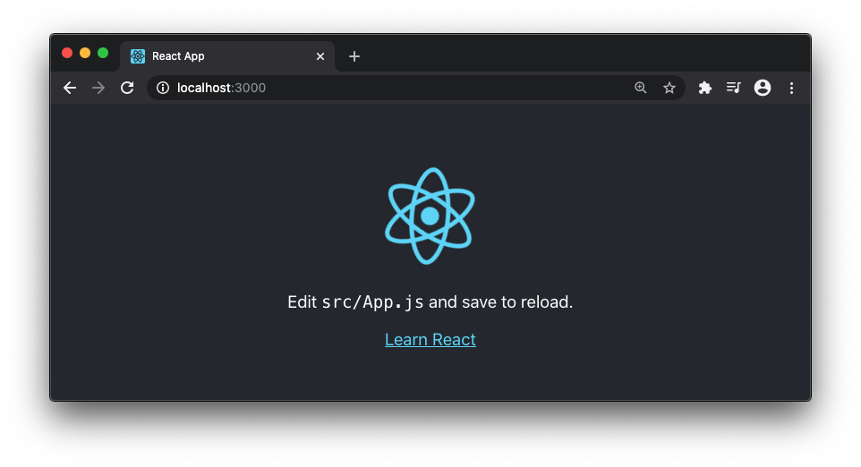

If you open the Elements Inspector in the Chrome Dev Tools, you'll see that the page contains familiar DOM elements: `<div>`, `<header>`, `<p>`, ``, and `<a>`:


### First Steps with React

The page advises you to edit the file `src/App.js` to get started. When we open that file, we see some unfamiliar syntax:

```js
import React from 'react';
import logo from './logo.svg';
import './App.css';

function App() {
    return (
        <div className='App'>
            <header className='App-header'>
                
                <p>
                    Edit <code>src/App.js</code> and save to reload.
                </p>
                <a
                    className='App-link'
                    href='https://reactjs.org'
                    target='_blank'
                    rel='noopener noreferrer'
                >
                    Learn React
                </a>
            </header>
        </div>
    );
}

export default App;
```

It appears to be a strange mix of JavaScript and HTML. The markup that looks like HTML is _JSX_. We'll explore JSX throughout this lesson and the ones that follow. Even though it looks odd, you'll recognize that it contains the same Elements that you saw in the Inspector.

Using React terminology, we say that `App` is a _Component_.

When the App Component is _rendered_ in the browser, it displays a `<div>` that contains a `<header>` with an ``, a `<p>`, and an `<a>`.

In this way, React lets you create groups of Elements.

#### Customizing the JSX

One of the benefits of the React Dev Server is that it will automatically reload the browser when you save changes to the code.

Locate the `<p>` tag and change the text inside of it to: `Hello React!`.

```js{7}
function App() {
  return (
    <div className="App">
      <header className="App-header">
        
        <p>
          Hello React!
        </p>
        <a
          className="App-link"
          href="https://reactjs.org"
          target="_blank"
          rel="noopener noreferrer"
        >
          Learn React
        </a>
      </header>
    </div>
  );
}
```

Your browser should reload, with the text updated:

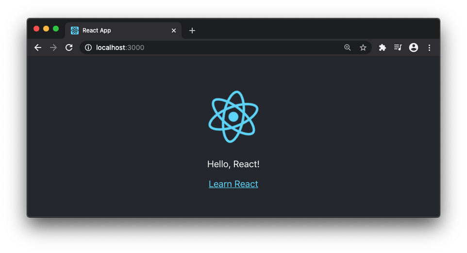

Next, we'll change the markup. Change the contents of the `<div>` so that it only contains `<h1>Hello React!</h1>`:

```js{4}
function App() {
  return (
    <div className="App">
        <h1>Hello React!</h1>
    </div>
  );
}
```

Your browser should reload, and the Elements Inspector will reflect the changes to the markup:

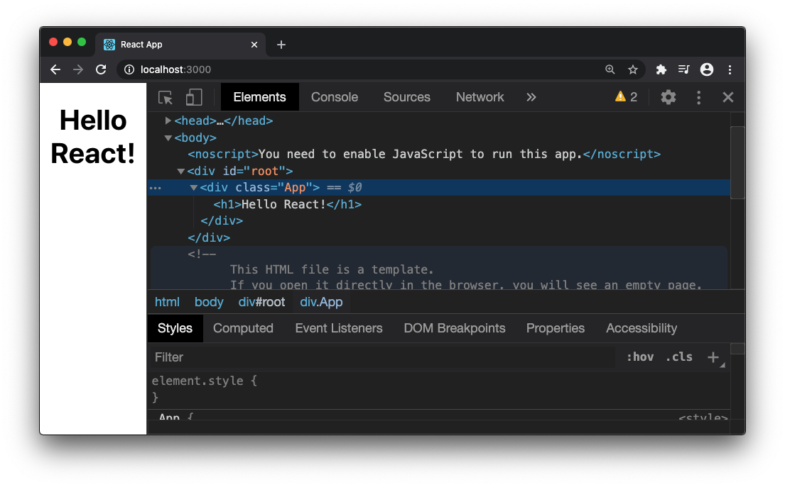

#### Customizing the CSS

React provides a number of ways to apply CSS to your UI. We'll look briefly at one of those techniques.

Edit the contents of the global stylesheet file `src/index.css`. As an experiment, try adding the following to the end of the global stylesheet:

```css
h1 {
    color: red;
}
```

Your browser will reload to show the changes:

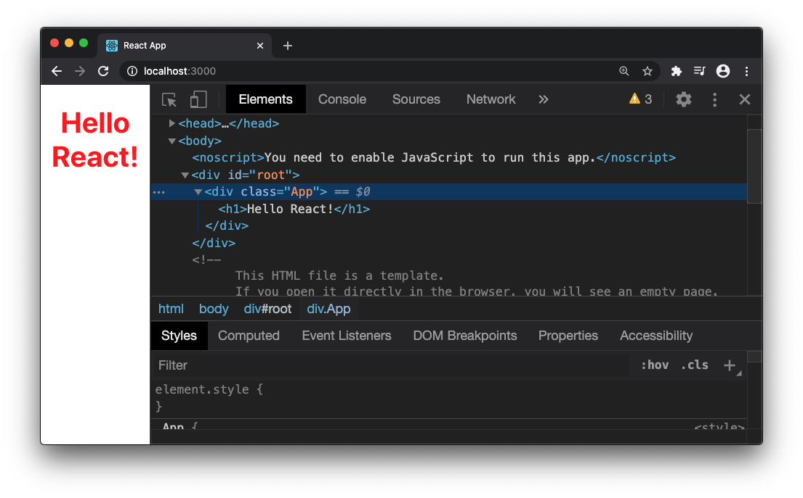

Next, add a class style to the stylesheet:

```css
h1 {
    color: red;
}

.greeting {
    color: blue;
}
```

In `src/App.js`, add the class name to the `<h1>`:

```js{4}
function App() {
  return (
    <div className="App">
        <h1 class="greeting">Hello React!</h1>
    </div>
  );
}
```

It works, but there's a warning message in the Dev Tools Console:


It's telling us that we used the word "class" in our markup, but that we should call it "className". This is one of the first differences beginners will encounter when writing JSX instead of HTML.

In your markup, change it from "class" to "className". The warning will go away.

```js{4}
function App() {
  return (
    <div className="App">
      <h1 className="greeting">Hello React!</h1>
    </div>
  );
}
```

### JSX !== HTML

The reason that `class` is not valid in JSX is because JSX is translated into JavaScript. In JavaScript `class` is a reserved word and cannot be used as a variable or function name.

`babel` is the tool that React uses to convert JSX into the JavaScript that runs in the browser. To see the JavaScript version of our code, copy and paste the `App()` function into the [babeljs.io website](https://babeljs.io/en/repl). You will see the following:


Comparing the JSX to the resulting JavaScript shows how each part of the JSX (the tag name, the attributes, the children) is an argument to `React.createElement()`:

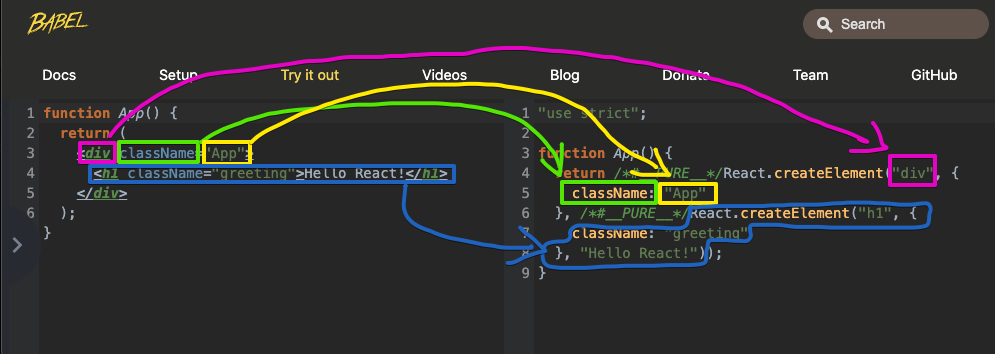

The tag name `div` is the first argument to `React.createElement()`.

The attribute `className="greeting"` is turned into a key-value pair in an Object. That Object is passed as the second argument to `React.createElement()`.

In HTML, we would say that the `<h1>` is a child of the `<div>`. Because it is JSX, the `<h1>` is converted into a call to `React.createElement("h1")` and used as the third argument to `React.createElement("div")`.

React takes the result of all of the `React.createElement()` calls and draws DOM Elements to the page.

### Creating a Custom Component

If that's all there was to it, React would offer no real benefit to developers. To get an idea of what React can do, we'll create our own Component.

Start by creating a `components` directory inside the `src` directory. Then, create a new file named `Greeter.js`:

```sh
mkdir src/components
touch src/components/Greeter.js
```

Open `src/components/Greeter.js` and enter the following code:

```js
import React from 'react';

class Greeter extends React.Component {
    // Make Greeter return some JSX
}

export default Greeter;
```

-   On line 1, we `import` the React library.
-   Line 3 begins the definition of our custom Component.
-   We export our `Greeter` Component on line 7 so that we can use it in other files.

Unlike `src/App.js`, `Greeter` uses the `class` syntax. Though more verbose than using a function, using a class makes it easier to see how your code interacts with React.

When we `extend React.Component`, we are saying that the `Greeter` class is a specialized kind of `React.Component`.

Those three steps are the starting point for creating a custom Component. The next step is to tell React what to draw to the DOM when it renders our `Greeter`. We'll begin with a simple `<h1>`.

Define a `render()` _method_ that `return`s the JSX for an `h1`:

```js{4-8}
import React from 'react';

class Greeter extends React.Component {
	render() {
		return (
			<h1>Hello again!</h1>
		);
	}
}

export default Greeter;
```

The `render()` method tells React what to draw to the page. React will call `render()` automatically when it's ready to display your Component.

There is a pair of parentheses around the JSX, with the opening `(` on the same line as `return`. React developers do this so they can format their JSX with line breaks and indentation.

:::tip A class Component requires two things.

Your `class` Components must:

1. `extend React.Component`
2. have a `render()` method that returns JSX
   :::

### Using a Custom Component

Using `Greeter` involves two steps:

1. `import`ing `Greeter`
2. Writing a `Greeter` JSX tag

```js{5,11}
import React from 'react';
import logo from './logo.svg';
import './App.css';

import Greeter from './components/Greeter';

function App() {
  return (
    <div className="App">
      <h1 className="greeting">Hello React!</h1>
      <Greeter />
    </div>
  );
}
```

When `import`ing a Component, specify the relative path to the JavaScript file. You can leave the `.js` extension off of the filename.

Our `Greeter` JSX tag is "self-closing". We could have written the equivalent opening and closing tag:

```js{5}
function App() {
  return (
    <div className="App">
      <h1 className="greeting">Hello React!</h1>
      <Greeter></Greeter>
    </div>
  );
}
```

:::warning Don't forget to close JSX tags!

Be careful when writing JSX. It's easy to forget your closing tags:

```js{5}
function App() {
  return (
    <div className="App">
      <h1 className="greeting">Hello React!</h1>
      <Greeter>
    </div>
  );
}
```

In that case, you would see a "Failed to compile" error:

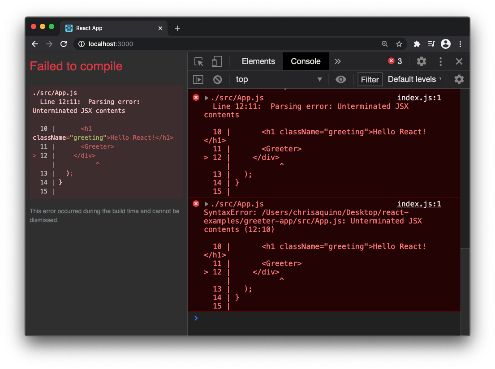

JSX is XML, not HTML. XML looks like HTML but is much more strict.
:::

### Repeating a Component

Components can be displayed multiple times on a page:

```js{5-9}
function App() {
  return (
    <div className="App">
      <h1 className="greeting">Hello React!</h1>
      <Greeter />
      <Greeter />
      <Greeter />
      <Greeter />
      <Greeter />
    </div>
  );
}
```

For each `Greeter` JSX tag, you will see `Hello again!` on the page:

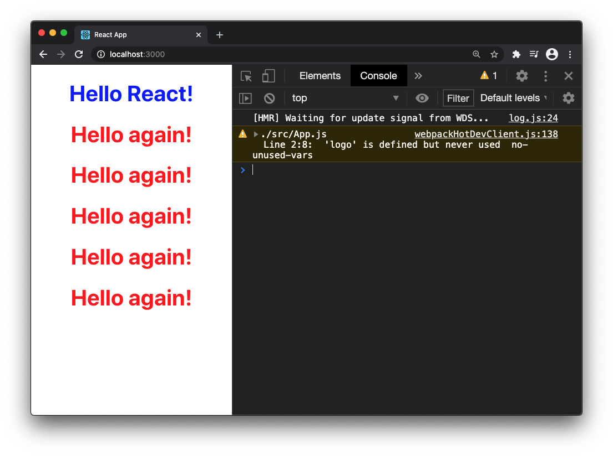

You can see that a Component can be reused, but it would be more interesting if a `Greeter` could say "Hello" to different people. In the next section, we'll make our `Greeter` Components accept data to display.

### Passing Props

To provide information to a Component, you add _props_, which look identical to HTML Attributes. (In fact, you have already been using the `className` prop.)

In the following example, we render a single `Greeter` and pass it a `name` prop. Our goal is to make `Greeter` show the text `"Hello again, Melanie"`.

```js{5}
function App() {
  return (
    <div className="App">
      <h1 className="greeting">Hello React!</h1>
      <Greeter name="Melanie" />
    </div>
  );
}

```

Nothing will change on the page until we update `Greeter`. We'll access the `name` prop and use it inside the `<h1>`.

```js{4}
class Greeter extends React.Component {
    render() {
        return (
            <h1>Hello again, {this.props.name}!</h1>
        );
    }
}
```

Two pieces of new syntax appear with this change;

1. We use `this.props.name` to access the `name` prop.
1. We use `{}` to interpolate a JavaScript value in JSX.

Inside a method, you use `this` to refer to the specific _instance_ of the `Greeter` class. Props are always available under `this.props`.

Some props have special meaning, like `className`. Otherwise, you can treat props like variables - you can call them whatever you like, but it's best to call them something clear and meaningful.

`{}` in JSX is like `${}` in a [Template literal](https://developer.mozilla.org/en-US/docs/Web/JavaScript/Reference/Template_literals). Any JavaScript expression inside of the `{}` will be evaluated.

:::tip You can put any JavaScript expression in between the {}

Any JavaScript that represents a single value can be used:

-   Strings, numbers, booleans
-   anonymous functions
-   function calls
-   arithmetic
-   String concatenation

What's an expression? Anything that you can pass to a function or put on the Right Hand Side (RHS) of an assignment.

That means you cannot put the following in between the `{}`:

-   if-else
-   loops

Gotcha: Syntax for template literals with interpolation can be tricky.
:::

In this example, React interpolates the value of `this.props.name` into the string `"Hello again, ___!"`

Props are not required. If you add more `Greeter` Components, but forget to pass the `name` prop, there is no error:

```js{5}
function App() {
  return (
    <div className="App">
      <h1 className="greeting">Hello React!</h1>
      <Greeter name="Melanie" />
      <Greeter />
      <Greeter />
      <Greeter />
      <Greeter />
    </div>
  );
```

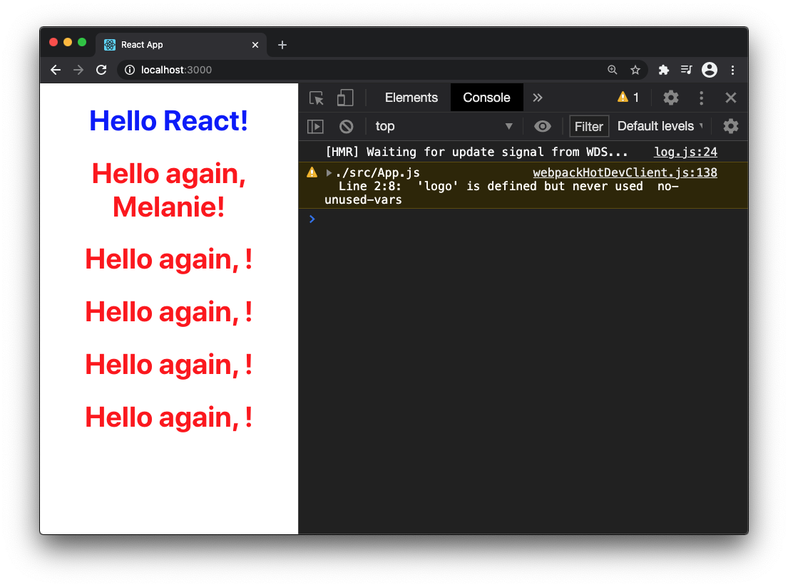

Update your `Greeter` Components, passing each a `name` prop:

```js{5-9}
function App() {
  return (
    <div className="App">
      <h1 className="greeting">Hello React!</h1>
      <Greeter name="Melanie" />
      <Greeter name="Emma" />
      <Greeter name="Mel B" />
      <Greeter name="Geri" />
      <Greeter name="Victoria" />
    </div>
  );
```

The page should automatically reload:


### Rendering an Array

React was made for dynamic data - created through user interaction or pulled from an API. Your application data will usually be an Array (or an Object).

Let's update our example so that the names are in an Array.

```js{1-7,13-15}
const nameArray = [
  "Melanie",
  "Emma",
  "Mel B",
  "Geri",
  "Victoria"
];

function App() {
  return (
    <div className="App">
      <h1 className="greeting">Hello React!</h1>
      {
        /* For each name in nameArray, render a <Greeter /> */
      }
    </div>
  );
}
```

To add a comment to our JSX, we use `/* */` style comments inside of `{}`.

With those changes in place, we'll learn a common React pattern: creating an Array of Components using `.map()`.

:::tip
If you're comfortable with using `Array.map()`, feel free to skip to the [next section](#transforming-an-array-into-components). For a review of `Array.map()` keep reading.
:::

How do we draw a `Greeter` for each of the names? We might be inclined to write something like this:

```js
function App() {
  return (
    <div className="App">
      <h1 className="greeting">Hello React!</h1>
      {
        /* For each name in nameArray, render a <Greeter /> */
        for (let n of nameArray) {
          <Greeter name={n} />
        }
      }
    </div>
  );
}
```

Conceptually, this is what we want. Syntactically, it produces an error:

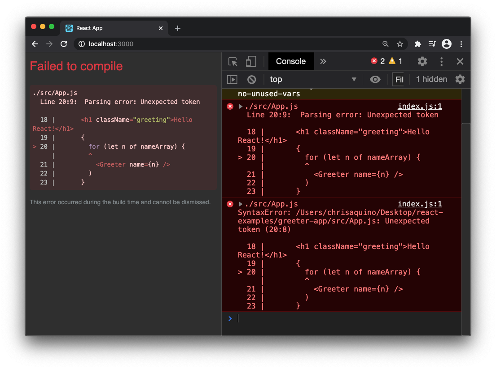

Why is this happening?

To answer this question, we can ask the babeljs.io site to interpret our JSX. This is our code without the for-loop:

```js
function App() {
    return (
        <div className='App'>
            <h1 className='greeting'>Hello React!</h1>
        </div>
    );
}
```

The babeljs.io site gives us the following translation:

```js
function App() {
    return React.createElement(
        'div',
        {
            className: 'App',
        },
        React.createElement(
            'h1',
            {
                className: 'greeting',
            },
            'Hello React!'
        )
    );
}
```

When you nest a JSX tag, it becomes an argument. In this example, `React.createElement("h1")` is the third argument to `React.createElement("div")`.

If you nest a for-loop in `React.createElement("h1")`, that for-loop becomes an argument. **For-loops cannot be used as an argument!** JavaScript treats that as an error.

To make it clear why it's an error, let's use a similar, non-React example.

```js
const nameArray = ['Melanie', 'Emma', 'Mel B', 'Geri', 'Victoria'];

function Greeter(name) {
    return `Hello, ${item}!`;
}

function App(dataToDisplay) {
    console.log(dataToDisplay);
}

App(/* What do we pass to App? */);
```

In this example, `App`'s job is to display whatever arguments are passed to it. `Greeter` receives a name and returns a greeting with that name.

This is what it looks like when we pass a for-loop to `App()`:

```js
App(for (let n of nameArray) { return Greeter(n)} );
```

You probably cried a little bit at the sight of that code sample.

1. A for-loop is not a function. You cannot `return` from them.
2. A for-loop is not a value. You cannot pass a for-loop as an argument.

Instead, you could transform `nameArray` before you call `App()`:

```js
const greetArray = [];
for (let n of nameArray) {
    greetArray.push(Greeter(n));
}
App(greetArray);
```

Logically, this is correct. But JavaScript Arrays can do this work for you:

```js
const greetArray = nameArray.map((n) => Greeter(n));
App(greetArray);
```

The `.map()` method does the following:

1. Expects to receive a function argument
1. Iterates over the elements of the Array
1. Passes each element to the function argument
1. Stores the returned value in a new Array
1. Returns the new Array

The difference between a for-loop and `.map()` is that `.map()` can return a value (the new Array), but a for-loop cannot.

You can omit the `greetArray` variable and write it like this:

```js
App(nameArray.map((n) => Greeter(n)));
// .map() will call the anonymous function,
// passing it each element in nameArray.
// The anonymous function calls Greeter().
```

Or even more succinctly:

```js
App(nameArray.map(Greeter));
// .map() will call Greeter(), passing it each element in nameArray
```

It's important to get comfortable with `.map()` - it's one of the most common conventions used in React codebases.

#### Transforming an Array into Components

We'll use a `map()` to create an array of `Greeter` Components.

```js{14}
const nameArray = [
  "Melanie",
  "Emma",
  "Mel B",
  "Geri",
  "Victoria"
];

function App() {
  return (
    <div className="App">
      <h1 className="greeting">Hello React!</h1>
      {
        nameArray.map(n => <Greeter name={n} />)
      }
    </div>
  );
}
```

You've seen that React can render individual Components (written in JSX, like `<h1>` or `<div>`).

In this example, we see that React can also render Arrays of Components (such as the Array of `Greeter` Components returned by `.map()`).

`nameArray.map()` is plain JavaScript, not JSX. Therefore, we must put it inside of `{}`.

On the page, we get the desired result! :tada:

But the console shows a warning... :disappointed:

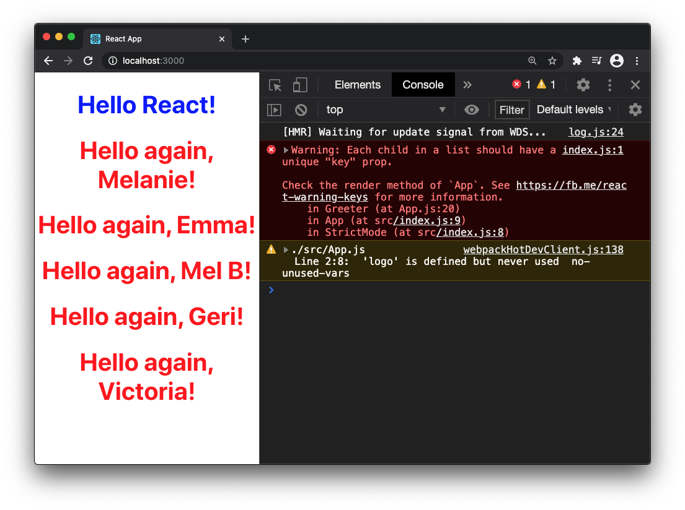

React is telling us that it sees multiple `Greeter` Components, but can't tell them apart and we should provide an additional prop to uniquely identify each one. For now, we'll use the Array item as the `key`:

```js{15}
const nameArray = [
  "Melanie",
  "Emma",
  "Mel B",
  "Geri",
  "Victoria"
];

function App() {
  return (
    <div className="App">
      <h1 className="greeting">Hello React!</h1>
      {
        nameArray.map(n => (
          <Greeter key={n} name={n}/>
        ))
      }
    </div>
  );
}
```

With that change, the warning goes away:

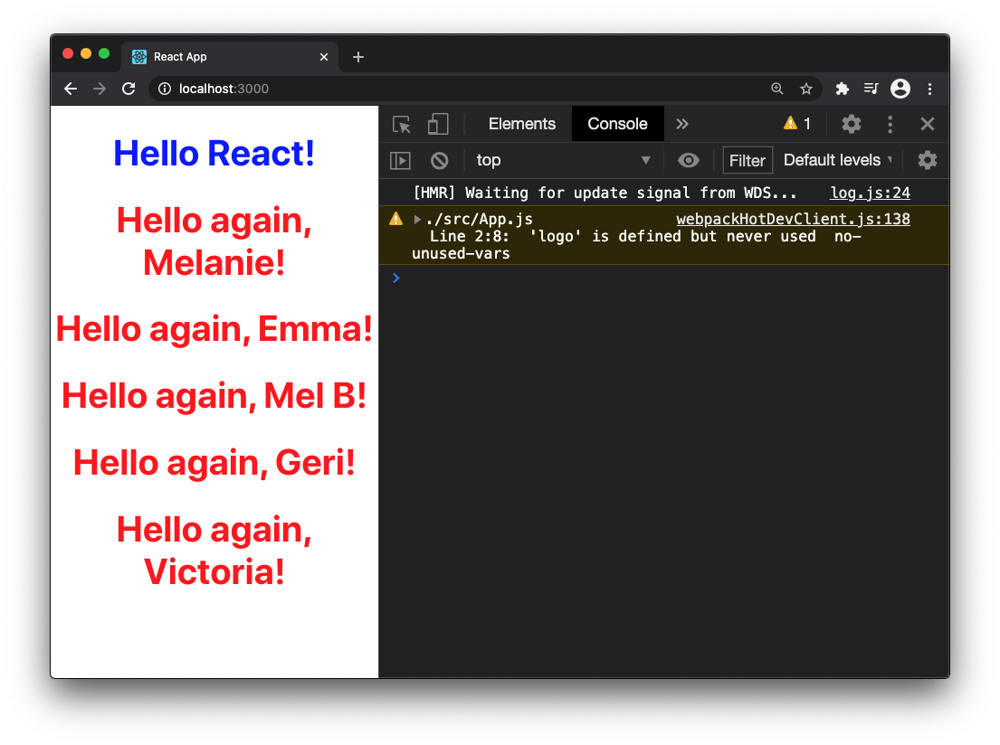

:::tip Why provide a key?
React was created to efficiently _redraw_ the UI whenever data changes. Even though we aren't changing the data in our Greeter app, we should always provide a unique `key` prop when we have an Array of Components.

In larger appliations with data that changes frequently, React can pinpoint the exact Components that need updating, and leave the others alone. This is the main technique that React uses for performance optimization.
:::

### Summary

In this lesson, you got started with React by using the built-in Components to create DOM elements on the page. You created custom Components using ES6 modules and class syntax. You used JSX as a shorthand way to call React's `createElement()` function, which produces descriptions of DOM Elements. You returned JSX from your Component's `render()` method, telling React to draw them on the page as DOM Elements. You provided data for your Components to display by passing props. In JSX, these look like HTML attributes, but are translated into arguments to `React.createElement()`.

You used the JSX interpolation syntax (curly braces) to display JavaScript values on the page. To display Arrays of values, you used the `.map()` method to convert each Array element into JSX, providing a unique `key` so that React can tell them apart.
