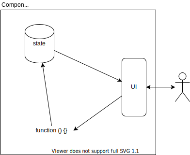

<!-- markdownlint-disable no-inline-html -->

:warning: THIS HAS BEEN DEPRECATED IN CURRENT VERSIONS OF REACT :warning:
<br/> We're keeping it here for as historical reference.

## Learning Objectives

After completing this lesson, you will be able to:

1. Define a `constructor()` method for your Components
1. Store a Component's data in `this.state`
1. Update your Component's state with `this.setState()`
1. Define helper methods and pass them as props
1. Receive functions as props
1. Call a function when a Component is clicked

## Lesson

### Overview

React's is optimized to redraw the UI when data changes in response to user interaction. To make this happen, React manages data in three separate steps:



1. The Component stores state in a variable
2. State is presented in the UI
3. Update the state when there is user interaction

Three parts to state in a React Component:

- A constructor that sets up initial state
- A helper function that updates state
- An event handler that triggers the helper function

In this lesson, we'll build the "Hello World" of managing state in a React Component: a simple counter.

### Setting Up

```sh
npx create-react-app state-counter
cd state-counter
mkdir src/components
code .
npm start
```

#### Creating a Counter Component

```sh
touch src/components/Counter.js
```

```js
import React from 'react';

class Counter extends React.Component {
    render() {
        return (
            <div>
                <button>-</button>
                <span>42</span>
                <button>+</button>
            </div>
        );
    }
}

export default Counter;
```

In `src/App.js`, import your `Counter` Component, delete most of the JSX (except for the `<div className="App">`), and add your `Counter`:

```js{2,7}
import React from 'react';
import Counter from './components/Counter';

function App() {
    return (
        <div className="App">
            <Counter />
        </div>
    );
}

export default App;
```

### What is state?

"State" refers to the data used by your app. In our counter application, the state is an integer that can be increased or decreased. In a messaging app, it might be an Array of message objects, each with a timestamp, the message content, and the id of the user who sent it. A tic-tac-toe game would store the placement of Xs and Os, and whose turn it is.

React provides two ways of managing state:

- Classes
- Hooks

When learning React, it's best to learn how to manage state with classes first. It will give you a clear picture of how information is flowing through your code and when that information is updating.

Hooks automate many of the steps, but it's far less obvious of how and when state changes occur.

### Setting Initial State in the `constructor()`

#### Defining the `constructor()`

```js{4-6}
import React from 'react';

class Counter extends React.Component {
    constructor(props) {
        super(props);
    }

    render() {
        return (
            <div>
                <button>-</button>
                <span>42</span>
                <button>+</button>
            </div>
        );
    }
}

export default Counter;
```

The `constructor()` runs any time a new instance of your Component is created. You define initialization steps here.

When writing a React Component, it's customary for the `constructor()` to expect to receive a `props` argument and to pass it to the `super()` function.

`super()` is how a class refers to the parent's `constructor()`. In this example, the parent is the `React.Component` class.

You can think of this step (calling `super(props)`) as setting up your Component to work with React. We have to implement this step since we are providing our own definition of `constructor()`.

:::tip constructor() is specific to JavaScript classes, not to React

The `constructor()` method is part of JavaScript classes. You can use it to initialize new instances of a class, even if you are not using React.

Like any JavaScript method, you can access the instance using the keyword `this`. React adds some additional properties and methods to any class that `extends React.Component`. You'll learn about one of these, `this.setState()`, later in this lesson.
:::

#### Initializing `this.state`

The `constructor()` gives us an opportunity to define the state for this Component. We do that by adding a `state` property to the instance:

```js{4-6}
class Counter extends React.Component {
    constructor(props) {
        super(props);
        this.state = {
            count: 0
        };
    }

    render() {
        return (
            <div>
                <button>-</button>
                <span>42</span>
                <button>+</button>
            </div>
        );
    }
}
```

In React, `this.state` is _always_ an Object. The team that developed React chose this because Objects let you manage multiple values, each with their own label.

Our state Object holds a single value, `count`.

#### Displaying `this.state.count`

Inside our `render()` method, update the JSX so that our `<span>` shows `this.state.count` instead of the hard-coded value `42`:

```js{13}
class Counter extends React.Component {
    constructor(props) {
        super(props);
        this.state = {
            count: 0
        };
    }

    render() {
        return (
            <div>
                <button>-</button>
                <span>{this.state.count}</span>
                <button>+</button>
            </div>
        );
    }
}
```

### Updating State with `setState()`

This section sets up the pieces necessary to update state, though we won't trigger updates until the [next section](#changing-state-onclick).

React adds a `this.setState()` method to any class that `extends React.Component`.

`this.setState()` does two things:

1. Updates values in `this.state`
2. Tells React to redraw the Component

:::warning Why call `this.setState()` instead of reassigning `this.state`?
Why does React provide a method to update `this.state`? Why can't you just reassign `this.state` to a new Object?

JavaScript does not provide a good/optimized way to "watch" if a variable has changed. As a workaround, React defines a `this.setState()` method for Components. The definition of `this.setState()` includes code to trigger a redraw.
:::

### Writing Helper Functions

A good practice is to define a helper function that calls `this.setState()`. This one will look a bit different from `constructor()` and `render()`.

Add the new method, `_incrementCounter` to the `Counter` class:

```js
class Counter extends React.Component {
    constructor(props) {
        super(props);
        this.state = {
            count: 0,
        };
    }

    render() {
        return (
            <div>
                <button>-</button>
                <span>{this.state.count}</span>
                <button>+</button>
            </div>
        );
    }

    _incrementCounter = () => {
        // Call this.setState() to increment this.state.count
    };
}
```

:::tip New syntax alert!
Technically, `_incrementCounter` is not a method. It is a [public instance field](https://developer.mozilla.org/en-US/docs/Web/JavaScript/Reference/Classes/Public_class_fields#Public_instance_fields).

This is newer JavaScript syntax that you can use in React (because it compiles it, or translates it, to browser-compatible JavaScript).
:::

The `_incrementCounter()` method is different from the others because:

- It's defined as an arrow function.
- It has an underscore `_` prefix.

An [arrow function](https://developer.mozilla.org/en-US/docs/Web/JavaScript/Reference/Functions/Arrow_functions) will always retain the correct value of `this`, making sure we can call `this.setState()` under any circumstances. (This will become apparent when writing more complex event handling.)

The `_` prefix is a convention that tells developers that this is a custom function, not a built-in React method.

:::tip Always define helper functions in the class that manages state
When building larger React applications, you'll create more Components.

Always define helper functions in the same class that manages state.

In fact, it's a good idea to follow this recipe any time you need to manage state:

1. Provide a name and a default value in the `this.state` Object.
2. Create a helper function that calls `this.setState()`
   :::

#### Calling `this.setState()` from `_incrementCounter()`

The next thing to do is to connect `_incrementCounter()` and `this.setState()`.

`this.setState()` expects to receive two arguments:

1. An Object with the key-value pairs to update
2. A function that will run after the state is finished updating

We'll add those in small steps. Begin by passing an empty Object and an arrow function to `this.setState()`:

```js{3}
    _incrementCounter = () => {
        // Call this.setState() to increment this.state.count
        this.setState({}, () => {})
    }
```

Since we're updating `this.state.count`, let's add that to the Object:

```js{4}
    _incrementCounter = () => {
        // Call this.setState() to increment this.state.count
        this.setState({
            count: this.state.count + 1
        }, () => {})
    }
```

We're telling React to update the `count` key. The new value will be the current value of `this.state.count` plus 1.

Finally, we'll put a `console.log()` in the body of the arrow function. That way, we'll know for sure when React is finished updating state.

```js{6}
    _incrementCounter = () => {
        // Call this.setState() to increment this.state.count
        this.setState({
            count: this.state.count + 1
        }, () => {
            console.log('Finished updating the count');
        })
    }
```

#### Adding the `_decrementCounter` Helper Method

In your `Counter` class, add a corresponding `_decrementCounter()` helper method:

```js{28-34}
class Counter extends React.Component {
    constructor(props) {
        super(props);
        this.state = {
            count: 0
        };
    }

    render() {
        return (
            <div>
                <button>-</button>
                <span>{this.state.count}</span>
                <button>+</button>
            </div>
        );
    }

    _incrementCounter = () => {
        // Call this.setState() to increment this.state.count
        this.setState({
            count: this.state.count + 1
        }, () => {
            console.log('Finished updating the count');
        })
    }

    _decrementCounter = () => {
        this.setState({
            count: this.state.count - 1
        }, () => {
            console.log('Finished updating the count');
        })
    }
}
```

### Changing state `onClick`

After all of that setup, it's time to see the results!

We'll discuss React Events in more depth in the next lesson. For now, we'll learn just enough about Events to trigger our helper function.

React Components have a built-in prop named `onClick`. As the name suggests, it can call a function when a `click` event occurs.

Update your `render()` method, adding an `onClick` prop to each of the `<button>` Components in the JSX.

```js{4,6}
    render() {
        return (
            <div>
                <button onClick={}>-</button>
                <span>{this.state.count}</span>
                <button onClick={}>+</button>
            </div>
        );
    }
```

We'll specify a function for each `onClick`. Since functions are JavaScript expressions, we use `{}`.

```js{4,6}
    render() {
        return (
            <div>
                <button onClick={this._decrementCounter}>-</button>
                <span>{this.state.count}</span>
                <button onClick={this._incrementCounter}>+</button>
            </div>
        );
    }
```

Try it out in the browser and make sure that the number changes as you click the buttons.

### Displaying Multiple `Counter` Components

If you add more than one `Counter` to the JSX, each one should work independently.

```js{4-6}
function App() {
    return (
        <div className="App">
            <Counter />
            <Counter />
            <Counter />
        </div>
    );
}
```

#### Passing in an Initial `count` value

Add an `initialCount` prop to the first two `Counter` Components in `App`:

```js{4-6}
function App() {
    return (
        <div className="App">
            <Counter initialCount={42} />
            <Counter initialCount={-13} />
            <Counter />
        </div>
    );
}
```

In `Counter`, use `props.initialCount` as the value. If `props.initialCount` is falsey (because it was not passed in), use `0` as a default:

```js{5}
class Counter extends React.Component {
    constructor(props) {
        super(props);
        this.state = {
            count: props.initialCount || 0
        };
    }

    render() {
...
```

### Passing Helper Methods as Props

Putting everything in `Counter` is fine for an app this size. However, let's explore the flexibility that React gives us.

We'll create `Increment` and `Decrement` Components that:

- Expect to receive a `handleClick` prop
- Use `this.props.handleClick` as an `onClick` handler.

And, we'll display the current count using an `Output` Component.

Here's `Increment`:

```js
import React from 'react';

class Increment extends React.Component {
    render() {
        return <button onClick={this.props.handleClick}>+</button>;
    }
}

export default Increment;
```

`Decrement` is similar:

```js
import React from 'react';

class Decrement extends React.Component {
    render() {
        return <button onClick={this.props.handleClick}>-</button>;
    }
}

export default Decrement;
```

`Output` expects to receive a `count` prop and displays it:

```js
import React from 'react';

class Output extends React.Component {
    render() {
        return <span>{this.props.count}</span>;
    }
}

export default Output;
```

Update `Counter` so that it imports the three new Components and renders them:

```js{2-4,16-18}
import React from 'react';
import Ouput from './Output';
import Increment from './Increment;
import Decrement from './Decrement;
class Counter extends React.Component {
    constructor(props) {
        super(props);
        this.state = {
            count: 0
        };
    }

    render() {
        return (
            <div>
                <Decrement handleClick={this._decrementCount} />
                <Output count={this.state.count} />
                <Increment handleClick={this._incrementCount} />
            </div>
        );
    }

    _incrementCounter = () => {
        // Call this.setState() to increment this.state.count
        this.setState({
            count: this.state.count + 1
        }, () => {
            console.log('Finished updating the count');
        })
    }

    _decrementCounter = () => {
        this.setState({
            count: this.state.count - 1
        }, () => {
            console.log('Finished updating the count');
        })
    }
}
```

### Summary

This lesson introduced the idea of state in a React application. You learned to define `this.state` in your custom Component's `constructor()` method. By defining `this.state` as an Object, your Component can manage multiple values, each with their own label.

To update your Component's state, you defined helper methods that call `this.setState()` and pass it an Object with the key-value pairs to update. Optionally, you passed in a second argument: a function that is called after React finishes updating state. Your helper methods are defined as arrow functions to ensure that the keyword `this` always refers to your Component instance.

You learned that functions can be passed as props and called `onClick`. In addition, props can be accessed in the `constructor()` to set the initial values of `this.state`.
