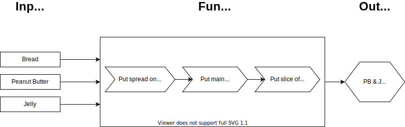

## Learning Objectives

After completing this section, you'll be able to:

- Create programs in your text editor and run them in the terminal
- Create and assign variables
- Use strings and numbers in your programs
- Define and invoke functions
- Specify and use function parameters

## Lesson

### Overview

In this lesson, you will learn the basic building blocks of writing programs.

Your programs will run in the Terminal, storing and printing numbers and text. You'll create _variables_ to serve as labels for these values, providing a convenient way to refer to and manipulate the values throughout your program.

Afterwards, you'll create and use _functions_. In the same way that variables are labels for values, functions are labels for groups of instructions.

Variables and functions will be the primary tools you'll use for solving problems, no matter what programming language you're using.

#### Why do we write in a programming language?

Your computer is really just a collection of on/off switches, some labeled storage boxes, and wires that run between the switches and the boxes.

What gives your computer its power is that there are billions of switches, many times more boxes, and the wires are extremely fast.

At this scale, your computer is able to coordinate all of this electrical activity so that it can run complex programs like web browser, word processors, spreadsheets, video players, and 3D games.

The problem is that your computer _only_ thinks in terms of "on" and "off". To make the leap from "on" and "off" to 3D games, computer scientists developed different kinds of short-hand, or _code_, that gets translated into "on" and "off". The process of translation is more commonly known as _compiling_.

More specifically, we represent the "on" and "off" states as 1s and 0s because those conveniently translate into `True` and `False`. (There's a [whole branch of mathematics](https://en.wikipedia.org/wiki/Boolean_algebra) dedicated to doing complex logic with `True` and `False`.)

Early computers didn't have nearly as many switches or as much storage, so programming them was not as complex as it is today. Over time, [computers evolved rapidly](https://www.youtube.com/playlist?list=PL8dPuuaLjXtNlUrzyH5r6jN9ulIgZBpdo).

In a nutshell, programmers write code because programming the hardware of a computer would be too complex a task otherwise.

#### What write programs that run in the terminal?

Even if your eventual goal is to build 3D games, one of the best ways to get started with programming is to build programs that only run in the terminal.

The reason is that terminal-based programs are small and focused. There are no extra layers (e.g., windows, graphics, sound effects, and networks) to take your attention away from the pure fundamentals.

Programs are built in layers. At their foundation are a few, main pieces. A chat application is still just text input and output. A video game is a loop filled with conditionals. A photo editing program can simply be described as a way to manipulate a grid of color values.

When planning, developing, and debugging programs it is best to focus on the most bare-bones implementation of an idea. It is easier to build on top of something that works.

### What are the essential elements of programming?

- Storing values and definitions
- Writing statements and expressions that use values and definitions
- Combining statements and expressions into programs

We will begin exploring these essentials with the most basic of programs.

#### What is "Hello World"?

"Hello World" is a short program that prints out "Hello World" to the screen.

Programmers use this as a first program because writing it answers the following questions:

- How do I create a String (a sequence of letters)?
- How do I print that String to the screen?

:::tip
Printing is one of the most powerful tools in a programmer's toolkit.
It provides a way to see what values are available in a program at a particular time.

You will use it regularly as you test an idea or debug your larger programs.
:::

Luckily, your code does not need to have any concept of the "screen" - JavaScript comes with a built-in function that handles that for you. You will see this in the upcoming code sample for the Hello World program.

#### What's an expression?

An expression is a piece of code that results in a single value.

An example of an expression is the String `"Hello World"`. It's a sequence of text characters enclosed by quotation marks. It is already in its simplest form and can't be reduced any further.

Another example of an expression is `23 + 19`. It can be reduced to the integer (whole number) `42` but is still considered a single expression.

#### What's a statement?

A statement is a general term for a single instruction that uses or manipulates values.

Here's a statement that prints `"Hello World"`:

```js
console.log("Hello World");
```

This statement uses the built-in `console.log()` function. Its job is to receive one or more values and print that to the terminal. In this example, we use it to display the String `"Hello World"`.

Create a new file named `hello_world.js`, type in this statement, and save the file. This is all it takes to write the "Hello World" program in JavaScript. To run your program, type this in your terminal and then press `Enter` on your keyboard:

```sh
node hello_world.js
```

You should see the following printed to the screen:

```
Hello World
```

#### How do I leave notes for myself in my code?

Programming languages let you put notes, or **comments** in your code. Comments can help you remember how a complex piece of code works and can help your team members understand the reasoning and purpose of your code.

```js
// Hello World: my first JavaScript program
console.log("Hello World"); // <--- Look! I did it!
```

In JavaScript, a pair of slashes (`//`) is the beginning of a comment - the rest of that line of code is ignored.

:::tip
You will often _comment out_ a piece of buggy code so that it is ignored. Programmers do this to confirm that the rest of the program is still working as expected.

Once you've fixed the bug, you'll _uncomment_ the code so that it is part of the running program once again.
:::

#### How do I save values for later use?

In JavaScript, you can give a value an easy-to-remember label and use it again and again. This is especially useful if the value itself is long and tricky to type out.

Programmers refer to these labels as **variables**.

```js{1}
const friendlyGreeting = "Hello World";
console.log(friendlyGreeting);
```

On the first line of this program, we are using `=` to **assign** the value `"Hello World"` to the _variable_ `friendlyGreeting`. We tell JavaScript to create a new variable using the `const` keyword.
If you were to add more lines to your program, you could refer to the String `"Hello World"` simply by using the variable name `friendlyGreeting`.

:::tip
When you see `=` in a program, it means you are _assigning a value to a variable_.

It does not mean that the two sides are equal, like it does in math.
:::

When you assign variables, the computer stores the value in memory. The computer knows the location of the value by a long, numeric address. These are hard for humans to remember, so programming languages let us give them convenient variable names.

#### What kinds of names should I give to variables?

It varies from language to language, but JavaScript variables must follow these rules:

- The first character must either be a letter (lower case or upper case), the underscore character (`_`), or the dollar sign (`$`)
- The rest of the variable name can consist of letters, numbers, underscores, or dollar signs.

:::tip
JavaScript variables typically use `camelCaseVariablenames` - all lowercase letters with words separated by underscores. It's not a requirement, but it is the convention adopted by the community of JavaScript programmers.

Other programming language communities favor other styles, such as `snake_case_variable_names` or `PascalCaseVariableNames`.
:::

#### What words can I not use as variable names?

The following are "reserved words", meaning they are part of the JavaScript language itself and cannot be used as variable names:

<table>
<tr><td>async</td>   <td>do</td>        <td>in</td>        <td>switch</td></tr>
<tr><td>await</td>   <td>else</td>      <td>instanceof</td><td>this</td></tr>
<tr><td>break</td>   <td>enum</td>      <td>let</td>       <td>throw</td></tr>
<tr><td>case</td>    <td>export</td>    <td>new</td>       <td>try</td></tr>
<tr><td>catch</td>   <td>extends</td>   <td>package</td>   <td>typeof</td></tr>
<tr><td>class</td>   <td>finally</td>   <td>private</td>   <td>var</td></tr>
<tr><td>const</td>   <td>for</td>       <td>protected</td> <td>void</td></tr>
<tr><td>continue</td><td>function</td>  <td>public</td>    <td>while</td></tr>
<tr><td>debugger</td><td>if</td>        <td>return</td>    <td>with</td></tr>
<tr><td>default</td> <td>implements</td><td>static</td>    <td>yield</td></tr>
<tr><td>delete</td>  <td>import</td>    <td>super</td></tr>
</table>

You will learn the meaning of many of these reserved words as you learn more JavaScript.

#### What are the basic data types in JavaScript?

In computer programming, a data type is a specific kind of value. (Often, programmers just call them "types" instead of saying "data types".)

JavaScript provides many data types. You have already seen the String type, which is a sequence of text characters. Each type has particular characteristics and uses. For example, you can do mathematical calculations with numbers, search and replace with Strings, and sorting with Lists.

Here are some of the other data types:

- Number - integers (whole numbers like `0`, `42`, `8675309`) and [floats](https://techterms.com/definition/floatingpoint) (a number with a decimal point such as`3.14159`, `6.626068`, `1.21`)
- Boolean - `true` or `false`
- Arrays - a sequence of values (`[1, 2, 3, 4]`, `["milk", "butter", "eggs"]`)
- Objects - a sequence of labeled values (`{ "name": "Galahad", "quest": "Seek the Grail", "favorite_color": "Blue"}`)

You will learn more about each data type throughout these lessons.

:::tip
Developers use the term "literal" to refer to a value that is not in a variable.

For example, `"Hello World"` is a String literal, and `42` is an Number literal.
:::

#### What are three ways to create a String literal?

A String literal can be created by putting quotes around text. In JavaScript, you can use single quotes, double quotes, and "backticks" (the symbol between the `Tab` and `Esc` key on US keyboards).

Here's what those look like:

```js
"I am a string.";

"I am also a string.";

"I'm a string and I have a single quote";

"I'm a string and I have to escape my single quote."`I'm surrounded by backticks and contain a mix of "double quotes" and 'single quotes'.``
I am a string
    with backticks
and I can

span

multiple

lines!
`;
```

#### How do I combine two or more Strings?

You can combine Strings by using the `+` operator. Though it looks like the math symbol for addition, it is called the **concatenation** operator when used with Strings.

```js{1}
const friendlyGreeting = "Hello" + " World";
console.log(friendlyGreeting);
```

You can also concatenate String literals with variables

```js{2}
const friendlyGreeting = "Hello";
console.log(friendlyGreeting + " " + "World");
```

:::tip
When concatenating Strings, you may need to add additional spaces as in the examples above.
:::

#### Which side of the assignment is handled first?

The `=` is more formally known as the **assignment operator**. It always appears between the Left Hand Side (LHS) and the Right Hand Side (RHS) of the assignment.

The LHS must be a variable.

The RHS can be any expression - that is, it must be a single value or it must be reducible to a single value. Because expressions can contain calculations, the RHS is evaluated before the assignment occurs.

The following example shows a value being assigned to the variable `theAnswer`:

```js
const theAnswer = 23 + 19;
console.log("The answer is", theAnswer);
```

What is the value being assigned? It is `42`, because the assignment occurs after the calculation of `23 + 19` takes place.

One of the handy things about variables is that they can be used as part of the RHS:

```js{3}
const firstNumber = 23;
const secondNumber = 19;
const theAnswer = firstNumber + secondNumber;
console.log("The answer is", theAnswer);
```

Using `const` creates a "permanent" label for a value. In the previous example, the value of `secondNumber` will always be `19`. However, you can create variables that can be _reassigned_ by using the keyword `let`.

```js{2,6}
const firstNumber = 23;
let secondNumber = 19;
const theAnswer = firstNumber + secondNumber;
console.log("The answer is", theAnswer);

secondNumber = 100;
console.log("The answer is still", theAnswer);
console.log("Even though the second number is now", secondNumber);
```

In this code sample, this is what is prints to the terminal:

```sh
The answer is 42
The answer is still 42
Even though the second number is now 100
```

It is important to understand that the RHS is never recomputed, even if one of its parts changes.

(In JavaScript, you can make definitions that recompute their results, but the syntax is different. This requires the use of functions, which you will learn about later in this lesson.)

:::tip
The value of a variable is set at the time of assignment. If part of the RHS changes, that does not retroactively change the value of the variable.
:::

#### What really happens when I do assignment?

JavaScript takes the following steps when you assign a value to a variable:

- Reduces the RHS to a single value
- Reserves memory for the value
- Saves the value to a memory address
- Associates the variable name with the memory address

:::tip var vs const and let
There is a third way to declare a variable using the keyword `var`. In earlier versions of JavaSript, it was the only way to declare a variable. `const` and `let` were introduced as an improvement over some buggy behavior with `var`.
:::

Now that you have the basics of creating and assigning variables, let's look at some ways to use them.

### How do I use the a value as part of a String?

Up to now, we have passed the `console.log()` function multiple values, separated by commas. If we wanted to do something more complicated with the output, we might need to use the string interpolation syntax.

```js{2}
const theAnswer = 23 + 19;
console.log(`The answer is ${theAnswer}! Isn't that wonderful?`);
```

Line 2 of this code sample shows string interpolation. To use string interpolation you need two things:

1. A backtick-quoted string
2. A variable wrapped in `${}`.

The `${}`-wrapped variable will be replaced with the value of the variable.

Here is the result of running the new version of the program:

```sh
The answer is 42! Isn't that wonderful?
```

:::warning You can only interpolate using a backtick-quoted string

If you use single or double quotes, JavaScript will not substitute the value.

```js{2}
const theAnswer = 23 + 19;
console.log("The answer is ${theAnswer}! Isn't that wonderful?");
```

This will produce the following output:

```sh
The answer is ${theAnswer}! Isn't that wonderful?
```

:::

### What are some other ways to work with numbers?

In most programs, you will need to perform some basic arithmetic, even if the main purpose of your program isn't calculation. (For example, count the number of search results and display a "Read more" link if there are more than 20.)

<table>
<thead>
<tr>
<th>Operator</th>
<th>Meaning</th>
<th>Example</th>
<th>Result</th>
</tr>
</thead>
<tbody>
<tr>
<td><code>+</code></td>
<td>Addition</td>
<td><code>1 + 1</code></td>
<td><code>2</code></td>
</tr>
<tr>
<td><code>-</code></td>
<td>Subtraction</td>
<td><code>3 - 2</code></td>
<td><code>1</code></td>
</tr>
<tr>
<td><code> * </code></td>
<td>Multiplication</td>
<td><code>2 * 3</code></td>
<td><code>6</code></td>
</tr>
<tr>
<td><code>/</code></td>
<td>Division</td>
<td><code>8 / 4</code></td>
<td><code>2</code></td>
</tr>
<tr>
<td><code>%</code></td>
<td>Remainder</td>
<td><code>3 % 2</code></td>
<td><code>1</code></td>
</tr>
</tbody>
</table>

### What is a function?

A function is like a recipe. It requires certain ingredients. After all the steps are carried out, the result is a specific dish.


What makes functions so powerful is that you can supply different inputs and obtain a different output, without changing the recipe:



An example of a function is the `console.log()` function.

The ingredient that it needs is a String (or something it can get a String version of). The result is output to the screen.

Let's imagine using an `add()` function that adds two numbers.

```js
const result = add(2, 3);
console.log(result);
```

Here is the output from running that code:

```sh
5
```

In our simple example, our "ingredients" are the numbers `2` and `3`. The "dish" that is produced is the number `5`.

Now that you have an idea of what a function does, it's time to build one.

### How do I write a function?

Here is the `add()` function mentioned above:

```js
function add(num1, num2) {
  return num1 + num2;
}
```

#### A function is defined in four parts

In JavaScript, you create a function by:

1. Using the `function` keyword
2. Naming the function
3. Declaring parameters ("ingredients")
4. Providing the body of the function as a _code block_

Like the steps for making a particular dish, the body of a function are the steps for creating a result out of our ingredients. Our `add()` function produces the sum of the two numbers.

#### How do I run a function?

After defining a function, you run the function by using its name, followed by a pair of parentheses.

When you run a function, each statement in the function's body is run, in order.

:::tip
Programmers refer to running a function as _calling_, _executing_, or _invoking_ a function.

A **function call**, or **invocation** is the act of running the body of a function, using any values that might have been passed in as arguments.
:::

### What are parameters?

We have described functions as reusable recipes, or a series of steps. Just as recipe has a list of necessary ingredients, function definitions have a list of _parameters_.

When you make a recipe, you might use different ingredients to get a different result. The same is true with functions. You can input different parameter values to get a different output.

This makes functions reusable, but also "configurable" by simply passing in different parameter values, or _arguments_, when you call the function.

Keeping with our recipe analogy, each argument is a particular ingredient. If we had a `sandwich()` function, we could configure it by passing in "turkey" to make turkey sandwich, or "veggie" to make a veggie sandwich.

In some of the examples in this lesson, you have already seen arguments in action. When you define a function, the argument names are listed between the parentheses. When you call a function, you provide argument values.

In our simple `add()` function, we listed two arguments, `num1` and `num2`:

```js
function add(num1, num2) {
  return num1 + num2;
}
```

In the body of the function, we use arguments the same way we use variables. In both cases, they are just labels for values.

When we call a function, we provide the values that get assigned to the argument names:

```js
const result = add(2, 3);
console.log(result);
```

:::tip
Though they are technically different, programmers often use the terms "parameter" and "argument" interchangeably.

Parameters (or the "formal parameter list") is part of a function's definition.

Arguments are the values provided when a function is called.
These are the values that are used while the function body is running.
:::

### How do I return a value from a function?

Our `add()` function `return`s a value, allowing us to use it on the RHS of an assignment:

```js{1}
const result = add(2, 3);
console.log(result);
```

The entire RHS of the assignment on line 1 is _effectively replaced_ with the number `5`, which is the value `return`ed by `add(2, 3)`.

:::tip
Functions are not required to `return` a value, but it is best to write functions that do.

Functions that `return` a value based on their inputs are easier to test and debug.
:::

### Summary

In this lesson, you learned how to store String and Number values in variables. Using those variables, you were able to manipulate them to produce new values (using arithmetic for Numbers and concatenation and interpolation for Strings).

Then you learned how to crate reusable functions so that you could run a series of statements again and again. By defining parameters and return values, you learned to create functions that produce outputs based on the inputs you give them.

:::tip
Though we used JavaScript as the programming language in this lesson, these concepts are transferable to languages like C, C#, Python, Ruby, Java, and others. This style of programming is called _Imperative Programming_ because you are giving explicit instructions on how to carry out a process.
:::

<!-- ## Training Exercises

[Click here for the Intro to JavaScript Exercises](./exercises.md) -->

## Additional Resources

What follows are links to tutorials and videos to help you reinforce and deepen your knowledge.

The following articles offer an alternate explanation of some of the material from the lesson. Note that they may cover slightly different areas of the same topics.

- [Floating Point Math](https://0.30000000000000004.com/) explains why computers have difficulty with adding numbers with decimals.
