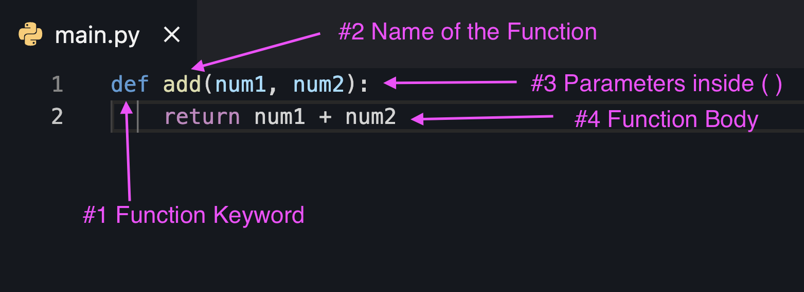

## Learning Objectives

After completing this lesson, you will be able to:

1. Organize code into functions
2. Use functions for encapsulation and abstraction
3. Reduce repetition of code

## Lesson

### Overview

Functions are one of the most useful tools in a programmer's toolkit. In the same way that variables are reusable labels for individual values, functions are reusable labels for a set of statements.

In the previous lesson, you learned how to write loops that iterate through sequences. The body of your loops performed a specific task, such printing a to-do list or marking a to-do item as complete.

In this lesson, you will improve on the to-do list by eliminating redundant code by defining functions.

### What is a function?

A function is like a recipe. It gives you a list of ingredients. After all the steps are carried out, the result is a specific dish.

(diagram of food going "into" a recipe card by getting mapped onto the ingredients list, then resulting dish being returned by the recipe)

An example of a function is the `print()` function.
The ingredient that it wants is a String (or something it can get a String version of). The result is output to the screen.

Let's imagine using an `add()` function that adds two numbers.

```py
result = add(2, 3)
print(result)
```

Here is the output from running that code:

```py
5
```

In our simple example, our "ingredients" are the numbers `2` and `3`. The "dish" that is produced is the number `5`.

Now that you have an idea of what a function does, it's time to build one.

### How do I write a function?

Here is the `add()` function mentioned above:

```py
def add(num1, num2):
    return num1 + num2
```

It can be defined in four parts:



In Python, you create a function by:

1. Using the `def` keyword
2. Naming the function
3. Declaring parameters ("ingredients")
4. Providing the body of the function as a code block

#### How do I run a function?

After defining a function, you run the function by using its name, followed by a pair of parentheses.

When you run a function, each statement in the functions body is run.

:::tip
Programmers refer to running a function as _calling_, _executing_, or _invoking_ a function.

A **function call**, or **invocation** is the act of running the body of a function, using any values that might have been passed in as arguments.
:::

#### How do I replace repetitive code with function calls?

Now it's time to put your understanding of functions to use. Update your to-do program by adding a `print_todos()` function. You will use that instead of repeating the for-loop that `print()`s your to-dos.

<details>
    <summary>
        Printing to-dos with a function
    </summary>

We define the new `print_todos()` function near the top of our program, **before** we try to call it. In our while-loop, we call `print_todos()` any time we want to show the user their current list of to-dos.

```py

todos = []

# Create a constant for our main menu.
# This saves us from having to type it out twice.
MAIN_MENU = """
Choose an action:
P: Print your to-do list
A: Add a to-do item
R: Replace a to-do item
C: Complete a to-do item
(Or press Enter to exist the program.)
"""

def print_todos():
    # Print the current list of to-do items
    print("\n\n\nTo do:")
    print("====================")
    count = 1
    for todo in todos:
        print("%d: %s" % (count, todo))
        count += 1

choice = input(MAIN_MENU)
choice = choice.upper() # Simplifies our if-conditions

# As long as they type something, keep prompting
while len(choice) > 0:
    if choice == "P":
        print_todos()
    elif choice == "A":
        new_todo = input("What do you need to do? ")
        if len(new_todo) > 0:
            todos.append(new_todo)
    elif choice == "R":
        print_todos()

        which_index = input("Which to-do number? ")
        try:
            which_index = int(which_index)
            which_index -= 1 # Convert from human-readable to 0-based index

            if which_index >= 0 and which_index < len(todos):
                new_todo = input("What do you need to do? ")
                todos[which_index] = new_todo
        except ValueError:
            print("\n\n***Please enter a number.***")
    elif choice == "C":
        print_todos()

        which_index = input("Which to-do number? ")
        try:
            which_index = int(which_index)
            which_index -= 1 # Convert from human-readable to 0-based index

            if which_index >= 0 and which_index < len(todos):
                completed_todo = todos[which_index]
                del todos[which_index]
                print("%s has been marked complete!" % completed_todo)
        except ValueError:
            print("\n\n***Please enter a number.***")
    else:
        print("\n\n***Please enter a valid menu option.***")

    choice = input(MAIN_MENU)
    choice = choice.upper() # Simplifies our if-conditions

print("Have a nice day!")
```

</details>

:::tip
Improving code by removing repetition, improving readability, and increasing flexibility are examples of _refactoring_.
:::

### How do I return a value from a function?

Our `add()` function `return`s a value, allowing us to use it on the RHS of an assignment.

:::tip
Functions are not required to `return` a value, but it is best to write functions that do.

Functions that `return` a value based on their inputs are easier to test and debug.
:::

#### How do I use return values to "signal" success or failure?

In our to-do program, we prompt the user for the number of an existing to-do in two places: when they replace a to-do and when they complete a to-do.

Unlike replacing the repetitive for-loops with `print_todos()`, the code is not exactly the same. Prompting the user and checking its validity are the same, but the meat of our code (replacing or completing) is buried inside of an `if`, which is inside of a `try`.

One option is to write a function that only handles prompting for a number and checking if it's valid. It can `return` the index if it's valid and return `-1` if it's not.

:::tip
`-1` is commonly used to indicate that an index is invalid. This convention is popular in a number of languages, including Python and Java.
:::

<details>
    <summary>Writing a `get_todo_index()` function</summary>

We refactor some of the old code into a new `get_todo_index()` function. Inside the function, if we determine that the index is valid, we `return` it. If it is invalid (either they didn't type a number or the number fell outside the range of valid indices), we `return -1`.

Knowing that `get_todo_index()` will only return `-1` or a valid index lets us simplify the code for replacing a to-do.

```py
todos = []

# Create a constant for our main menu.
# This saves us from having to type it out twice.
MAIN_MENU = """
Choose an action:
P: Print your to-do list
A: Add a to-do item
R: Replace a to-do item
C: Complete a to-do item
(Or press Enter to exist the program.)
"""

def print_todos():
    # Print the current list of to-do items
    print("\n\n\nTo do:")
    print("====================")
    count = 1
    for todo in todos:
        print("%d: %s" % (count, todo))
        count += 1

def get_todo_index():
    which_index = input("Which to-do number? ")

    try:
        which_index = int(which_index)
        which_index -= 1 # Convert from human-readable to 0-based index

        if which_index >= 0 and which_index < len(todos):
            return which_index
        else:
            return -1
    except ValueError:
        print("\n\n***Please enter a number.***")
        return -1


choice = input(MAIN_MENU)
choice = choice.upper() # Simplifies our if-conditions

# As long as they type something, keep prompting
while len(choice) > 0:
    if choice == "P":
        print_todos()
    elif choice == "A":
        new_todo = input("What do you need to do? ")
        if len(new_todo) > 0:
            todos.append(new_todo)
    elif choice == "R":
        print_todos()
        which_index = get_todo_index()
        if which_index != -1:
            new_todo = input("What do you need to do? ")
            todos[which_index] = new_todo
    elif choice == "C":
        print_todos()

        which_index = input("Which to-do number? ")
        try:
            which_index = int(which_index)
            which_index -= 1 # Convert from human-readable to 0-based index

            if which_index >= 0 and which_index < len(todos):
                completed_todo = todos[which_index]
                del todos[which_index]
                print("%s has been marked complete!" % completed_todo)
        except ValueError:
            print("\n\n***Please enter a number.***")
    else:
        print("\n\n***Please enter a valid menu option.***")

    choice = input(MAIN_MENU)
    choice = choice.upper() # Simplifies our if-conditions

print("Have a nice day!")
```

We can reuse `get_todo_index()` for completing a to-do.

```py
todos = []

# Create a constant for our main menu.
# This saves us from having to type it out twice.
MAIN_MENU = """
Choose an action:
P: Print your to-do list
A: Add a to-do item
R: Replace a to-do item
C: Complete a to-do item
(Or press Enter to exist the program.)
"""

def print_todos():
    # Print the current list of to-do items
    print("\n\n\nTo do:")
    print("====================")
    count = 1
    for todo in todos:
        print("%d: %s" % (count, todo))
        count += 1

def get_todo_index():
    which_index = input("Which to-do number? ")

    try:
        which_index = int(which_index)
        which_index -= 1 # Convert from human-readable to 0-based index

        if which_index >= 0 and which_index <details len(todos):
            return which_index
        else:
            return -1
    except ValueError:
        print("\n\n***Please enter a number.***")
        return -1


choice = input(MAIN_MENU)
choice = choice.upper() # Simplifies our if-conditions

# As long as they type something, keep prompting
while len(choice) > 0:
    if choice == "P":
        print_todos()
    elif choice == "A":
        new_todo = input("What do you need to do? ")
        if len(new_todo) > 0:
            todos.append(new_todo)
    elif choice == "R":
        print_todos()
        which_index = get_todo_index()
        if which_index != -1:
            new_todo = input("What do you need to do? ")
            todos[which_index] = new_todo
    elif choice == "C":
        print_todos()
        which_index = get_todo_index()
        if which_index != -1:
            completed_todo = todos[which_index]
            del todos[which_index]
            print("%s has been marked complete!" % completed_todo)
    else:
        print("\n\n***Please enter a valid menu option.***")

    choice = input(MAIN_MENU)
    choice = choice.upper() # Simplifies our if-conditions

print("Have a nice day!")
```

</details>

#### How do I `return` multiple values?

You are only allowed to `return` a single value from a function. To get around this constraint, you can return a sequence instead.

Here's an example of a `divide()` function that returns both the quotient and the remainder:

```py
def divide(dividend, divisor):
    quotient = dividend // divisor # The // operator rounds
    remainder = dividend % divisor
    return (quotient, remainder) # Return a tuple

result = divide(5, 3)
print(result)
```

The function appears to return multiple values, but it is really just a single tuple:

```py
(1, 2)
```

#### What if there is no `return`?

If you do not include a `return` statement or if you use the `return` keyword by itself, Python interprets this as returning the value `None`.

```py
def return_nothing():
    return

result = return_nothing()
print(result)
```

When you run this code, the `None` keyword is printed:

```py
None
```

As the name implies, `None` signifies "no value".

#### Does any code run after a `return` statement?

When Python encounters the `return` keyword while running a function, it _exits_ the functions. This means that none of the statements after `return` will run.

```py
def does_not_print():
    print("This prints")
    return
    print("This does not print")
    print("Nor does this")

    print("Third time is not a charm")
    print(":)")

does_not_print()
```

The first `print()` runs, but the rest do not:

```py
This prints
```

### What are arguments?

We have described functions as reusable recipes, or a series of steps.

Not only are they reusable, but you can "configure" their behavior by **passing arguments** when you call the function.

Keeping with our recipe analogy, each argument is a particular ingredient. If we had a `sandwich()` function, we could configure it by passing in "turkey" to make turkey sandwich, or "veggie" to make a veggie sandwich.

In some of the examples in this lesson, you have already seen arguments in action. When you define a function, the argument names are listed between the parentheses. When you call a function, you provide argument values.

In our simple `add()` function, we listed two arguments, `num1` and `num2`:

```py
def add(num1, num2):
    return num1 + num2
```

In the body of the function, we use arguments the same way we use variables. In both cases, they are just labels for values.

When we call a function, we provide the values that get assigned to the argument names:

```py
result = add(2, 3)
print(result)
```

:::tip
Though they are technically different, programmers often use the terms "parameter" and "argument" interchangeably.

Parameters (or the "formal parameter list") is part of a function's definition.

Arguments are the values provided when a function is called.
These are the values that are used while the function body is running.
:::

#### Are arguments required?

If you call a function but fail to provide the correct number of arguments, an error will be thrown.

```py
result = add(2)
print(result)
```

We defined the `add()` function with 2 arguments, but only passed 1. This results in a `TypeError`:

```py
Traceback (most recent call last):
  File "add-2.py", line 1, in <module>
    result = add(2)
TypeError: add() missing 1 required positional argument: 'num2'
```

Thankfully, Python makes it clear which arguments are missing.

#### Does the order of arguments matter?

When you call a function, the order of the arguments must be the same as the function definition.

Here is a variation of our "greeter" program:

```py
def make_formal_greeting(name, title):
    return "This is %s, the %s!" % (name, title)

result = make_formal_greeting("Rob Stark", "King in the North")
print(result)

oops = make_formal_greeting("King in the North", "Rob Stark")
print(oops)
```

The first time we call `make_formal_greeting()`, we match the order of arguments. The second time, we do not.

```py
This is Rob Stark, the King in the North!
This is King in the North, the Rob Stark!
```

Though Python does not throw an Error, the output is not quite right.

### What is scope?

Scope is the amount of code where a variable can be accessed.

The two main kinds of scope are _local_ and _global_

#### What is local scope?

Local scope is when a variable is defined as part of a function body, or as one of its arguments.

A local variable (i.e., one with local scope) can only be accessed inside of the function where it is defined.

```py
def dance():
    kind = "silly"
    print("I am doing a %s dance" % kind)

dance()

print(kind)
```

When we call `dance()`, the `print()` statement on line 3 accesses the `kind` variable. This is OK because `kind` is local to the `dance()` function.

On line 7, if we try to `print(kind)`, we get an error because `kind` does not exist outside of the `dance()` function.

```py
I am doing a silly dance
Traceback (most recent call last):
  File "scope_1.py", line 7, in <module>
    print(kind)
NameError: name 'kind' is not defined
```

Likewise, the local scope of one function has no access to the local scope of another function.

```py
def dance():
    kind = "silly"
    print("I am doing a %s dance" % kind)

def dance2():
    print("I want to do a %s dance" % kind)

dance()
dance2()
```

`dance()` can access `kind`, but `dance2()` cannot:

```py
I am doing a silly dance
Traceback (most recent call last):
  File "scope_2.py", line 9, in <module>
    dance2()
  File "scope_2.py", line 6, in dance2
    print("I want to do a %s dance" % kind)
NameError: name 'kind' is not defined
```

:::tip
Every function has its own local scope.
:::

#### Do parameters and local variables have the same scope?

You can think of a parameter as a local variable whose assigned value comes from the "outside" of the function body.

```py
def dance(kind="silly"):
    print("I am doing a %s dance" % kind)

dance("funky") # Totally OK.
print(kind) # Error!
```

Therefore, the scope of a parameter and a local variable are the same.

```py
I am doing a funky dance
Traceback (most recent call last):
  File "scope_3.py", line 5, in <module>
    print(kind) # Error!
NameError: name 'kind' is not defined
```

Trying to access a parameter outside the scope of a function causes an error.

#### What is global scope?

The other kind of scope is the scope of the entire program file, known as global scope.

```py
kind = "mesmerizing"
def dance():
    print("I am doing a %s dance" % kind)

dance() # Totally OK.
print(kind) # Also totally OK.
```

Therefore, the scope of a parameter and a local variable are the same.

```py
I am doing a mesmerizing dance
mesmerizing
```

:::tip
It is best to use local variables instead of global variables. Overuse of global variables is a sign of poor organization and can lead to buggy programs.
:::

:::danger
Python does not normally allow you to modify global variables from inside your functions. Check out the "Scope of Variables in Python Tutorial" link in the additional-resources at the end of the lesson.
:::

### What is recursion?

A function that calls itself is a _recursive function_. Recursion is an alternative to using a loop.

Here is a loop that we can convert to a recursive function:

```py
def calculate_sum(number_list):
    result = 0
    for number in number_list:
        result += number
    return result

the_sum = calculate_sum(range(100))
print(the_sum)
```

When using a loop, your function goes like this:

- Create a variable for the `result` and set it to `0`
- For each `number` in the list add it to `result`
- Then return `result`

With recursion, you would approach the problem differently. Your function description is:

- The sum of the list is the first number plus the sum of the rest of the list
- If there are no more items in the list, we're finished

This is what that description looks like in code:

```py
def calculate_sum(number_list):
    if len(number_list) == 0:
        return 0
    else:
        return number_list[0] + calculate_sum(number_list[1:])

the_sum = calculate_sum(range(100))
print(the_sum)
```

On line 2, we check for the _base case_ - this is how the function knows that it is finished.

On line 5 is the recursive definition: the first number plus the sum of the rest of the list. We return the result of adding `number_list[0]` to the result of calling `calculate_sum()` again. But when we call `calculate_sum()`, we pass it **everything except** `number_list[0]`.

That is, each time we call `calculate_sum()`, we pass it a shorter List. Eventually, the final time we call `calculate_sum()`, it receives a List whose `len()` is `0`.

:::tip
Recursion can be tricky to understand at first. It is a useful technique if you can describe a solution in simple operation that can be applied to a smaller and smaller set of values.

But, most programming languages can only handle recursion over relatively small sets of values (typically tens of thousands). For very large sets, you will need to use loops.
:::

To write recursive functions, make sure that:

- You define the base case
- Your alternate case includes a recursive function call
- The set of values gets smaller each time

For more information about recursion, check out the [Additional Resources](#additional-resources) section below.

## Summary

In this lesson, you learned how to:

- Define reusable functions
- Return values
- Specify arguments
- Work with local and global scope
- Do basic recursion

:::tip
Besides serving as building blocks for your programs, it is useful to think of functions as communicating with each other via arguments and return values.
:::

## Additional Resources

- [Effective Python: 4 Best Practices for Function Arguments](http://www.informit.com/articles/article.aspx?p=2314818)
- [Scope of Variables in Python Tutorial](https://www.datacamp.com/community/tutorials/scope-of-variables-python)
- [A beginner's guide to Python's namespaces, scope resolution, and the LEGB rule](https://sebastianraschka.com/Articles/2014_python_scope_and_namespaces.html)
- [Recursion — How to overflow the stack and how not to](https://medium.com/@vijeshsalian/recursion-how-to-overflow-the-stack-and-how-not-to-b9dcffdfab27)
- [Recursion: Visualizing the recursive `sum` Function](https://alvinalexander.com/scala/fp-book/recursion-visualizing-sum-function)
