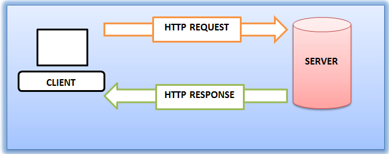
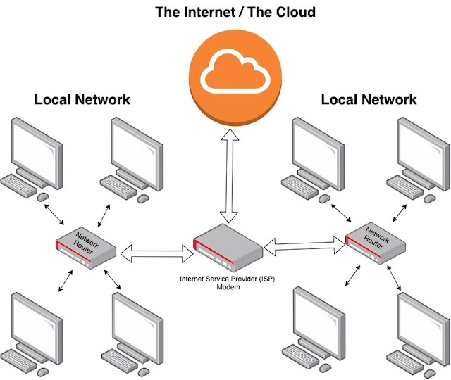

## Learning Objectives

- [What does it mean when a client makes a request?](#the-request)
- [What is a server response?](#the-response)
- [What does it mean to render a site?](#what-does-it-mean-to-render-a-site)
- [How are requests and responses received?](#how-are-requests-and-responses-received)
- [What is the Domain Name System (DNS)?](#what-is-the-domain-name-system)

## Overview

Before you start to work on websites and/or web applications, it's helpful to understand what is happening behind the scenes. There is more to web development than just what a user sees in the browser, and a truly "full-stack" application will take all these parts into account.

When you type in a websites address, i.e. `https://google.com`, you are making a `request`. Google's servers receive that request and sends back a `response`. In general, the computer making the request is called a **client**, and the computer that send a response is a **server**.



- Clients make a `request` from a web server.
- The Server sends a `response` to the client.

All of these requests and responses happen via HTTP, the HyperText Transfer Protocol.

:::tip What is a Protocol?

A protocol, according to [Mozilla Developer Network](https://developer.mozilla.org/en-US/docs/Glossary/protocol) is:

> **[...] a system of rules that define how data is exchanged within or between computers.**

Computers require a format be defined in order to send information between them. We refer to these rules as **protocols**.
:::

### The Request

When you type `http://google.com` you're making a HTTP `request`. A very simple HTTP request from a browser will look something like this:

```sh
GET / HTTP/1.1
Host: google.com
User-Agent: Mozilla/5.0 (Macintosh; Intel Mac OS X 10_15_5) AppleWebKit/537.36 (KHTML, like Gecko) Chrome/83.0.4103.116 Safari/537.36
```

Each `request` tells the **server** what the **client** wants, and the `reponse` either returns the resource (usually a web page), or a message to let the client know there was a problem.

The first line of the `request` can be broken down accordingly:

| The Method | The Path | The Protocol Version |
| ---------- | -------- | -------------------- |
| `GET`      | `/`      | `HTTP/1.1`           |

- The **HTTP Method**
  - The _method_ describes the type of operation the client want to make.
  - `GET` and `POST` are the most typical (there are others).
  - `GET` Method: A client wants to _fetch_ a resource _from_ the server.
  - `POST` Method: A client wants to _send_ data _to_ the server.
- The **Path**
  - The _path_ of the resource, based on the URL
  - `/` means the "root" of a domain.
  - `/contact` would mean the resource path is located outside of the "root," in a location called `contact`. This tells the server to load a different part of the site, relative to the resource path. In this example, it would load a page with contact information.
- The **Protocal Version**
  - What version of the HTTP protocal should be used?
  - The `/1.1` correlates to version number 1.1 of the HTTP Protocol.
  - As of this writing the HTTP/1.1 format is the most common.
  - HTTP/2 is a newer version that provides a few enhancements over the earlier versions.

The following line comprise the _request headers_:

```sh
Host: google.com
User-Agent: Mozilla/5.0 (Macintosh; Intel Mac OS X 10_15_5) AppleWebKit/537.36 (KHTML, like Gecko) Chrome/83.0.4103.116 Safari/537.36
```

These headers provide any additional information that a server might require. The _request headers_ can contain information about the resource that is being requested, or the client making the request. In this example, one of these headers is the `User-Agent`. This tells the server what type of browser, and device, is making the request.

:::tip HTTP Headers

You can think of HTTP Headers as being similar to shipping labels on a package. A shipping label will have the desintation address, as well as the sender's address. In addition, the label may contain additional information such as "Fragile: Handle with Care," "Perishable," "Shipment Contains Lithium Batteries", etc...

HTTP Headers contain pertinent information about each `request` and `response` that takes place between the client and server.
:::

### The Response

The server will send an HTTP _response_ that looks something like this:

```sh
HTTP/1.1 200 OK
Content-Type: text/html; charset=UTF-8
Date: Fri, 26 Jun 2020 19:20:51 GMT
Expires: Sun, 26 Jul 2020 19:20:51 GMT
```

The `response` from the server involves the response data, and the requested resource, contained in the `body` of the response.

The first line of the response is broken down as follows:

| Protocol Version | The Path | Status Message |
| ---------------- | -------- | -------------- |
| `HTTP/1.1`       | `200`    | `OK`           |

- The **HTTP Protocol Version**
  - The version of the HTTP Protocol the server is using
- The **Status Code**
  - Status Codes indicate whether a request was successful or not
  - Successful responses are in a range between `200`-`299`
  - Client Errors (i.e. `Page Not Found`) are in a range from `400`-`499`
  - Server Errors (i.e. Problem with the server, not a page) are in the range `500`-`599`
- The **Status Message**
  - A short text message that correlates with the Status Code

#### Examples of Status Codes & Messages

- Status Code `200` will have a status message `OK`
- Status Code `404` will have a status message `Not Found`
- Status Code `500` will have a status message `Internal Server Error`

The following lines comprise the `response headers`:

```sh
Date: Fri, 26 Jun 2020 19:20:51 GMT
Expires: Sun, 26 Jul 2020 19:20:51 GMT
```

Just like the `request headers`, the `response headers` provide additional information about the response. They are indepdendent of the content of the response _body_. They are designed to provide more information about the response itself. In this example the `Date` header indicates when the response was initiated. The `Expires` header indicates the date/time when the content would be considered "stale," thus requiring the browser to fetch a fresh copy.

This line is returned with the `response headers` but is considered an `entity header`:

```sh
Content-Type: text/html; charset=UTF-8
```

It's designed to provide information about the `body` of the response. In in this instance, the header tells the browser how to treat the response `body`. In this example, the `Content-Type` is an HTML page, so the browser will _render_ this HTML for the end user.

### What Does it Mean to Render a Site?

Every web browser has a _rendering engine_. It's the rendering engine's job to take the `body` from the server response, interpret how it should be read, and _render_ that in the browser. As an end user, you see the finished website.

When we say a browser "renders a website" we're saying that the browser is converting the code, on the fly, into something with which a user can read and/or interact (click, type, edit, etc...).

The `body` is actually series of computer code, made up of `1`s and `0`s called _bytes_. The role of the rendering engine is to convert this data from bytes into data that a person can read. In this case the bytes are converted into _characters_, and those characters into _tokens_. You can think of these _tokens_ as representations of the human-readable code that was written to create the website.

For example, in HTML, there are tokens that represent each element of a page. We'll cover this concept more when discussing the role of the `DOM`.

### How Are Requests and Responses Received?

Now that we've looked into the messages that get sent between clients and servers, let's dig into _how_ those messages travel across the internet. The internet itself is MASSIVE. How does any request know how to make it to the correct server? How do responses know to return to your laptop or your phone??

Every device on the internet is assigned a unique address, known as an _Internet Protocol (IP) Address_. At any moment there could be billions of devices online, from phones, to computers, to televisions, and Internet of Things devices (cameras, "smart" devices, etc...).

A website like `amazon.com` or `google.com` can have millions of visitors **per day**. It's difficult for a single server to handle that many _requests_ at once. In order to handle these requests, Amazon or Google would divide up the work across multiple servers across the globe. As the end user, this is all transparent to you. You just type in `amazon.com` or `google.com` in your browser. This is an example of using a _domain name_. Domain names map to these unique addresses, which creates a route for a `request` from your device to the appropriate server. The routes are facilitated by a system called the _Domain Name System_, also known as DNS.

### What is the Domain Name System?

Your browser sends a _request_ to retrieve the domain `google.com` to a server that is part of the _Domain Name Sytem_ (DNS). These DNS servers are servers whose sole purpose is to keep track of the IP addresses for a given domain name. For every website on the internet, there is a DNS record that keeps up with the IP Addresses of the servers that host the necessary files.

You can think of the Domain Name System like your contact list on your phone. The names in your contact list correspond to phone numbers, email addresses, and possibly physical addresses. When you make a call, or send a text, you choose the name from your contact list, you don't have to remember their phone number. If you use a voice assistant you can say things like "Call Mom" or "Give me directions to Leslie's house" and your phone will know what number to call, or street address to show on a map. Your phone will check the contact list, get the proper information, and pass it along accordingly.

Similarly, when your browser requests a website, the request first goes to a DNS Resolver. The DNS Resolver, like your contact list, will give your `request` the proper address for the server. Your `request` goes to the proper IP Address and the server will send back the corresponding `response`.

### Summary

Getting started with web development means understanding the various moving pieces that are involved with delivering a website, or web application. Understanding how a clients makes a `request` and how servers reply with a `response` provides the foundations for both front-end and back-end web development. The `request` and `response` cycle is integral in everything from a simple web "page," to more robust applications like GMail, Amazon e-commerce, or Google's search engine.

## Additional Resources

### Browser Rending

- [How browser rendering works — behind the scenes](https://blog.logrocket.com/how-browser-rendering-works-behind-the-scenes-6782b0e8fb10/)

### How Chrome Works

- [Learn about the engineering decisions that went into Google Chrome](https://www.google.com/googlebooks/chrome/big_00.html)
    > Look under the hood of Google Chrome in this comics interpretation of key engineering decisions with art by Scott McCloud.

### What is the Internet?

The internet is a large group of interconnected computers called servers. The connection between these servers is referred to as a network. The network is designed to handle communication between each of these servers. You can think of "internet" as being shorthand for "interconnected networks."

A simple network can be created by connecting at least two computers, allowing them to share data between each other. In order to connect _multiple_ computers together you need a specialized computer called a _router_.

A single router can handle routing traffic between _multiple_ computers. With one single router you can scale beyond just two computers. In addition, routers can then attach to other routers. These router-to-router connections can theoretically scale infinitely, which creates the global network that we commonly refer to as the "cloud." Servers connect to routers, which connect to other routers, connecting more servers, all spreading out across the Earth.



### What is the Cloud?

Initially, the term **web** referred to the networks of routers and servers that comprise the internet. A visual representation of these interconnected networks resemble a spider's web. If you're _primarily_ accessing the application via a web browser, such as Chrome, Safari, Windows Edge, you're browsing the **web**.

In essence, the **cloud** is just a series of servers spread out geographically across the planet. The distinction between the **cloud** and the **web** can be thought of in terms of _how_ you access a service.

Some common types of **cloud** applications are:

- **Software-as-a-Service (SaaS)** applications, like Google Docs or Microsoft Office 365, provide both web applications _and_ their underlying network architecture to multiple users.
- **Platform-as-a-Service (PaaS)** applications, like Windows Azure, Heroku, Amazon AWS Elastic Beanstalk, provide computing platforms where developers can run their software. It allows a developer to have the right server architecture for their application, with the ability to scale, without requiring the developer invest in their own hardware.
