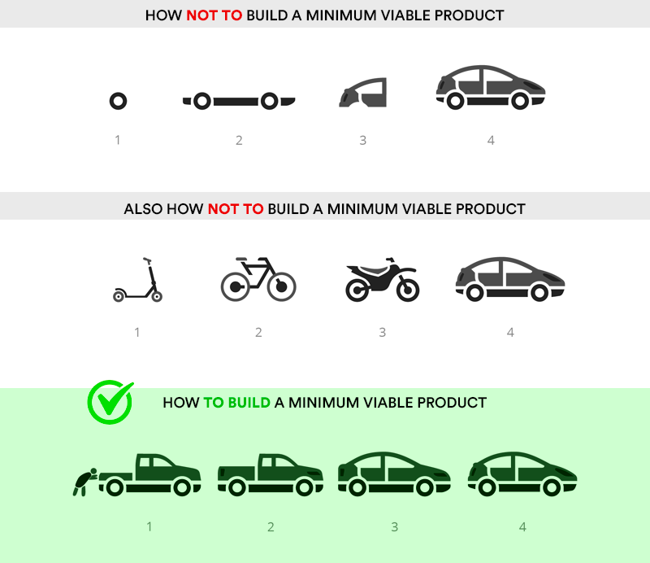

<!-- markdownlint-disable no-inline-html no-trailing-punctuation -->

:::info

## Career Support Schedule

| Date       | Time                | Presenter(s)                                   | Topic                                         |
|------------|---------------------|------------------------------------------------|-----------------------------------------------|
| 7/14/2025  | 5:30-8:30 PM EST    | Kaity Miller                                   | CS Kick Off                                   |
| 7/15/2025  | 5:30-8:30 PM EST    | Guest Speaker: Caleb Craigo                    | Working in Tech                               |
| 7/29/2025  | 5:30-8:30 PM EST    | Guest Speaker: Matt McNeill                    | Intro to Machine Learning                     |
| 8/4/2025   | 5:30-8:30 PM EST    | Lauren McGlamery                               | LinkedIn & Networking                         |
| 8/7/2025   | 5:30-8:30 PM EST    | Kaity Miller & Cara Davis Anderson             | Live Resume Review                            |
| 8/11/2025  | 5:30-8:30 PM EST    | Chris Guirl                                    | Craftsmanship in the LLM age, Portfolio Polish|
| 8/14/2025  | 5:30-8:30 PM EST    | Cara Davis                                     | Mock Interview Slots                          |
| 8/18/2025  | 5:30-8:30 PM EST    | Cara Davis Anderson                            | Mock Interview Slots                          |
| 8/21/2025  | 5:30-8:30 PM EST    | Megan Marson                                   | Freelancing/Contract Work                     |

:::

## Web Application Development Graduation Celebration

- **When:** Monday, August 25th, 5:30 - 7 pm
- **Where:** Virtually, via Google Meet
- **What**: Focus on celebrating the accomplishment of completing the 20-week course, and let the grads share the overview of the projects.

## The gist...

:sparkles: **GO BUILD SOMETHING RAD!** :rainbow:

In my (Sean's) opinion, apps should either be:

- Something that sounds fun

OR

- Something that solves a problem.

The proverbial "sweet spot" is an app that does _both_ of those things.

So, start there, and see where you go!

:::tip
You can find tools, tutorials, videos, on the [Resources](./RESOURCES.md) page!
:::

## The rest...

The purpose of the final project is to showcase your abilities as a developer, not to create the Next Big Thing (but if you can do both, go for it!). Make sure to decide beforehand what you think your greatest strengths are, and use your application and presentation as a platform to showcase those strengths. Together, your final project and portfolio should tell a story about what sets you apart from other developers, so that you can stand out when seeking employment.

For example, if you have a graphic design background, you should nail the graphic design, in addition to the technical aspects, so that you can tell the story of your diverse experience. If you have business acumen, you could develop an idea that shows your ability to create a viable business idea and execute a minimum viable product quickly. This doesn't have to be anything spectacular, just choose some strength about yourself that you can showcase with the application idea or the technical choices you make. Ask your instructor and classmates for help refining which strengths you should focus on.

## Requirements

### Project Management

1. Make sure you're storing all your work in a Github repository!
   - "Branches will save your time and sanity, I promise." - _Sean_
2. Make regular commits each day (_it's recommended to make at least one commit per day_)
3. Before starting development, it's recommended that you create wireframes
   - These can be hand sketches or digital designs in Figma, Illustrator, etc.
4. Document [User Stories](https://www.atlassian.com/agile/project-management/user-stories) about your app
   - "As an admin user, I want the ability to create courses so that learners can see what courses are available."
   - User stories follow this structure: "As a **\_\_\_\_** I want **\_\_\_** so that **\_\_\_\_**"
5. You must write a README that lists all the technologies and APIs used in the project.
   - Your README is usually the first thing employers see about your project/portfolio.
   - _Don't blow this off!_ It's a big opportunity to show how professionally you can communicate in a technical setting.
6. Be prepared to explain your project with an [elevator pitch](https://www.universitylabpartners.org/blog/how-to-write-a-winning-elevator-pitch):
   - 15 to 25 words of what your app does

### Backend

1. Build a project with both user authentication and authorization
2. Use data stored in a persistent database _(an RDBMS like Postgres or MySQL is preferred)_
3. Build a RESTful API.
   - FastAPI is recommended.
   - You can try others, but know that time is limited so you'll need to account for learning time!

### Frontend

1. Build a responsive UI that works across various screen sizes.
   - React is recommended
   - You can try others (i.e. Svelte, NextJS) but be sure to account for learning time in your estimates.
2. Implement CRUD functionality
   - Create (a new entry)
   - Read (existing entries)
   - Update (an existing entry/value)
   - Delete (an entry/value)

### Level Up

1. Integrate at least one 3rd-party API (_not required_)
2. Use at least one technology or package we haven't covered in class
3. Deploy your app (we'll discuss options in class)
4. The URL for the deployed site should be in your README and in your repo description
5. All code should conform to best practices ([PEP-8](https://peps.python.org/pep-0008/), [Google JavaScript Style Guide](https://google.github.io/styleguide/jsguide.html), [Airbnb React Style Guide](https://github.com/airbnb/javascript/tree/master/react)) and be as DRY (Don't Repeat Yourself) as possible.

### Special considerations

We have seen many web developers succeed within these requirements and we know you can too! Sometimes a great idea comes along that doesn't quite fit this mold. If you have a project idea with requirements different from what is outlined above, speak to your instructor about it as soon as possible.

**Additional allowances or changed requirements must be agreed upon before you proceed working on them.** Submitting a project that is unexpectedly outside these bounds risks forfeiting both graduation and career support.

## Pitching The Projects

Make sure your projects are centered around things you truly care about; bee-keeping, beer, dancing, hiking, basketball, etc. This makes a huge difference and can make the project a lot of fun! Chat with your classmates if you need help coming up with fun ideas.

## Ask Your Peers for Feedback

Community feedback is invaluable in keeping scope-creep (a.k.a kitchen sink syndrome) out and making sure the projects are the right mix of ambition, talent, feasibility, and hubris _(a careful mixture of all four is required)_.

Peer code reviews are also extremely helpful. This is a team activity, not a competition: while you must complete your project indpendently, we encourage you to check in with your classmates frequently for feedback during the development process.

## Start Small, Grow with Agility

## 3rd Party API Testing

You will want to test any 3rd party APIs you have in mind to verify that they are suitable for your needs. Within one week of beginning final projects, you are required to demonstrate that your API is suitable by showing it being used in your app.

**NOTE:** It's not unusual for an API to go offline, break down, hit a rate limit. If you're using a 3rd party API, it's recommended to have a backup "in case of emergency, break glass" type of file. Usually this is a JSON file with the usual output you'd expect from the API.

This is also helpful while developing, so you're not constantly hitting an API over and over.

## Final Project Q&A

- How do we do check-ins for class?
  - You will be expected to check in with a "standup" report Monday through Friday, between 5:00 PM and 7:00 PM.
  - You will answer 3 questions
      1. What did you do yesterday?
      2. What will you do today?
      3. What, if anything, is blocking your progress?
- What support is available during projects?
  - Office Hours will be from 5:00 PM - 7:00 PM every day.
  - In addition to your standup report, this is an opportunity to work with your instructor to resolve any blockers
  - Other times can be scheduled as needed throughout the three project weeks.
  - The [#codehelp channel](https://buildcarolina.slack.com/archives/CM857C3K7) in Slack is also helpful for reaching help from others staff and/or alumni.
  - **NOTE**: If you use [#codehelp](https://buildcarolina.slack.com/archives/CM857C3K7), make sure you explain what you're working on and share a link to your Github repo!
- How often will lectures happen, and will they be optional?
  - There is no set lecture schedule during final projects. Instructional staff (including TAs) may hold impromptu lectures to fill in gaps when multiple students are struggling with the same topic.
  - There _will_ be
  - Students will be notified in class communication channels ahead of time if a lecture is planned. No lecture during this time is mandatory, but you will be responsible for project requirements even if you miss a relevant lecture.
  - **We strongly suggest attending any lecture/guest speaker opportunities during this time.**
- How often do we check in with the instructor?
  - You must check in with your instructor and/or campus coordinator _every day_ during standup.
  - There will be a final "Demo Day Ready" check-in ~2 days before Demo Day.
       i.e. If Demo Day is on Friday, this means your project is **feature complete by Wednesday.**
  - Be prepared to show a functioning version of your project to the instructional team at this time.

## Resources

- Check out these [TED Talks](https://www.ted.com/playlists/226/before_public_speaking) to help you get ready to speak in front of a crowd.
