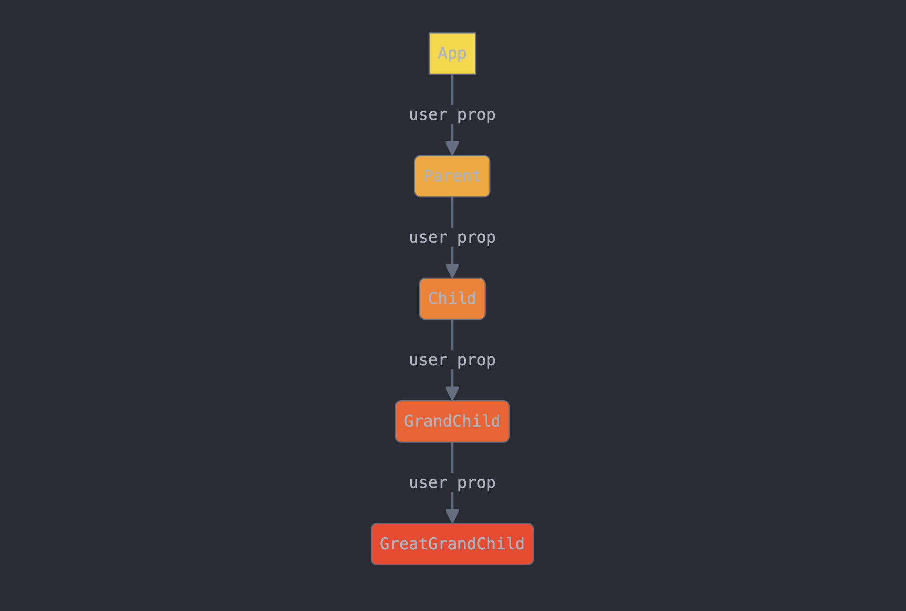

## Let's talk about `props`

To drill, or not to drill?

<iframe src="https://giphy.com/embed/l2JdSdMPUfijMQWcM" width="480" height="367" frameBorder="0" class="giphy-embed" allowFullScreen></iframe>

<a href="https://giphy.com/gifs/thesimpsons-the-simpsons-6x25-l2JdSdMPUfijMQWcM">via GIPHY</a>

### Simple prop drilling

(Credit to [Claude](https://claude.ai/) for the diagrams)

### Prop drilling with sibling components

## Now, let's get some reps...

- We're going to spin up a new React app
- Add some components.
- Add some `state` and pass around some `props`