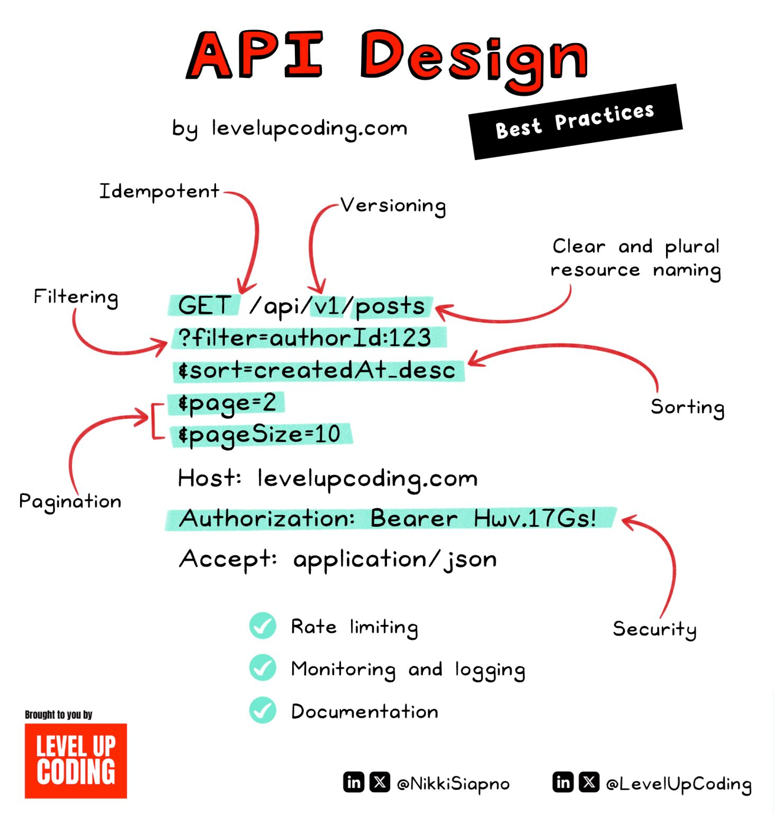

<!-- markdownlint-disable no-inline-html -->

## Project talk

- We'll start with some Q & A regarding [Final Projects](/docs/pt_cohorts/cohort01/final-project#final-project-qa)

## New Features for Auth Week

- Add Authentication
  - Review [JWT](https://flaviocopes.com/jwt/)
  - Review [bCrypt](https://en.wikipedia.org/wiki/Bcrypt)
- Test our API to register/login a user via Swagger
- Work on the client UI

### Upcoming Steps

- Let users _actually_ login
- Handle the _actual_ redirection
- Deploy? (time permitting)

## Adding Authentication

- We'll follow [this guide](./API_UPDATES.md) to add the necessary models/routes/services/libraries to our API.

### Relevant XKCD Comic

## Good API Design

This is something I found via LinkedIn, it does a good job of mapping out an API structure.

## Notes and Video

- [Class Notes](https://docs.google.com/document/d/1_RnmqRPlNF1FsnsMhb6tvp3LK4qUrnnoH4P6sBii6Tg/view?usp=sharing)
- [Class Video :movie_camera:](https://drive.google.com/file/d/1e1g51P-FB3vREcxTN4U0jsIZnXvwgONk/view?usp=sharing)
- [Shrink Ray API Repo](https://github.com/buildcarolina/shrinkray_api)
- [Shrink Ray UI Repo](https://github.com/buildcarolina/shrinkray_ui)
