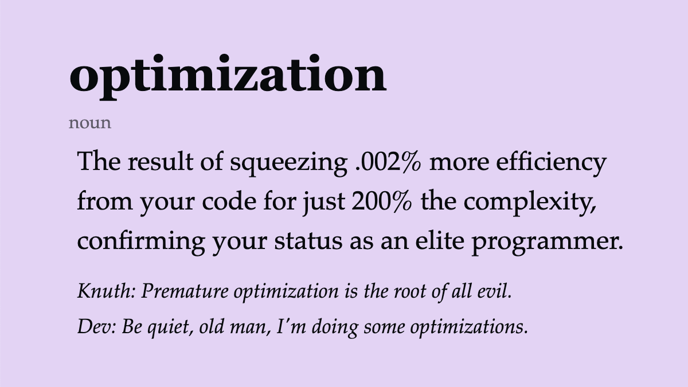

## First Hour

- Show'n'tell'debug
- Review [Hotel Manager](/docs/exercises/python-hotel-manager/) solution

## Hours 2 & 3

- Functions and Object Oriented Programming (OOP)

## Presentations

- [Functions](https://docs.google.com/presentation/d/1qDTa_qmtTG3parlrDLcc_RdpxF8ceJsIm7-vPRJ1I00/edit?usp=sharing)
- [Object Oriented Python](https://docs.google.com/presentation/d/1pqIK5nza4rjglKo3iCms3dfDZgBw2CcwI2fq7T3nmIE/edit?usp=drive_link)

## Lessons

- [Functions](/docs/lessons/solving-problems-using-code-python/python-functions)
- [Object Oriented Programming(OOP)](/docs/lessons/solving-problems-using-code-python/python-oop)

## Optimization?

## Notes and Video

- [Class Notes](https://docs.google.com/document/d/15PdNu6KpFsZSEw-ONN9-0VjVzI9bXnQbj5h2YnFgJAA/edit?usp=drive_link)
- [Class Video :movie_camera:](https://drive.google.com/file/d/14-q1qd-APPMS-CE-hZnY_PWINxcBIMgh/view?usp=drive_link)
