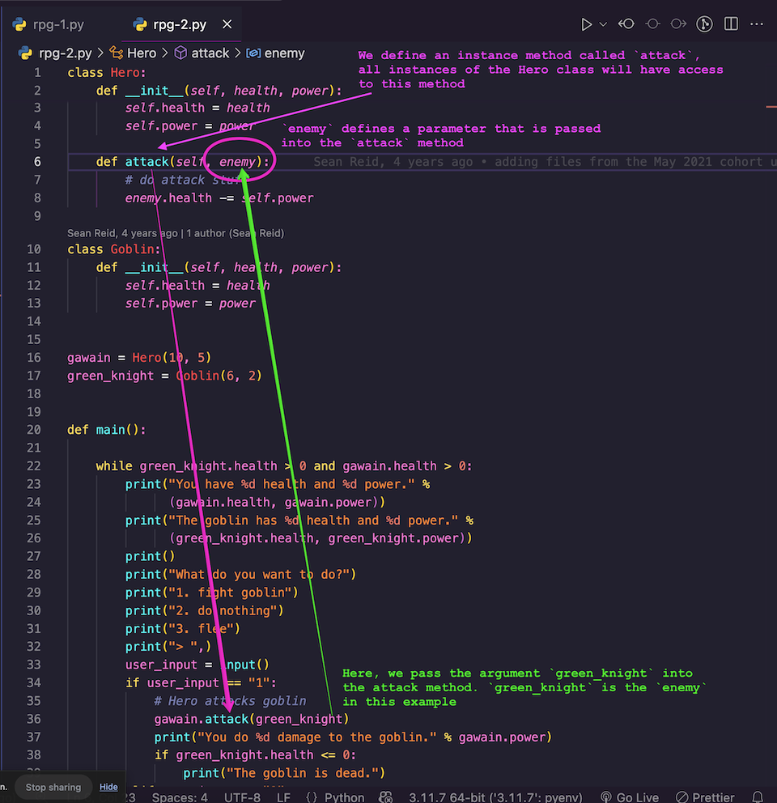

## Goals

- Review the [Warrior RPG 1](/docs/exercises/python-rpg/part-1/) and [Warrior RPG 2](/docs/exercises/python-rpg/part-2/)

## Lessons

- [Object Oriented Programming(OOP)](/docs/lessons/solving-problems-using-code-python/python-oop)

## In Class

Here's the screenshot we marked up in class show how an instance method is defined with parameters, and how it's called with an argument.

## Notes and Video

- [Class Notes](https://docs.google.com/document/d/1DnbdVk2mfbyLz8A9N9nrCGS31c-iji2waCoH8SA4u9U/edit?usp=sharing)
- [Class Video :movie_camera:](https://drive.google.com/file/d/13auRUqv0JZCE7lfObhXI5VIom-7MSohL/view?usp=sharing)
