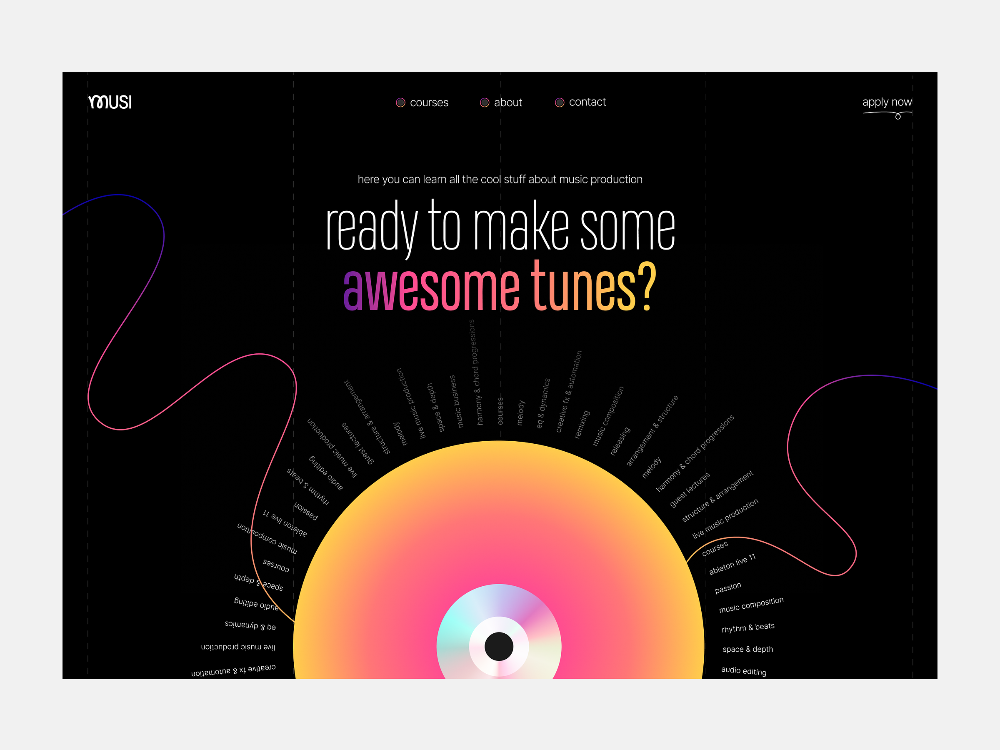

<!-- markdownlint-disable no-inline-html -->

## Presentations

- [Welcome to the Internet](https://docs.google.com/presentation/d/1VV0ATWAFqKgDebwt4MS4SR1ptXfmXjez0aL0lnPHqJ8/edit?usp=sharing)

## Types of programming

1. **Imperative programming** is writing code that tells the computer _how_ to do something.
   > "Hey, Computer, if a user gives you value [x] then perform action [y]."
2. **Decalartive programming** is writing code that tell the computer _what_ you want to see.
   > "Hey, Computer, this content needs to look like this..."

## HTML & CSS

- You can think of HTML as our "architecture"
- CSS would could then be considered the "interior design."

This [Anatomy of HTML PDF](anatomy-of-html.pdf) from a University of Pittsburgh CS Course is a solid overview of an HTML document.

## In Class

Let's break down a design and build it out in HTML

|               |
| :----------------------------------------------------------------------------------------------------------------------: |
| _[Via Dribbble: Landing page design by Daniella for heartbeat](https://dribbble.com/shots/23271135-Landing-page-design)_ |
